# DGIST 연구 인턴

**2024 하계 · 2025 동계 (CASSP Lab)**

RF 송수신 보드를 schematic부터 PCB layout까지 설계하고, TSMC 28 nm 공정에서 Ring Oscillator를 full-custom으로 그려 PEX까지 돌렸습니다.

| 기간 | 주제 |
|---|---|
| 2024 하계 | RF up/down converter **PCB 설계**, wireline TRX·equalization 문헌 조사, DMT MATLAB 시뮬레이션 |
| 2025 동계 | **Ring Oscillator full-custom** — schematic → layout → DRC/LVS → PEX (TSMC 28 nm) |

**사용 도구** — Altium Designer (PCB) · Cadence Virtuoso (schematic · layout · ADE) · Siemens Calibre (DRC · LVS · PEX) · MATLAB

---

## 1. RF Modulator PCB 설계 — 2024 하계

Power converter(5 V → 3.3 V), mixer, I/Q divider를 거쳐 RF modulator 보드까지 설계했습니다.

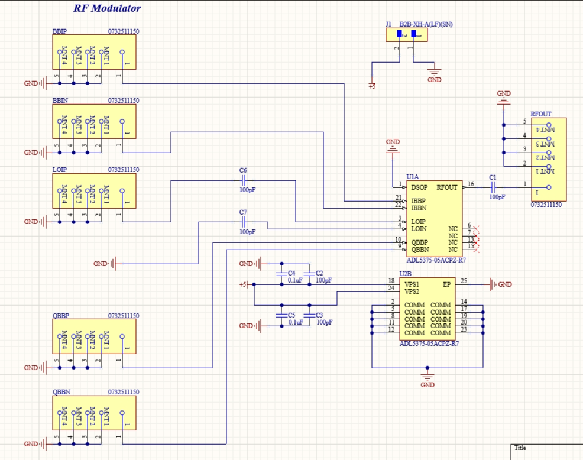

RF Modulator schematic입니다. JLCPCB 재고에 있는 부품으로 BOM을 맞추는 것부터가 제약이었습니다.

<table>
<tr>
<td width="34%">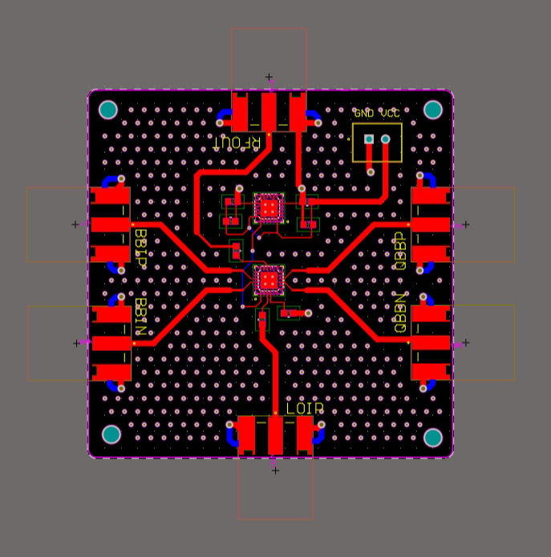</td>
<td width="33%">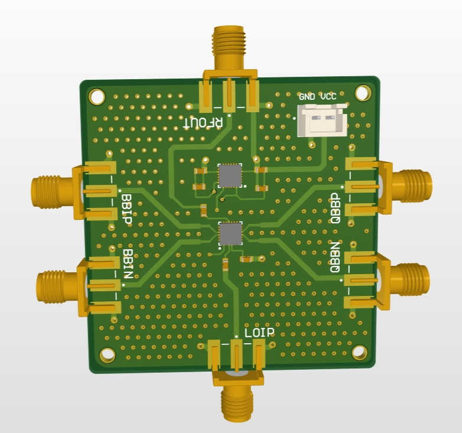</td>
<td width="33%">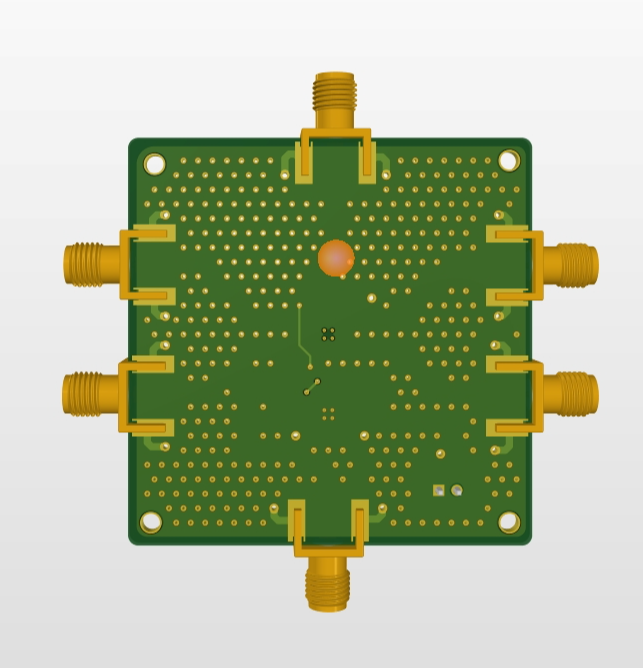</td>
</tr>
<tr>
<td>2D layout — 차동 입력(BBIP/BBIN, QBBP/QBBN), LO 입력, RF 출력을 SMA로 뺐습니다.</td>
<td>3D top</td>
<td>3D bottom</td>
</tr>
</table>

기판 전체에 via stitching을 깔아 GND를 묶었고, 고주파 경로는 길이를 맞춰 배선했습니다.

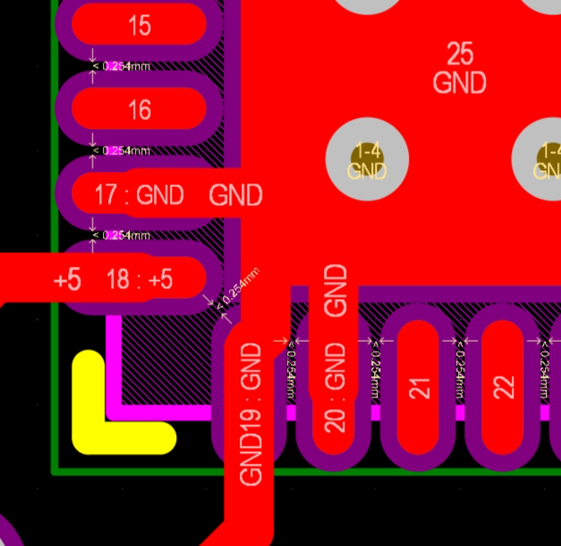

**DFM / DRC 확인** — soldermask bridge 오류가 걸렸습니다. 패드 간격이 0.254 mm보다 좁아 발생한 것인데, 칩 내부 핀 배치는 바꿀 수 없으므로 soldermask 설정을 조정하는 쪽으로 처리했습니다.

---

## 2. Ring Oscillator Full-Custom — 2025 동계

TSMC 28 nm 공정으로 인버터부터 그려 Ring Oscillator를 완성했습니다.

### 2.1 Schematic

<table>
<tr>
<td width="45%">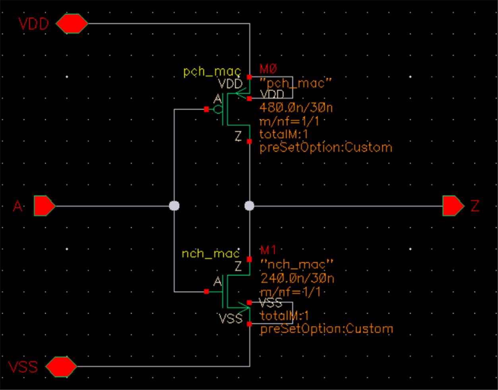</td>
<td width="55%">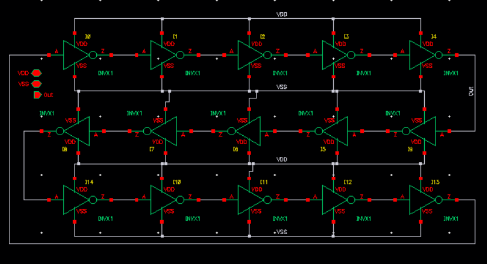</td>
</tr>
<tr>
<td><b>Inverter</b> — pch 480 n / 30 n, nch 240 n / 30 n. PMOS를 NMOS의 2배로 두어 상승·하강을 맞췄습니다.</td>
<td><b>Ring Oscillator</b> — 인버터 symbol을 인스턴스화해 홀수 단으로 링을 닫았습니다.</td>
</tr>
</table>

Transient noise 시뮬레이션(noise Fmax 10 G)으로 발진을 확인했습니다.

### 2.2 Layout

<table>
<tr>
<td width="35%">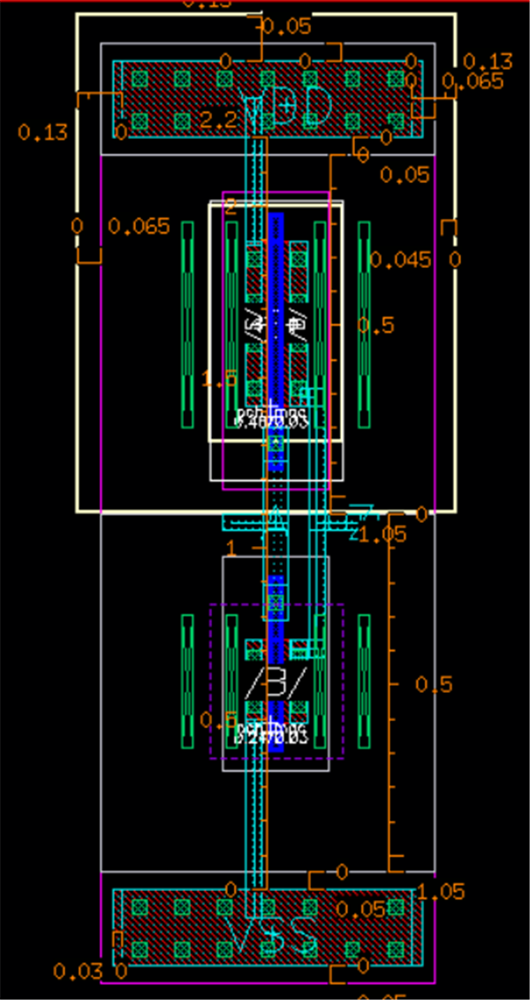</td>
<td width="65%">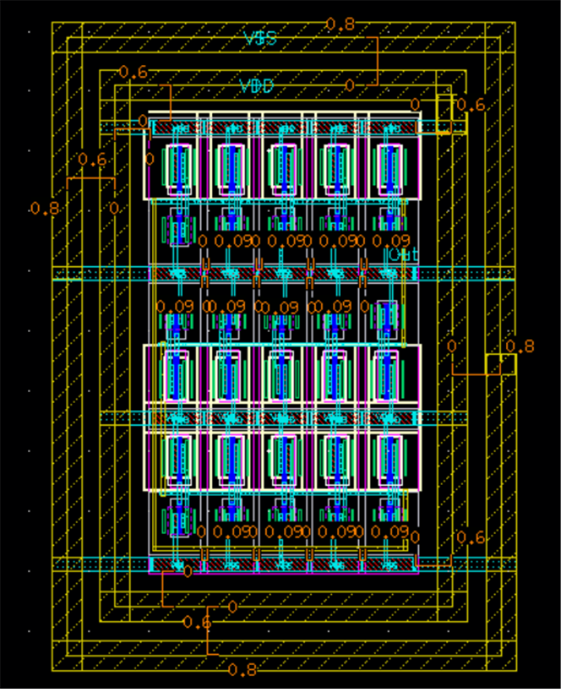</td>
</tr>
<tr>
<td><b>Inverter layout</b> — 링으로 쌓을 것을 고려해 좌우·상하 대칭을 유지했습니다.</td>
<td><b>Ring OSC layout</b> — power routing 폭을 0.5로 넉넉히 잡았습니다.</td>
</tr>
</table>

**공정 규칙에서 걸렸던 것**

- TSMC 28 nm에서는 **Polysilicon(PO)을 가로로 그을 수 없습니다.** 가로 연결이 필요한 구간은 metal로 빼고 via를 박아 우회했습니다.
- Display 설정에서 **snap spacing을 0.005로 고정**해야 격자가 어긋나지 않습니다.
- Poly-to-Poly, Metal-to-Metal spacing 규칙을 지켜 배치했습니다.

### 2.3 DRC / LVS

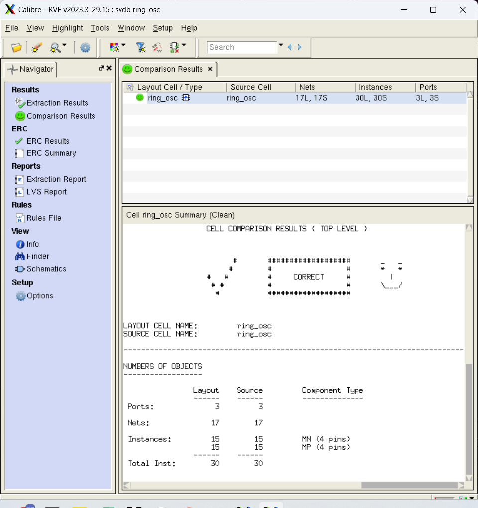

LVS는 layout과 schematic이 일치(CORRECT)합니다. DRC에서 남은 경고는 각각 원인을 확인하고 시뮬레이션 영향 여부를 판단했습니다.

| 경고 | 원인 | 판단 |
|---|---|---|
| `IO_CONNECT_CORE_NET_VOLTAGE_IS_CORE` | IO와 Core 사이 네트워크 전압 불일치 | 시뮬레이션 영향 없음 |
| `DIODMY_L_WARNING` | 저누설 다이오드(DIODMY) 커버리지 | 시뮬레이션 영향 없음 |
| `local density error` | 레이어 밀도 부족 | 더미 레이어로 해결 가능, 현 단계에서는 보류 |

### 2.4 Post-layout Simulation (PEX)

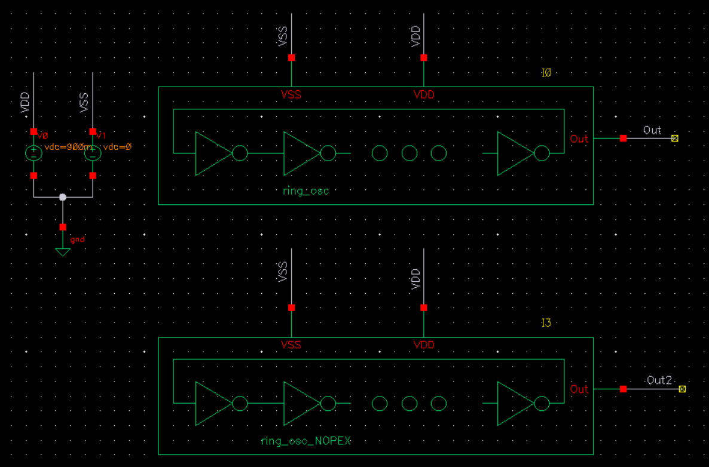

PEX를 반영한 `ring_osc`의 출력 `Out`과, 반영하지 않은 `ring_osc_NOPEX`의 출력 `Out2`를 같은 테스트벤치에 올려 직접 비교했습니다.

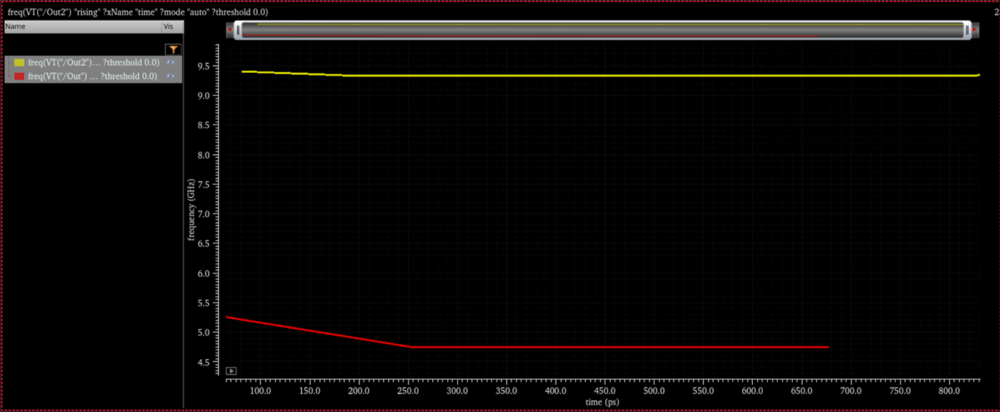

| | 발진 주파수 |
|---|---|
| Before PEX (`Out2`, 노란색) | 약 **9.35 GHz** |
| After PEX (`Out`, 빨간색) | 약 **4.75 GHz** |

**layout 기생 성분이 반영되면서 주파수가 절반으로 떨어졌습니다.** schematic 시뮬레이션만으로는 실제 동작 속도를 알 수 없고, layout 단계의 parasitic을 반영해야 한다는 점을 수치로 확인한 결과입니다.

## 3. OFDM 모델과 수신 경로 분석

### 2024 하계 OFDM 시뮬레이션

| 송신 심볼 | Equalization 후 수신 심볼 |
|---|---|
| 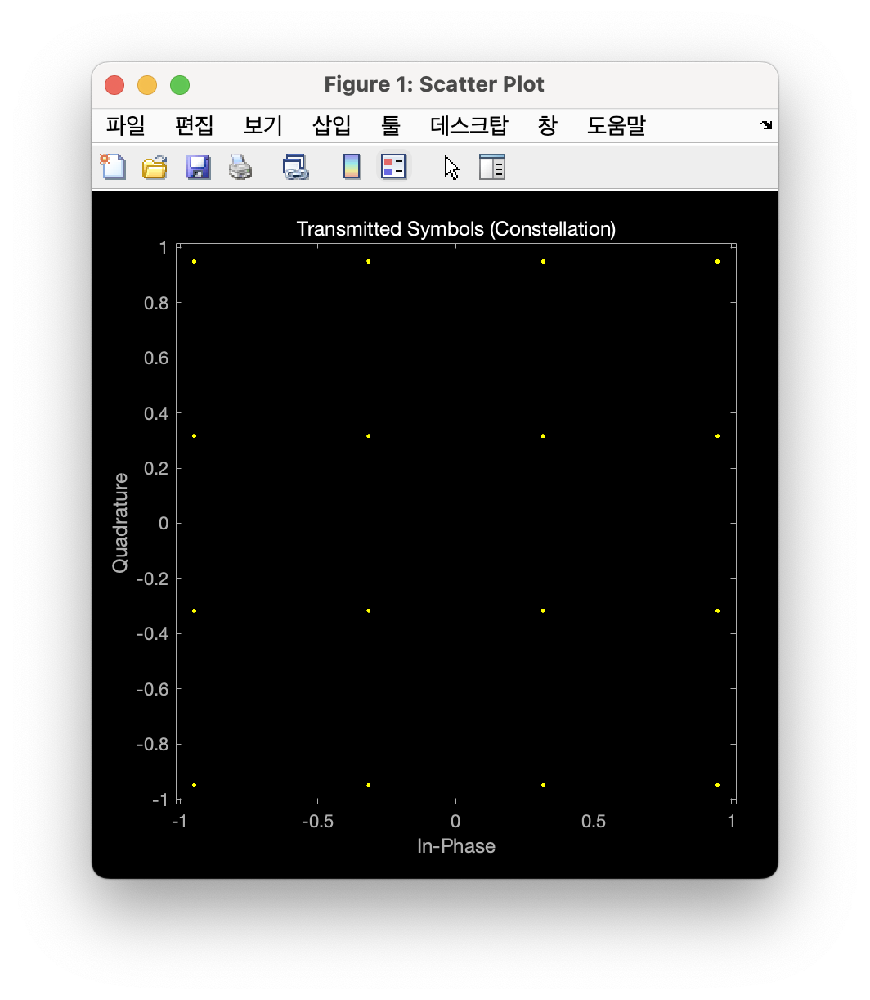 | 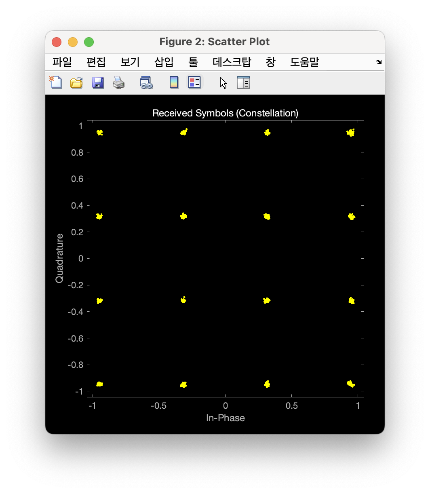 |

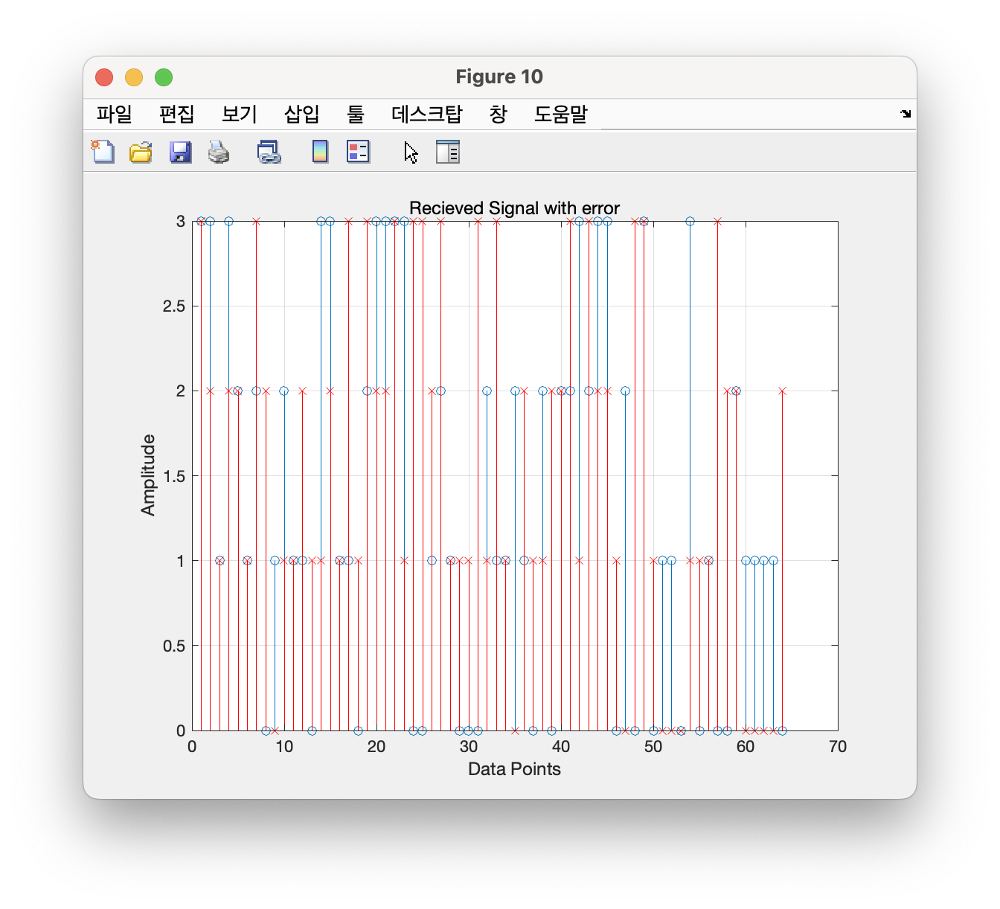

예제 기반 OFDM 모델 학습 결과입니다. QAM, CP, FFT·equalization과 복조 데이터 비교를 연결했습니다.

### 2025 동계 Scope·ILA 디버깅

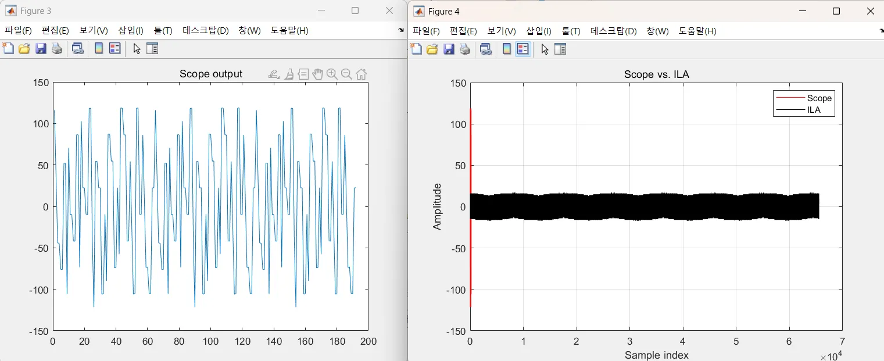

Scope와 ILA 사이 진폭 불일치를 발견하고 관측 위치·sample index·decode mode를 분석했습니다. 해당 기록만으로 문제 해결 완료를 주장하지 않습니다.

---

[← 학부 과정](../README.md)
