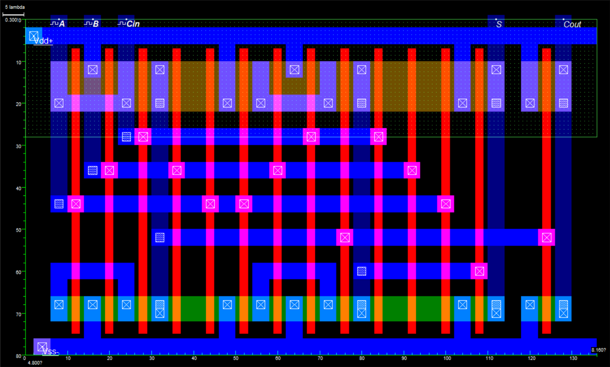
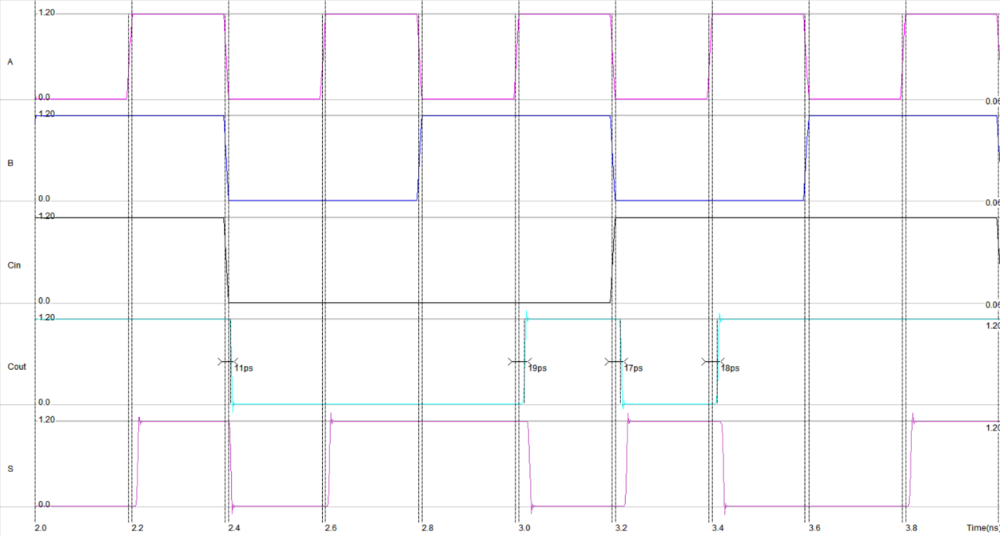
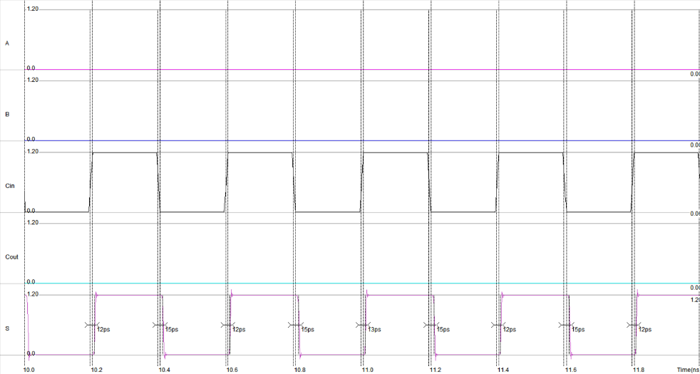
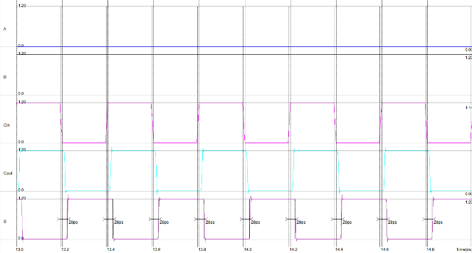
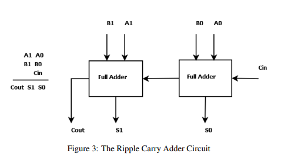
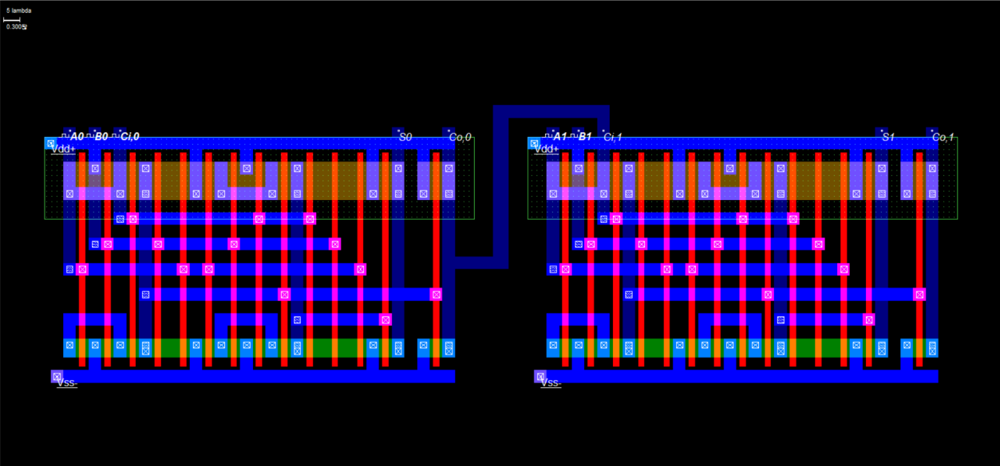
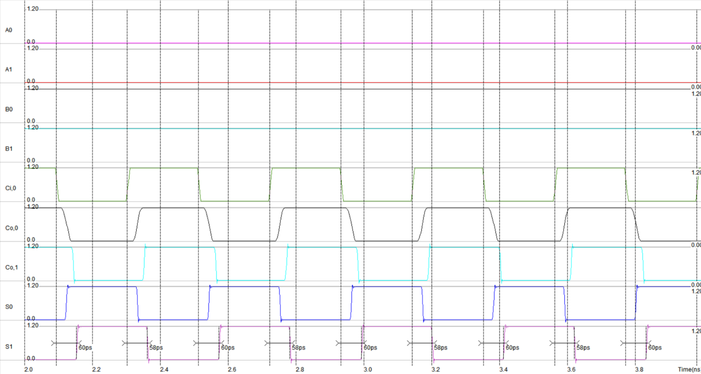
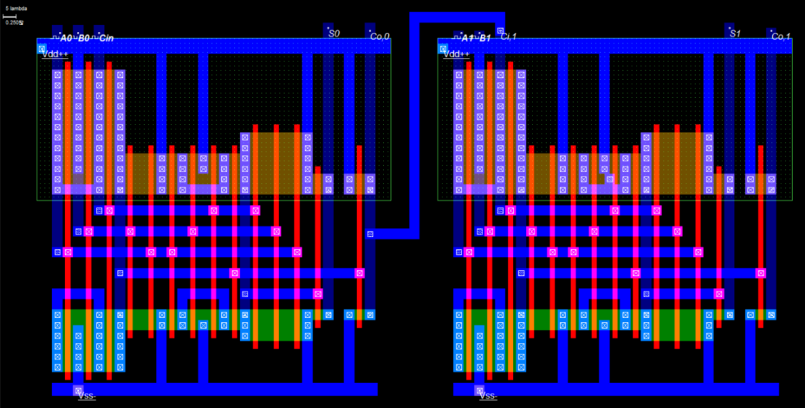

# 1-bit Full Adder — Schematic부터 Layout까지

**집적회로설계 (CAD) · CMOS 90 nm**

Mirror style full adder를 schematic부터 layout까지 직접 그리고, transient 시뮬레이션으로 worst-case delay가 어느 입력 조합에서 나오는지 확인했습니다.

**사용 도구** — Microwind (λ 기반 layout · 내장 아날로그 시뮬레이터)

---

## 1. 회로

트랜지스터 **24개**로 구성된 Mirror Adder입니다. A, B, Cin으로 먼저 `Cout`을 만들고, 그 `Cout`을 다시 써서 `S`를 만드는 구조입니다.

각 트랜지스터의 크기를 표기한 도면입니다. 유효 fanout을 약 2로 맞췄습니다.

---

## 2. Layout

면적은 **6.8 × 4 µm² (136 × 80 λ²)** 입니다.

---

## 3. Transient 시뮬레이션과 delay 분석

A, B, Cin에 서로 다른 주기의 클럭을 주어 **8가지 입력 조합을 전부** 훑고, 각 전이에서 Cout delay를 측정했습니다.

| A | B | Cin | S | Cout | Carry 상태 | S delay | Cout delay |
|---|---|---|---|---|---|---:|---:|
| 0 | 0 | 0 | 0 | 0 | Delete | 15 ps | — |
| 0 | 0 | 1 | 1 | 0 | Delete | 12 ps | — |
| 0 | 1 | 0 | 1 | 0 | Propagate | **28 ps** | 17 ps |
| 0 | 1 | 1 | 0 | 1 | Propagate | **28 ps** | 17 ps |
| 1 | 0 | 0 | 1 | 0 | Propagate | **28 ps** | 17 ps |
| 1 | 0 | 1 | 0 | 1 | Propagate | **28 ps** | 18 ps |
| 1 | 1 | 0 | 0 | 1 | Generate | 12 ps | — |
| 1 | 1 | 1 | 1 | 1 | Generate | 16 ps | — |

delay를 재려면 입력 하나만 움직여야 하므로, **A와 B는 DC로 고정하고 Cin에만 클럭 펄스**를 넣어 케이스별로 측정했습니다.

<table>
<tr>
<td width="50%"></td>
<td width="50%"></td>
</tr>
<tr>
<td><b>Delete (A = B = 0)</b> — S만 반응. rise 12 ps / fall 15 ps</td>
<td><b>Propagate (A ≠ B)</b> — S rise·fall 모두 <b>28 ps</b></td>
</tr>
</table>

**worst-case delay는 Propagate 구간에서 나옵니다.**

Sum은 Cout을 받아 만들어지므로 Sum delay가 Cout delay 위에 얹힙니다. 그런데 Delete(A = B = 0)와 Generate(A = B = 1)에서는 Cout이 Cin과 무관하게 각각 0과 1로 정해져 **Cin이 S까지만 전파**됩니다. Propagate(A ≠ B)에서만 `Co = AB + Ci(A+B)`가 `AB = 0`, `A+B = 1`이 되어 **`Co = Ci`**, 즉 Cin이 Cout을 거쳐 S까지 전파됩니다.

그래서 Propagate의 S delay(28 ps)가 Delete·Generate(12~16 ps)의 두 배 가까이 나옵니다. Cout delay 17~18 ps가 그대로 더해진 결과입니다.

---

## 4. 2-bit Ripple Carry Adder로 확장

<table>
<tr>
<td width="40%"></td>
<td width="60%"></td>
</tr>
<tr>
<td>Full adder 2개를 캐리로 연결한 2-bit RCA.</td>
<td>Full adder layout을 그대로 인스턴스화해 배치·배선했습니다.</td>
</tr>
</table>

### Critical path 측정

2-bit RCA의 critical path는 **두 full adder가 모두 propagate 상태**일 때 나타납니다. A와 B의 각 비트를 반대로 넣으면 `Ci,0 → Co,0 → Ci,1 → Co,1`로 캐리가 끝까지 흘러갑니다.

| 출력 | 지연 |
|---|---:|
| Cout (t_carry) | 28 ps |
| S0 (t_sum) | 28 ps |
| **S1 (t_adder)** | **58 ps** |

전체 rise / fall은 60 ps / 58 ps입니다.

**1-bit의 worst case 28 ps가 2-bit에서 58 ps로 거의 두 배가 됩니다.** 캐리가 단을 하나 지날 때마다 지연이 선형으로 쌓이는 ripple carry 구조의 특성이 수치로 그대로 나타납니다. 비트 폭이 커질수록 이 경로가 병목이 되며, 이것이 carry-lookahead 같은 구조가 필요한 이유입니다.

## 5. 2-bit Adder sizing 개선

| Critical-path 비교 | 기존 | 개선 후 |
|---|---:|---:|
| 최종 Sum delay 범위 | 57–61 ps | 47–56 ps |
| 동일 입력별 감소량 | — | 5–11 ps |

출처: `C135001_강가영_CAD2.pdf`, pp. 11–14. 동일 입력 조건의 transient simulation 비교입니다. 별도 제작·실측 성과로 표시하지 않습니다.

---

[← 학부 과정](../README.md) · [자료 출처](figure-sources.json)
