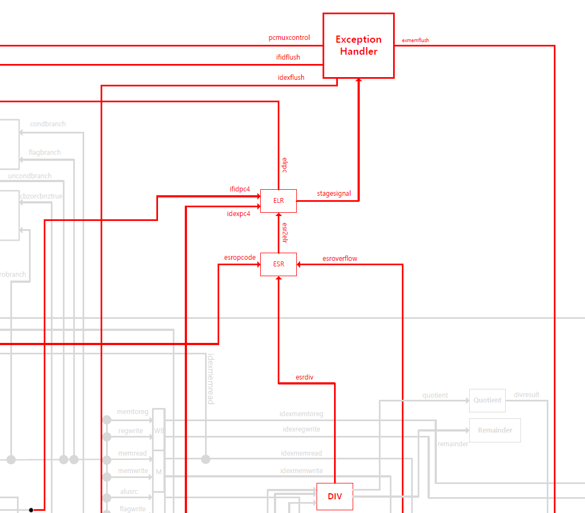
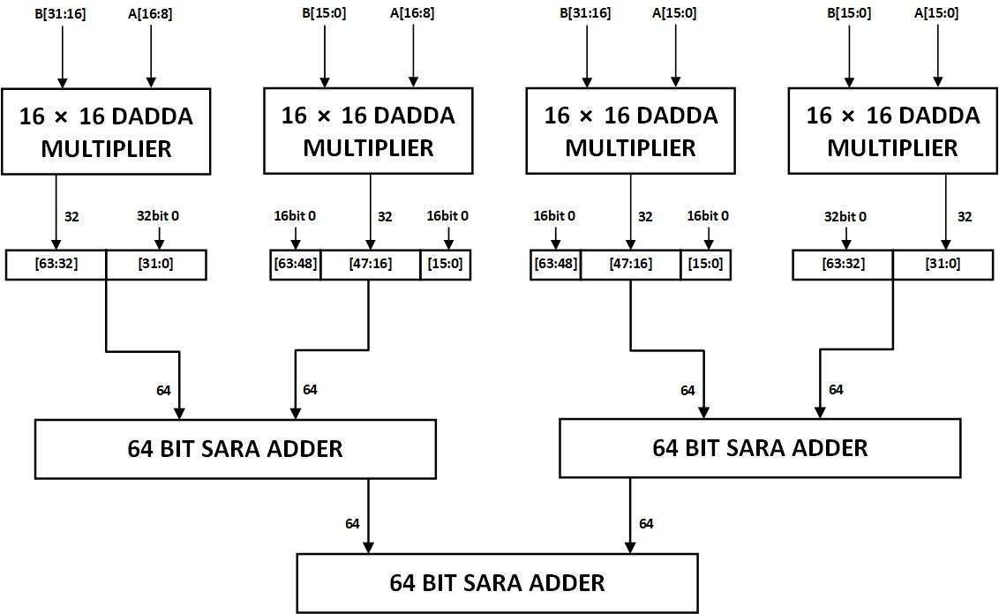
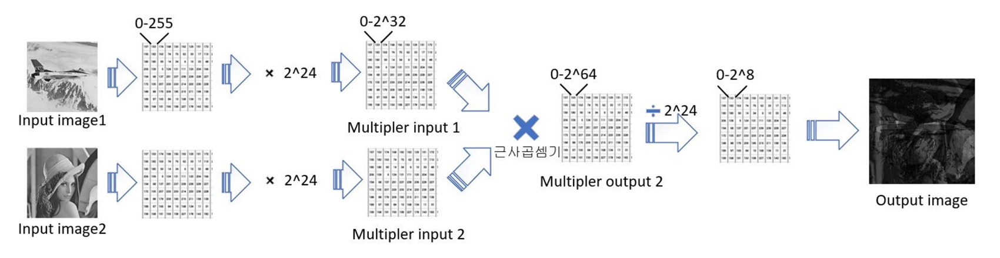
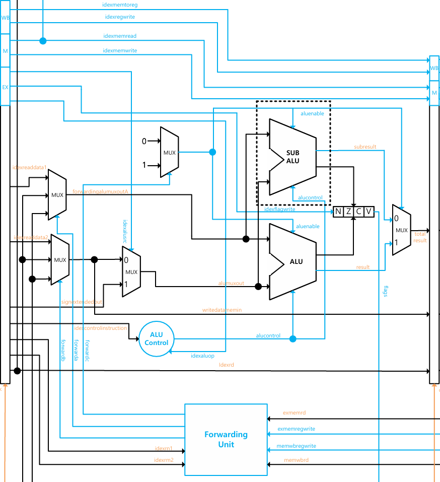
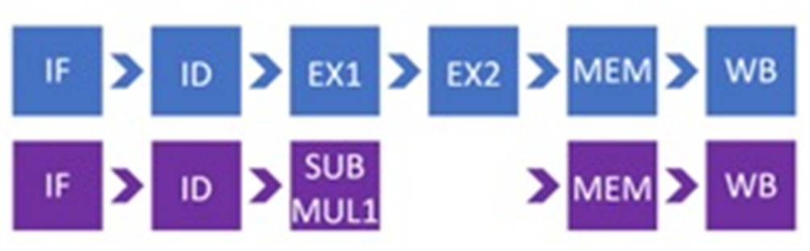
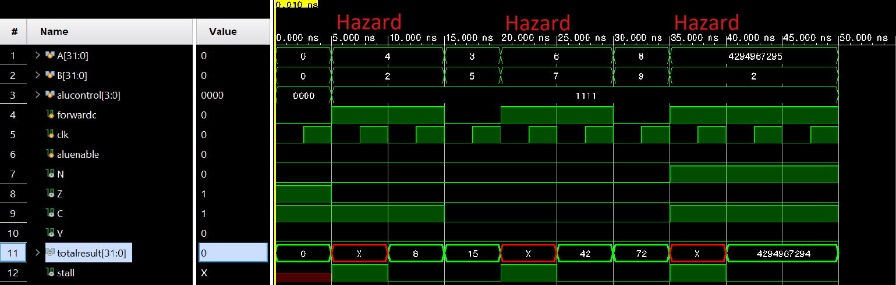
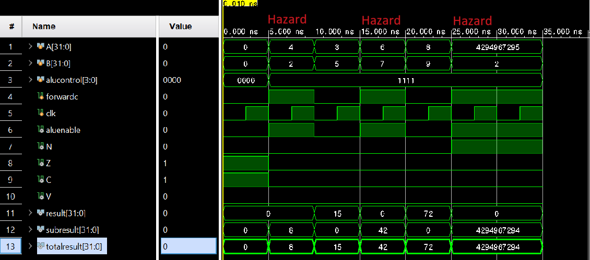
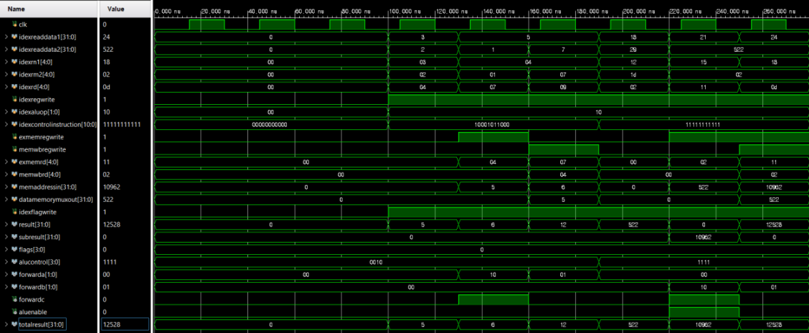

# LEGv8 ARM CPU EX단 최적화

**IT 시스템 종합설계 (6인 팀) → 2024 반도체공학회 하계학술대회 포스터 발표**

> *Mitigating Data Hazards in LEGv8 ARM Processor Using Geometric Approximation Speed Unit*
> 김은수, **강가영** — 홍익대학교 전자전기공학부 (책임저자: 허서원)
> 2024 반도체공학회 하계학술대회 · 디지털 회로/시스템 분야 · 포스터 발표
> 2024년도 부처협업형 인재양성 반도체전공트랙사업 지원

**사용 도구** — Verilog HDL · Xilinx Vivado (RTL 시뮬레이션) · Synopsys Design Compiler (Nangate 45 nm Open Cell Library)

📄 [논문·포스터 원본](paper/2024_반도체공학회_하계학술대회_포스터.pdf)

---

## 1. 팀 프로젝트 — LEGv8 ARM 프로세서

5단 파이프라인(IF / ID / EX / MEM / WB) LEGv8 ARM 프로세서를 설계하고 명령어와 모듈을 확장했습니다.

- `MUL`, `LPMUL`, `UDIV` 명령어와 해당 모듈 추가
- `BR`, `BL` 분기 명령어 추가 — factorial 등 재귀·반복 동작 지원
- ID / EX 단계에 **exception handler** 모듈 추가
- 어셈블러로 어셈블리를 기계어로 변환
- Synopsys Design Compiler 합성으로 clock speed 최적화

여기서 **EX 단계가 critical path**로 드러났습니다. 곱셈이 EX를 2 cycle 잡아먹고, 뒤따르는 명령이 그 결과를 참조하면 data hazard로 stall이 걸립니다.

`MUL` 다음 명령이 결과 레지스터를 참조할 때마다 1 cycle stall이 발생합니다.

---

## 2. 문제 정의

EX 단계를 파이프라인화하면 곱셈 지연은 숨길 수 있지만, **EX에서 해저드가 나면 결국 data stall이 필요**합니다. 논문에서는 방향을 바꿔, 정확도가 덜 중요한 상황에 한해 **근사 곱셈기로 EX를 1 cycle에 끝내는** 접근을 제안했습니다.

근사 컴퓨팅은 저전력 IC 설계에서 유망한 접근입니다. 동적인 근사 수준을 수용하려는 accuracy-configurable adder(ACA) 연구 중 **SARA** 덧셈기를 **Dadda** 곱셈기에 결합해 **GASU(Geometric Approximation Speed Unit)** 를 설계했습니다.

<table>
<tr>
<td width="50%"></td>
<td width="50%"></td>
</tr>
<tr>
<td>(a) 일반 full adder (b) carry-out selectable (c) carry-in configurable</td>
<td>SARA — 캐리를 예측해 sub-adder를 병렬로 돌려 캐리 전파 지연을 끊는 구조</td>
</tr>
</table>

---

## 3. GASU 구조

32×32 GASU의 계층 구조입니다.

| 계층 | 구성 |
|---|---|
| 32×32 GASU | 16×16 Dadda 곱셈기 4개 + 64-bit SARA 가산기 3개 |
| 16×16 Dadda 곱셈기 | 8×8 Dadda 곱셈기 4개 + 4-bit SARA 가산기 3개 |
| 64-bit SARA 가산기 | 4-bit SARA 가산기로 구성 |

Dadda 곱셈기의 효율적인 부분곱 생성과 SARA의 빠른 덧셈을 함께 씁니다. Verilog HDL로 게이트 레벨 모델링했습니다.

### 합성 결과 — Synopsys Design Compiler, Nangate 45 nm Open Cell Library

| 구조 | Power | Delay | Area | PSNR |
|---|---:|---:|---:|---:|
| Wallace_RCA | 3.3 mW | 1.72 ns | 4,193 µm² | Inf |
| Dadda_CLA | 3.2 mW | 1.61 ns | 3,981 µm² | Inf |
| Wallace_SARA | 3.7 mW | 1.33 ns | 4,650 µm² | 24 dB |
| **GASU (제안)** | 3.9 mW | 1.46 ns | 4,919 µm² | **53 dB** |

- 지연 시간: Wallace_RCA 대비 **15.1 % 감소**
- 정확도(PSNR): Wallace_SARA 대비 **120.8 % 향상**
- 전력·면적은 비교 대상 중 가장 큽니다. 논문에서도 이를 단점으로 명시하고, 더 간결한 구조로의 최적화를 후속 과제로 두었습니다.

### 정확도를 어떻게 쟀는가 — 이미지 블렌딩

근사 곱셈기의 오차는 입력 조합마다 달라서 최대 오차 하나로는 실사용 품질을 알기 어렵습니다. 그래서 **실제 데이터로 32×32 곱셈을 수천만 번 돌려보는** 방식을 택했습니다.

8-bit 회색조 이미지 두 장(0~255)을 각각 2²⁴배 스케일해 32-bit 곱셈기 입력으로 만들고, 근사 곱셈기를 통과시킨 64-bit 출력을 2²⁴로 나눠 8-bit로 되돌립니다. 픽셀 하나가 곱셈 한 번이므로, 512×512 이미지면 **26만 번 이상의 실제 곱셈 결과**가 출력 영상에 그대로 누적됩니다. 오차가 크면 영상에 잡음으로 드러납니다.

<table>
<tr>
<td width="50%"></td>
<td width="50%"></td>
</tr>
<tr>
<td align="center"><b>(a) Wallace_RCA</b> — 정확 곱셈, PSNR ∞</td>
<td align="center"><b>(b) GASU</b> — 근사 곱셈, PSNR 53 dB</td>
</tr>
</table>

**두 영상이 눈으로 구분되지 않습니다.** PSNR 53 dB는 그만큼 오차가 작다는 뜻입니다. 같은 방식으로 잰 Wallace_SARA는 24 dB로, 이 경우에는 영상에 눈에 띄는 열화가 나타납니다.

곱셈기 하나의 지연을 1.72 ns에서 1.46 ns로 줄이면서도 **출력 품질은 육안으로 구분되지 않는 수준**을 유지했다는 것이 GASU의 근거입니다.

---

## 4. Sub ALU 적용 — 언제 근사 곱셈기를 쓸 것인가

기존 LEGv8의 EX 단계에 GASU 기반 **Sub ALU**를 덧붙인 datapath입니다. 핵심은 **아무 때나 근사 곱셈기를 쓰지 않는다**는 점입니다.

Sub ALU는 **곱셈 ALU control 신호와 Execution Hazard 신호가 함께 오는 critical한 상황에서만** 활성화됩니다. Hazard 신호는 Forwarding Unit에서 받습니다.

| 상황 | 사용 경로 |
|---|---|
| 곱셈이 아닌 명령 | Main ALU (정확) |
| 곱셈이지만 Execution Hazard 없음 | Main ALU (정확) |
| **곱셈 + Execution Hazard** | **Sub ALU (GASU, 근사)** |

결과를 급히 forwarding해야 하는 경우에만 정확도를 양보하는 구조입니다.

일반 `MUL`은 EX1·EX2 두 단계를 쓰고, `SpeedMUL`은 SUB MUL 한 단계로 끝납니다.

### EX 단계 전체 지연

| 구성 | Delay |
|---|---:|
| Main ALU (Wallace_RCA) | 6.71 ns |
| **Sub ALU (GASU)** | **4.88 ns** |

---

## 5. RTL 시뮬레이션 결과

`clock = 5 ns` 기준으로 곱셈 명령 5개를 연속 실행했습니다.

**(a) Sub ALU 없음** — Hazard가 올 때마다 `stall` 신호가 뜨고 `totalresult`가 `X`로 무효화됩니다. 총 **45 ns** 소요.

**(b) Sub ALU 적용** — 곱셈이 1 cycle 안에 끝나 data stall 없이 모든 명령이 각 단계를 통과합니다. 총 **30 ns** 소요.

같은 의존 관계의 명령열에서 stall이 사라집니다.

| 항목 | 값 |
|---|---|
| 곱셈 명령 5개 실행 (Sub ALU 없음) | 45 ns |
| **곱셈 명령 5개 실행 (Sub ALU 적용)** | **30 ns** |
| 단축 | **33 %** |
| 최종 동작 주파수 | 200 MHz (5 ns) |

---

## 6. 정리

근사 곱셈기로 **연산 정확도를 조건부로 양보해 파이프라인 해저드를 완화**한다는 접근에 의의가 있습니다. 전력·면적이 늘어난다는 단점이 남아 있어, 더 간결한 구조의 근사 곱셈기로 최적화하는 것이 후속 과제입니다.

**참고문헌**

1. X. W. Sapatnekar et al., *A simple yet efficient accuracy-configurable adder design*, IEEE TVLSI, 26(6), 1112–1125, 2018.
2. W. J. Townsend et al., *A comparison of Dadda and Wallace multiplier delays*, SPIE Advanced Signal Processing Algorithms, Architectures, and Implementations XIII, Vol. 5205, 552–560, 2003.
3. G. Jeong et al., *A Study on multiplier architecture optimized for 32-bit processor with 3-stage pipeline*, 대한전자공학회 ISOCC, 656–660, 2004.
4. S. Song et al., *Novel in-memory computing adder using 8+T SRAM*, Electronics, 11(6), 929, 2022.

## 개인 설계·검증 범위

개인 기말보고서 2페이지는 Wallace·Dadda 곱셈기와 RCA·CLA·SARA 조합 설계, testbench 비교, 32×32 근사곱셈기 및 EX단 적용·검증, divider 구현을 담당 내용으로 기록합니다. 최종 Design Compiler 성능 분석은 다른 팀원의 수행으로 명시되어 있어, 위 팀 성능과 개인 담당을 구분합니다.

개인 보고서 17페이지의 SubALU prototype 검증 파형입니다. 최종 포스터의 high-speed mode 구조와 버전을 구분하며, 모든 곱셈 입력을 exhaustive 검증한 결과로 해석하지 않습니다.

---

[← 학부 과정](../README.md) · [자료 출처](figure-sources.json)
