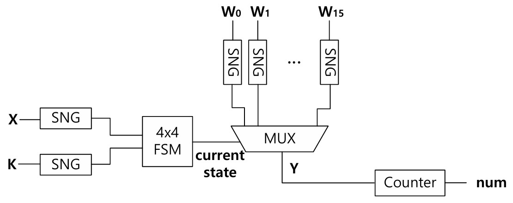
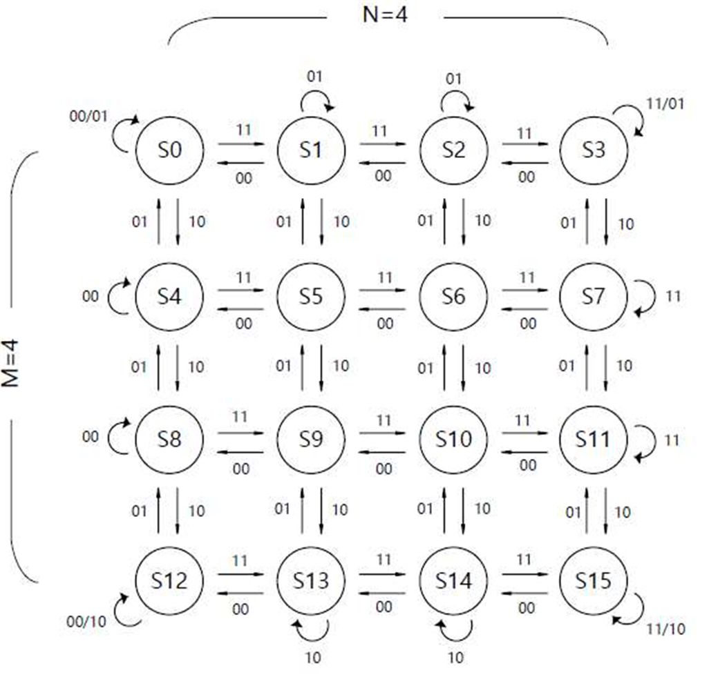

# 2D FSM 기반 Stochastic Computing

**학부연구생 · IEEE TENCON 게재 · 포스터 발표**

> *Practical 2D FSM for Stochastic Computing with Improved Hardware Efficiency and Accuracy*
> Jiho Kim, **Gayoung Kang**, Youngmin Kim — School of Electronics and Electrical Engineering, Hongik University

> 논문 원본은 IEEE 저작권 대상이라 이 저장소에 포함하지 않았습니다. IEEE Xplore에서 확인할 수 있습니다.

**사용 도구** — Verilog HDL · Synopsys Design Compiler (전력 · 면적 측정)

---

## 1. 배경 — Stochastic Computing

값을 비트스트림에서 '1'이 나올 확률로 표현합니다. 길이 N인 비트스트림에서 '1'이 N₁개면 값은 `P = N₁/N`입니다.

이렇게 두면 연산이 극단적으로 단순해집니다. **Unipolar에서 곱셈은 AND 게이트 하나**, bipolar에서는 XNOR 하나로 끝납니다. 덧셈은 MUX 하나입니다.

```
입력값 → SNG(LFSR + comparator) → 확률 비트스트림 → 게이트/FSM 연산 → counter → 출력값
```

병렬성이 높고 하드웨어가 가벼워 뉴로모픽·저전력 응용에 맞지만, **효율과 정확도의 trade-off** 때문에 실제 적용이 어려웠습니다.

## 2. 문제 — 1차원 FSM의 한계

게이트만으로는 sigmoid 같은 비선형 함수를 만들 수 없어 FSM을 씁니다. 그런데 **1차원 FSM은 상태 수에 따라 구현 가능한 함수와 입력 범위가 묶입니다.**

8-state FSM으로는 sigmoid(x)를 직접 구현하지 못하고 **sigmoid(8x)** 형태로 입력 범위를 접어야 합니다. 원래 함수를 얻으려면 추가 비트 연산이 붙고, 그만큼 오차가 더 쌓입니다. 게다가 비트스트림을 순차 처리하는 특성상 오차가 누적되기 쉽습니다.

---

## 3. 제안 구조 — 4×4 2D FSM



입력 X와 별도의 확률 입력 K를 각각 SNG로 변환해 **두 독립 변수로 상태를 전이**시킵니다. X와 K의 조합 4가지에 따라 상태가 옮겨가고, 4×4 = 16개 상태가 MUX의 선택 신호가 되어 가중치 비트스트림 `W₀ ~ W₁₅` 중 하나를 고릅니다. 마지막에 counter로 '1'의 개수를 세어 값을 복원합니다.

두 입력이 독립이므로 **비트스트림 간 상관이 줄고**, 가중치를 상태마다 따로 줄 수 있어 **구현 가능한 함수의 자유도**가 올라갑니다.



M = N = 4로 가로·세로를 맞췄습니다. **sigmoid처럼 0을 기준으로 대칭인 함수에서는 K와 X에 같은 가중치를 주는 것이 정확도에 유리**하기 때문입니다.

`Pk`와 `Pwt` 파라미터는 출력 T(Px)와 실제 값 Py의 오차를 최소화하도록 정했습니다. `Pk`를 [0, 1] 구간에서 0.0001씩 올리며 오차를 계산해 최적점을 찾았습니다. sigmoid(4x)의 경우 `Pk = 0.5`입니다.

---

## 4. 정확도 비교


sigmoid(4x) 구현 결과입니다. 1차원 FSM(검정)은 입력이 −0.5 이하에서 0, 0.5 이상에서 1로 붙어 곡선을 따라가지 못합니다. 제안한 2D FSM(파랑)은 실제 곡선(빨강)에 근접합니다.

8-bit 입력 x에 대해 `Px = X/256`으로 두고 출력 T(Px)를 계산했습니다.

| 상태 수 | FSM 1D | | FSM 2D (N = 4) | |
|---|---|---|---|---|
| | **구현 함수** | MSE / 정확도 | **구현 함수** | MSE / 정확도 |
| 4-state | sigmoid(4x) | 3.64 × 10⁻³ / 56.3 % | sigmoid(4x) | 11.43 × 10⁻³ / 25.8 % |
| 8-state | sigmoid(8x) | 3.16 × 10⁻³ / 74.6 % | sigmoid(4x) | 1.47 × 10⁻³ / 79.3 % |
| **16-state** | sigmoid(16x) | 1.54 × 10⁻³ / 86.7 % | **sigmoid(4x)** | **0.37 × 10⁻³ / 96.5 %** |
| 32-state | sigmoid(32x) | 1.07 × 10⁻³ / 91.8 % | sigmoid(4x) | 0.54 × 10⁻³ / 94.5 % |

정확도는 오차가 ±0.05 이내인 값의 비율입니다.

**표를 세로로 읽으면 1차원 FSM의 구조적 한계가 보입니다.** 1D는 상태를 늘릴 때마다 구현 함수가 sigmoid(4x) → (8x) → (16x) → (32x)로 바뀝니다. 상태 수가 곧 입력 범위를 정해버리기 때문입니다. 반면 2D는 상태 수와 무관하게 **전부 sigmoid(4x)를 구현**합니다.

**2D 16-state(4×4)가 1D 32-state보다 정확합니다.** 상태 수는 절반인데 MSE는 0.37e-3 대 1.07e-3입니다.

---

## 5. 전력·면적 분석

Verilog HDL로 구현하고 Synopsys Design Compiler로 측정했습니다.

| 구성 | Power (mW) | Area (µm²) | Error (MSE) | FoM (P×A×E) |
|---|---:|---:|---:|---:|
| 2×4 (8-state) | 5.28 | 64,001 | 1.47 × 10⁻³ | 498.04 |
| **4×4 (16-state, 제안)** | 9.02 | 108,818 | **0.37 × 10⁻³** | **362.69** |
| 8×4 (32-state) | 16.63 | 198,834 | 0.54 × 10⁻³ | 1,773.50 |

FoM은 전력 × 면적 × 오차로, 낮을수록 좋습니다. 4×4 구성이 2×4 대비 **1.37배**, 8×4 대비 **4.89배** 우수합니다.

**상태를 무작정 늘리면 손해입니다.** 8×4는 4×4보다 면적과 전력이 약 2배인데 오차는 오히려 나빠졌습니다(0.37e-3 → 0.54e-3). 가로·세로 균형(M = N)이 깨지면서 상태 전이가 한쪽으로 쏠린 결과입니다.

---

## 6. 정리

4×4 2D FSM은 **낮은 MSE와 합리적인 전력·면적 사이에서 최적점**을 잡습니다. 하드웨어 자원이 제한된 상태에서 높은 정확도가 필요한 응용 — sigmoid를 쓰는 뉴로모픽 연산 — 에 적합한 구조입니다.

---

[← 학부 과정](../README.md) · [자료 출처](figure-sources.json)
