# On-chip Adaptive Bit/Power Loading

DMT 유선 송수신기의 bit/power loading을 호스트 PC에서 칩 안으로 옮긴 석사 졸업연구입니다. RX가 파일럿으로 부채널 오차를 측정하고, 같은 다이의 로딩 엔진이 비트와 전력을 계산해 TX CONFMEM에 직접 씁니다. SPI 왕복과 PC 연산이 링크업 경로에서 빠집니다.

MATLAB 고정소수점 시뮬레이터 → RTL → RFSoC ZCU111 실시간 검증까지 수행했습니다. Back-end(DC synthesis·PnR)는 진행 전이며, **TSMC 28 nm 공정으로 tape-out 예정**입니다.

**사용 도구** — MATLAB (고정소수점 시뮬레이터 · HDL 자동 생성 · SPI 제어) · VHDL · ModelSim (bit-exact 검증) · Xilinx Vivado · Tcl · RFSoC ZCU111

---

## 1. 시스템 구조

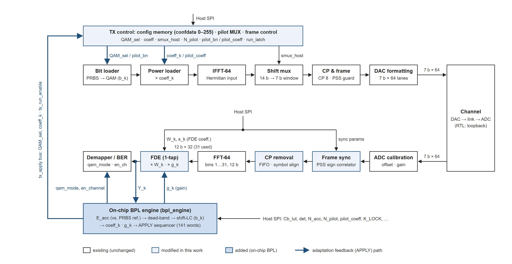

RX의 FDE 출력에서 부채널별 오차에너지를 측정하고, 로딩 엔진이 결정한 비트·전력·수신 이득을 TX/RX 설정 레지스터에 반영합니다. 호스트 SPI 왕복 없이 다이 내부에서 닫히는 경로입니다.

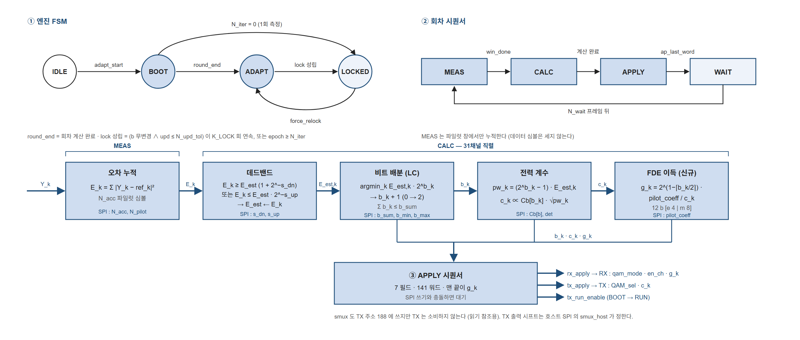

엔진은 측정(`bpl_snr_meas`) → 로딩 계산(`bpl_lc`/`bpl_coeff`) → 적용·상태 판단(`bpl_ctrl`/`bpl_adapt`)으로 구성됩니다.

### off-chip 대비

| | off-chip (host) | on-chip (pilot 기반) |
|---|---|---|
| 측정 | QAM-4 pilot, 링크업 시 1회 | QAM-4 pilot, frame마다 연속 |
| 계산 | 호스트 PC (float) | 칩 내부 정수 연산 (shift / compare / isqrt 1개) |
| 로딩 전달 | SPI writeback | on-die: RX engine → TX CONFMEM |
| 재측정 | 없음 (1회성) | 주기적 자동 |
| 호스트 의존 | 필요 | 불필요 |

관측하는 물리량은 선형 SNR로 동일합니다. 차이는 측정 정확도가 아니라 **호스트 없이 · 빠르게 · 계속** 본다는 점입니다.

---

## 2. 정수 연산 기반 측정 → 결정 체인

나눗셈·로그·LUT 없이 shift와 비교만으로 구현했습니다.

**측정** — `E_acc[48b] = Σ|fdeX − ref|²`
프레임당 pilot 8 symbol을 누적하고 누산기를 프레임 경계에서 초기화하지 않습니다. 112 frame(896 symbol)을 모아 `win_full`에서 한 번만 결정합니다. 8 symbol만으로 결정하면 σ = 1.32 dB로 dead-band 문턱(0.51 dB)보다 커져 측정잡음을 추종합니다.

**Dead-band** — 비교기 2개 + SPI 상수로 비대칭 문턱을 둡니다.

| 방향 | 조건 | 문턱 | 동작 |
|---|---|---|---|
| 나빠짐 | E ≥ E_est · (1 + 2⁻³) | +0.51 dB | 즉시 반영 |
| 좋아짐 | E ≤ E_est · 2⁻² | −6.02 dB | 그때만 반영 |

채널이 변하지 않으면 로딩도 변하지 않습니다. 대칭 문턱보다 BER과 data rate 모두 유리해 이 방식을 택했습니다.

**Bit loading (shift-LC)** — 다음 비트의 추가 전력이 `E · 2^b`이므로 정수에서는 `E << b` 한 번입니다. `argmin(E << b)` 채널에 +1 비트를 주고 그 채널 가격을 `<<1` 합니다.

**Power coefficient** — `pw = (E<<b) − E [56b]`, `rt = ⌊√pw⌋` (자리별 정수 sqrt, 31채널이 1개를 시분할), `amp = C_b(b) · rt`. 환산 상수 K는 설계 상수라 PC가 √K를 `C_b`에 넣어 SPI로 씁니다. 칩 안에 K가 없습니다.

**Lock 판정** — `stable = (b_n 무변경) AND (upd ≤ N_upd_tol)`. stable이 연속 `K_LOCK(=4)`회면 FSM이 ADAPT → LOCKED로 갑니다. 수렴 실패 대비로 watchdog을 둡니다.

**APPLY** — CONFMEM 110 word (TX 48: QAM_sel I/Q ×16, coeff ×31, shift_mux ×1 / RX 62: qam_mode ×31, en_channel ×31)

### RTL 신호 폭

| 신호 | 폭 | 근거 |
|---|---:|---|
| `E_acc` | 48b | 관측 최대 7.13e7 (27b), 여유 3.9e6배 |
| `E << b` | 56b | 48b + b_max 8 |
| `pw` | 56b | 2⁵⁶−1 포화 |
| `isqrt(pw)` | 18b | 관측 ~16b |
| `√K` | 16b | Ksint = 19,672 |
| `C_b` | 14b | b=2 항목 13,910 |
| `coeff` | 7b | = N_bit_DAC, 이진소수점 = 7 − shift_mux_sel |
| `shift_mux_sel` | 3b | 31채널 공유 지수 |

---

## 3. 프레임 구조와 TX FSM

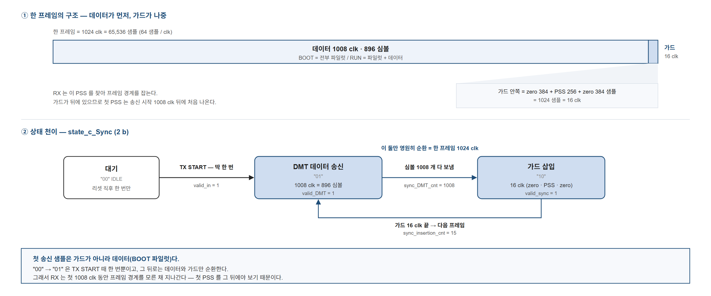

한 프레임 = 1024 clk = 65,536 sample. `zeros1(384) + SS(256) + zeros2(384) + Pilot(8×72 = 576) + DMT symbol(888×72 = 63,936)` 구성입니다. Pilot이 8의 배수인 이유는 1 symbol(72 sample)과 64-way 경계의 최소공배수가 576 sample이기 때문입니다. Framing overhead는 1,600 / 65,536 = **2.44 %** 입니다.

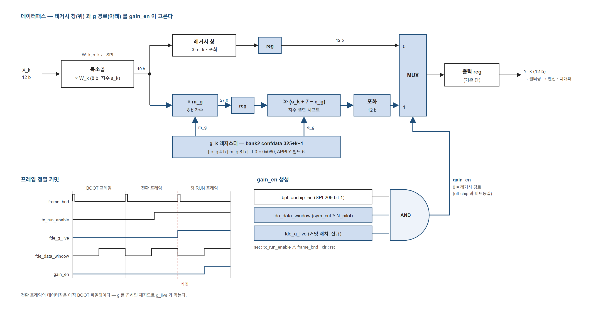

FDE 이득단 데이터패스입니다. 레거시 경로와 g 경로를 `gain_en`으로 고릅니다. `gain_en`이 0이면 off-chip 동작과 비트 단위로 동일합니다. 전환 프레임의 데이터창은 아직 BOOT 파일럿이므로 `fde_g_live` 커밋 래치로 막습니다.

---

## 4. MATLAB 고정소수점 시뮬레이터

`simDMT_64_64way_SL_BPL_adaptive.m`. 공통 조건: SER 목표 1e-4, K_LOCK = 4, s_dn = 3, s_up = 2, clk 500 MHz, iteration마다 AWGN realization 변경.

### 4.1 평탄 채널 — 16 dB thru

| 항목 | 값 |
|---|---|
| Data rate | 65.04 Gb/s |
| mean BER | 3.04e-04 |
| Lock | iteration 4 |

<table>
<tr>
<td width="50%">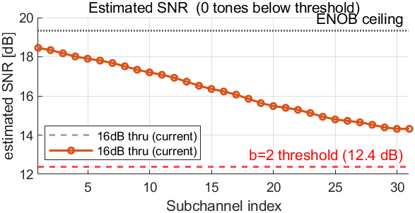</td>
<td width="50%">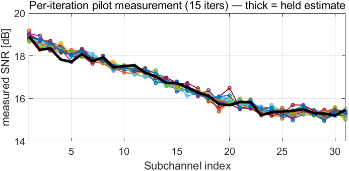</td>
</tr>
<tr>
<td>부채널별 추정 SNR. 문턱 아래로 내려간 톤 0개.</td>
<td>iteration마다 측정값은 흔들리지만 dead-band가 굵은 선(held estimate)을 유지합니다.</td>
</tr>
</table>

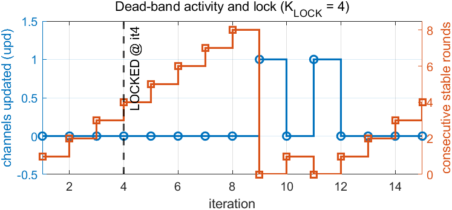

갱신 채널 수와 연속 stable 회차. iteration 4에서 LOCKED입니다.

### 4.2 Notch 채널 — CableBKP 16 dB, 0.995 m (S21)

| 항목 | 값 |
|---|---|
| Data rate | 40.76 Gb/s |
| mean BER | 3.39e-04 |
| Lock | iteration 4 |

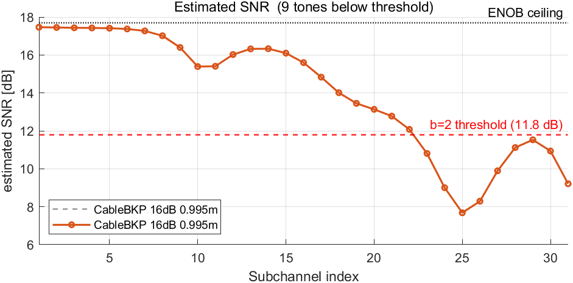

SNR이 문턱 아래인 톤이 9개입니다. 해당 부채널에는 비트를 할당하지 않습니다.

<table>
<tr>
<td width="50%">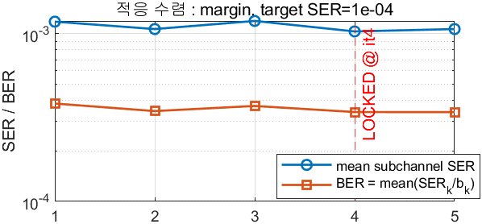</td>
<td width="50%">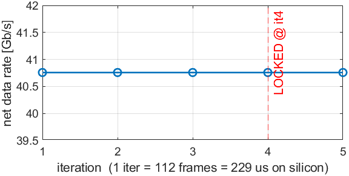</td>
</tr>
<tr>
<td>적응 수렴 — 부채널 평균 SER과 BER.</td>
<td>순 data rate. lock 이후 변동 없음.</td>
</tr>
</table>

### 4.3 FXP 골든 출력 — RTL 대조 기준

RTL을 bit-exact로 맞출 기준이 되는 고정소수점 시뮬레이터의 최종 출력입니다. `SimulationFigure/loopback_onchip/`, loopback 조건 · on-chip 엔진 모드.

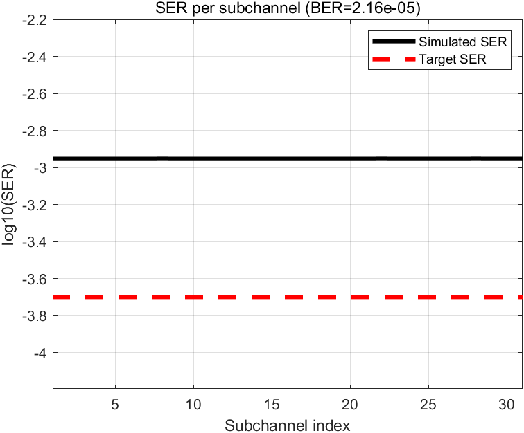

31개 부채널의 SER이 균일합니다. 목표 SER 선(빨강)보다는 위에 있으나, 비트당 오류율 기준 **BER = 2.16e-05**로 목표 1e-4를 만족합니다.

<table>
<tr>
<td width="50%">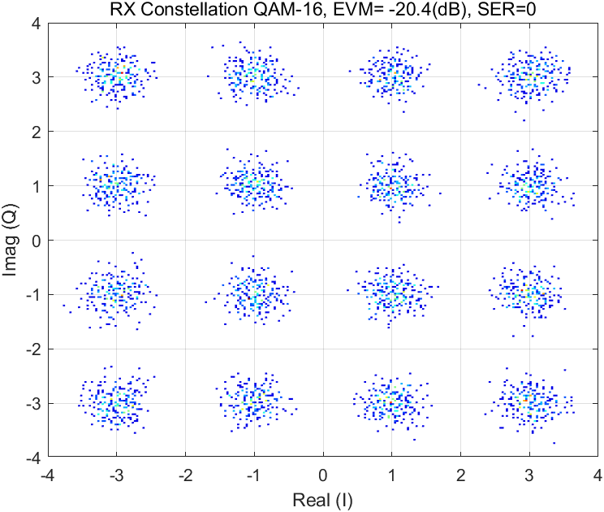</td>
<td width="50%">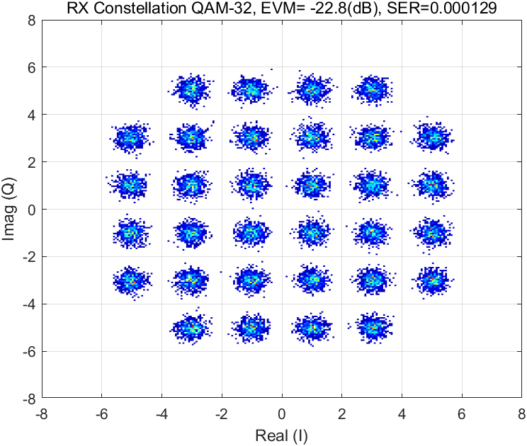</td>
</tr>
<tr>
<td><b>QAM-16</b> — EVM −20.4 dB, 관측 구간 내 심볼 오류 0</td>
<td><b>QAM-32</b> — EVM −22.8 dB, SER 1.29e-04</td>
</tr>
</table>

---

## 5. On-chip과 off-chip 로딩 결과 비교

16 dB 채널, DAC/ADC ENOB = 5.0, 31 부채널 조건에서 비교했습니다.

### Margin-adaptive — 결과 일치

<table>
<tr>
<td width="50%">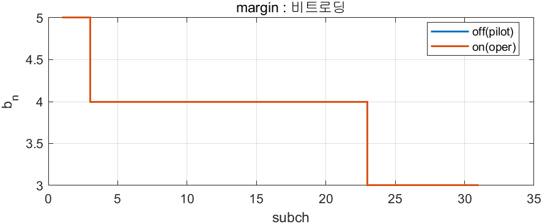</td>
<td width="50%">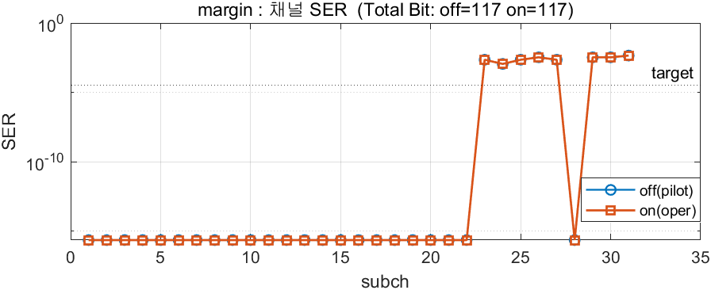</td>
</tr>
<tr>
<td>부채널별 할당 비트. 두 곡선이 겹칩니다.</td>
<td>부채널별 SER. Total bit off = 117, on = 117.</td>
</tr>
</table>

Margin-adaptive는 부채널 SNR의 순위만 쓰므로, on-chip 엔진이 수렴한 뒤 상태에서 off-chip과 비교하면 비트·전력 할당과 SER이 동일합니다.

### Rate-adaptive — data rate / BER trade-off

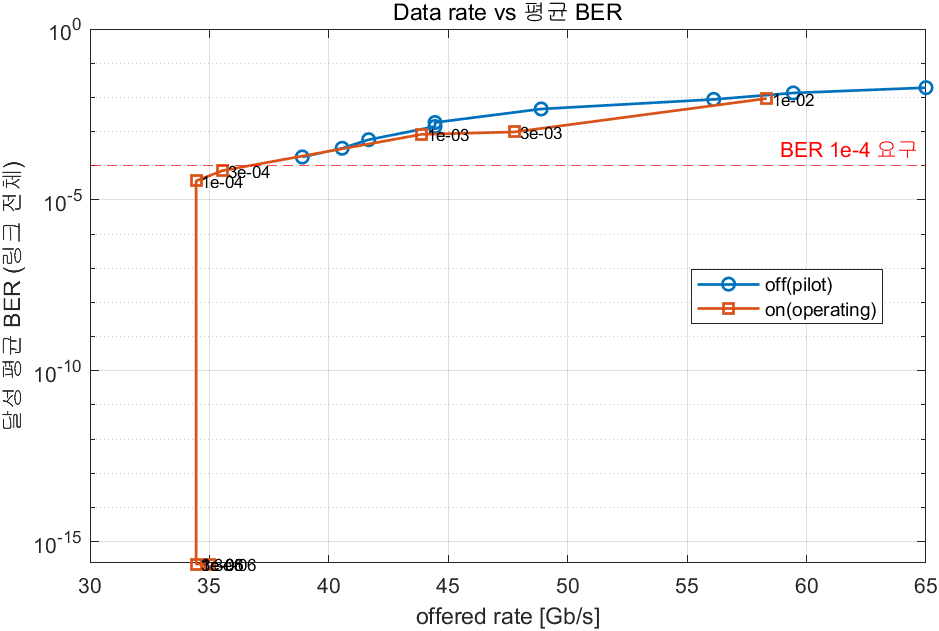

target SER을 sweep하며 달성 data rate를 비교했습니다. 평균 BER 기준으로 두 방식의 성능은 비슷합니다. Rate-adaptive는 절대 SNR을 쓰므로 off-chip은 QAM-4 파일럿만 보고 낙관적으로 과배정할 수 있고, 그 경우 일부 채널의 BER이 올라갑니다.

ENOB = 5.0에서 BER 1e-4를 만족하는 data rate 상한은 **36 Gb/s** 입니다.

---

## 6. RTL 검증

RX 계층에 `bpl_engine_lane`을 추가했습니다.

```
genHDL_RX_DMT_BPL_V1                      RX DSP 본체
 ├ adc_delay_calibration → adc_calibration
 ├ top_ctrl                                sign FIR + 동기
 ├ fifo_cp_removal → psfft → fdeX
 ├ cross_sign_lms                          FDE 계수 적응
 ├ constellation_scanner / ber_counter     측정기
 └ bpl_engine_lane                         on-chip BPL 엔진 (신규)
```

MATLAB에서 VHDL을 생성하고 ModelSim에서 FXP 골든과 계층별 bit-exact로 대조했습니다.

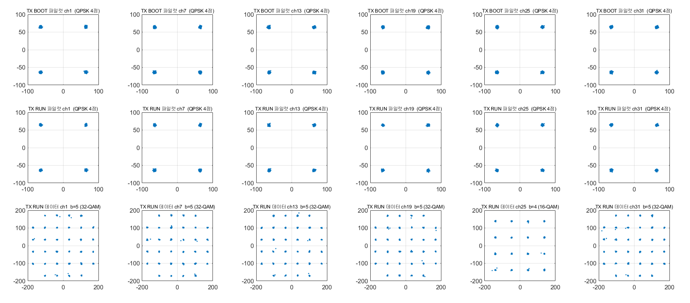

TRX 통합 검증. 위: BOOT 구간 QAM-4 파일럿. 가운데: RUN 구간 파일럿. 아래: RUN 구간 데이터 — 부채널별로 엔진이 결정한 차수(ch1·7·13·19·31은 b=5 32-QAM, ch25는 b=4 16-QAM)가 실제 송신 심볼에 반영되어 있습니다.

TX APPLY가 지시한 `b_n`과 RUN 심볼에서 역으로 추정한 `b_n`을 31개 부채널 전부 대조해 일치를 확인했습니다. 로딩 결정이 실제 송신에 반영되는 폐루프가 닫혔습니다.

---

## 7. RFSoC ZCU111 실시간 검증

`main_fpga_TRX_SPI_*` 스크립트로 보드에서 엔진을 구동하고 SPI로 상태를 읽었습니다.

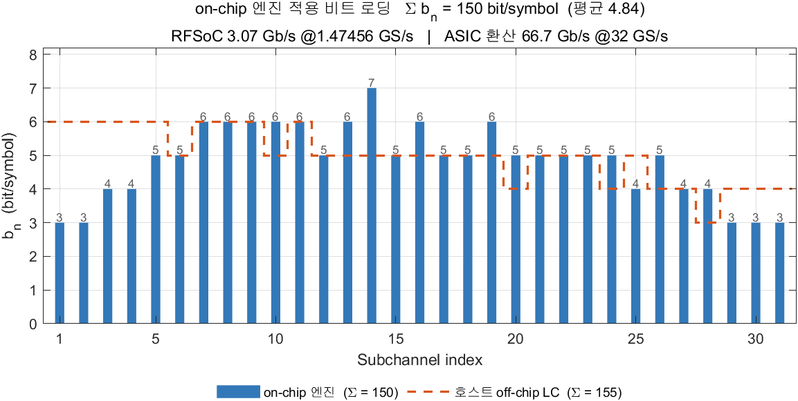

**보드 실측.** on-chip 엔진이 적용한 비트 로딩(막대)과 호스트 off-chip LC(점선)의 비교입니다. Σb_n = **150** bit/symbol(평균 4.84) 대 off-chip 155로, 부채널별 분포는 다르지만 총 비트는 3 % 이내입니다. RFSoC 동작 속도 기준 3.07 Gb/s @1.47456 GS/s이며, ASIC 샘플레이트 32 GS/s로 환산하면 66.7 Gb/s입니다.

### Constellation scanner — QAM 차수별 실측

`main_fpga_RX_SPI_constellation_scanner_BPL_fast.m`로 FDE 출력을 읽어 부채널별 성상을 복원했습니다. 엔진이 배정한 차수 그대로 관측됩니다. 엔진이 유일하게 7 bit를 준 ch14가 128-QAM으로 나타납니다.

<table>
<tr>
<td width="50%">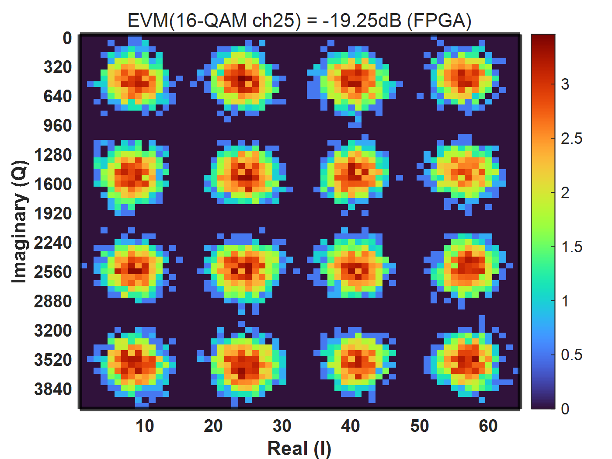</td>
<td width="50%">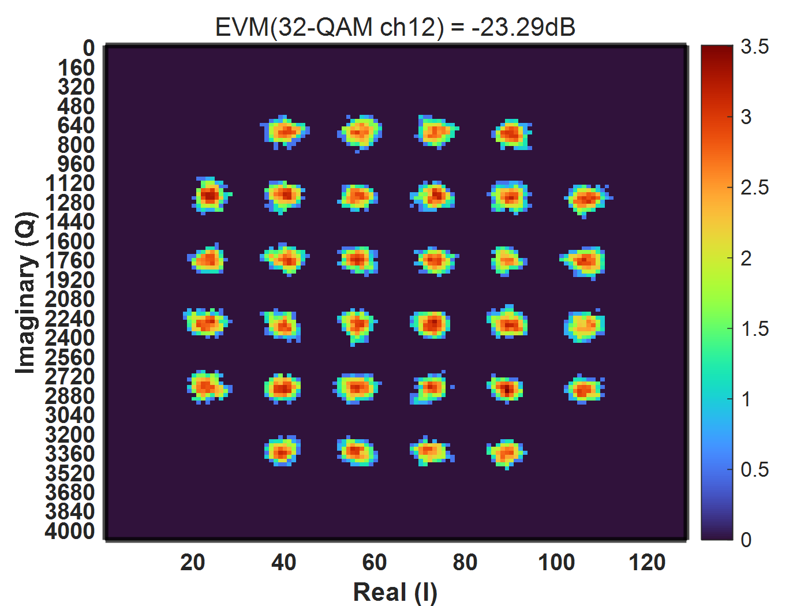</td>
</tr>
<tr>
<td><b>16-QAM · ch25</b> — EVM −19.25 dB</td>
<td><b>32-QAM · ch12</b> — EVM −23.29 dB</td>
</tr>
<tr>
<td>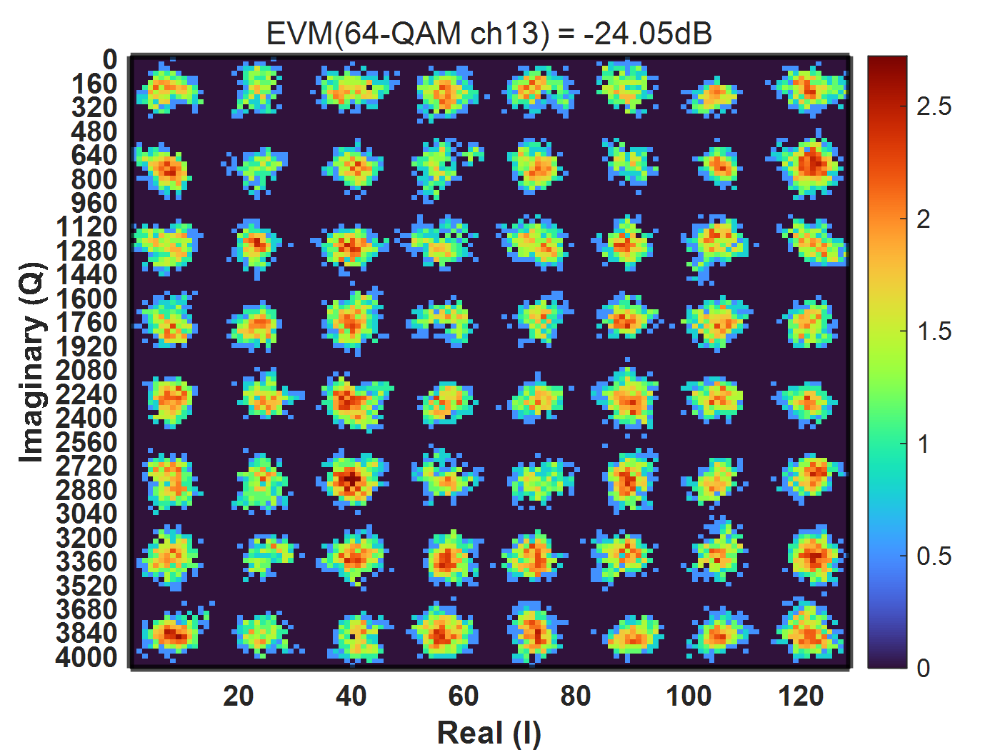</td>
<td>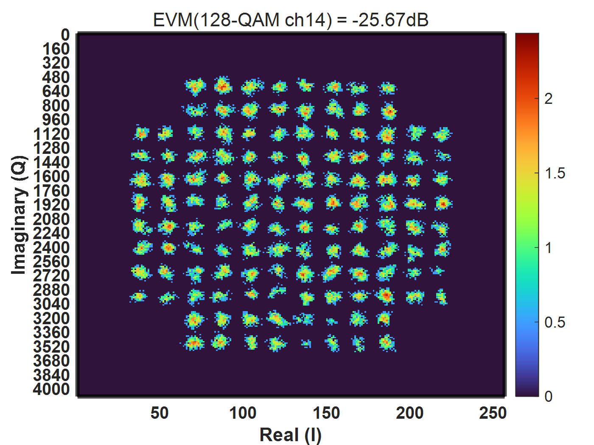</td>
</tr>
<tr>
<td><b>64-QAM · ch13</b> — EVM −24.05 dB</td>
<td><b>128-QAM · ch14</b> — EVM −25.67 dB</td>
</tr>
</table>

차수가 높은 부채널일수록 EVM이 좋습니다. 엔진이 SNR이 좋은 부채널에 높은 차수를 배정한 결과이며, 로딩 결정이 실제 링크 품질과 일치한다는 확인입니다.

---

## 8. 진행 상태

| 단계 | 상태 |
|---|---|
| MATLAB 고정소수점 시뮬레이터 | 완료 |
| RTL 설계 및 ModelSim bit-exact 검증 | 완료 |
| RFSoC ZCU111 실시간 검증 | 완료 — 엔진 동작 및 16/32/64/128-QAM 성상 확인 |
| DC synthesis · PnR | 진행 전 |

해당 BPL 설계의 최종 layout은 아직 없습니다. 다른 IP의 28 nm PnR 결과와 구분합니다.

---

## 관련 페이지

- [RFSoC 하드웨어 검증 과정](../RFSoC/README.md)
- [KETI DMT Transceiver](../KETI/README.md)

## 자료 출처

모든 figure는 `On-Chip Adaptive BPL_강가영_발표자료.pptx`(2026-09-11)와 `figures_thesis/`(2026-09-04 ~ 09-06)에서 가져왔습니다. 슬라이드 번호와 원본 경로는 [`figure-sources.json`](figure-sources.json)에 기록했습니다.

---

[← 석사 연구](../README.md)
