# TSMC 28 nm Back-end Flow 실습

**DC Synthesis → PnR → Sign-off → Post-simulation**

[KETI DMT TRX](../KETI/README.md)의 PnR과 PCB는 외주로 진행됐습니다. 그런데 **업체와 제대로 소통하려면 제가 그 흐름을 알아야** 했습니다. 넘겨줄 RTL의 제약을 어떻게 잡아야 하는지, 핀을 어디에 둘 것인지, 타이밍 위반이 나면 어느 단계에서 막힌 것인지를 알고 요청해야 하기 때문입니다.

그래서 **32-tap FFT를 예제로 삼아 back-end 전 과정을 직접 돌려봤습니다.**

**사용 도구** — Synopsys Design Compiler · Formality · PrimeTime · IC Compiler · StarRC · Siemens Calibre · Cadence Virtuoso · ModelSim · Tcl · MATLAB

| | |
|---|---|
| 대상 설계 | `fft32_in7_w8_inter18_out11_pin.vhdl` — 32-tap FFT |
| 공정 | TSMC 28 nm |
| 합성 목표 | 2 GHz |

---

## 전체 흐름

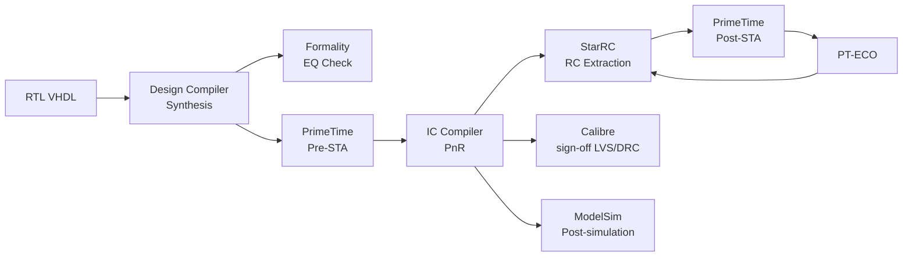

---

## 1. Synthesis — Design Compiler

`.synopsys_dc.setup` → `common_setup.tcl` → `dc_setup.tcl` → `cons.tcl` → `dc.tcl` 순으로 스크립트를 구성했습니다.

**제약 작성에서 배운 것**

| 항목 | 내용 |
|---|---|
| `create_clock` | 주기를 직접 쓰지 않고 speed 변수를 두고 참조. 클럭이 여러 개면 도메인마다 제약을 따로 잡고, 파생 클럭은 `create_generated_clock`으로 연결 |
| `set_input_delay` / `set_output_delay` | 입력이 클럭과 동기되기까지의 시간. transition 속도는 driving cell이 결정 |
| `set_driving_cell` / `set_load` | 입력을 구동하는 셀과 출력이 보는 부하. 입력마다 다르게 줄 수 있음 |

RTL이 VHDL이므로 `dc.tcl`의 `analyze` 대상 언어를 Verilog에서 VHDL로 바꿔야 했습니다.

## 2. EQ Check — Formality

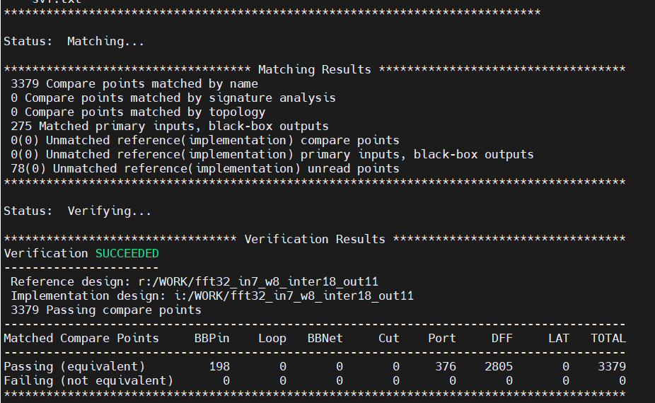

합성 전 RTL과 합성 후 netlist가 논리적으로 같은지 확인합니다. DC가 만든 `.svf`를 guide로 넣고, Ref(RTL) ↔ Impl(netlist)을 각각 읽어 verify합니다. **3,379개 compare point가 모두 통과**했습니다.

## 3. Pre-STA — PrimeTime

`report_analysis_coverage`를 보면 **DC에서는 보이지 않던 hold violation이 나타납니다.** DC 단계에서는 배선 지연을 이상적으로 가정하기 때문입니다. hold는 PnR 이후 실제 배선이 들어가야 제대로 볼 수 있으므로, 여기서는 존재만 확인하고 넘어갑니다.

---

## 4. PnR — IC Compiler

`00 read design` → `01 floorplan` → `02 powerplan` → `03 place_opt` → `04 clock_opt_cts` → `06 route` → `07 route_opt` → `08 chip_finish` → `09 write_data` → `10 pt_eco` 순으로 진행했습니다.

### 4.1 Floorplan

<table>
<tr>
<td width="50%">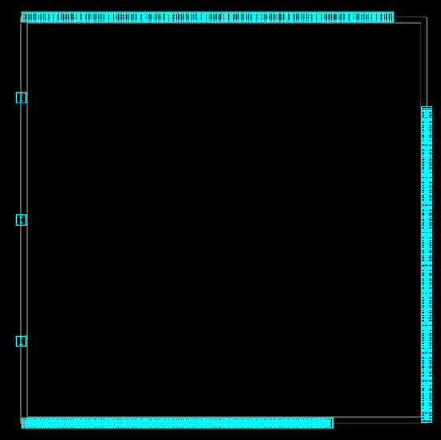</td>
<td width="50%">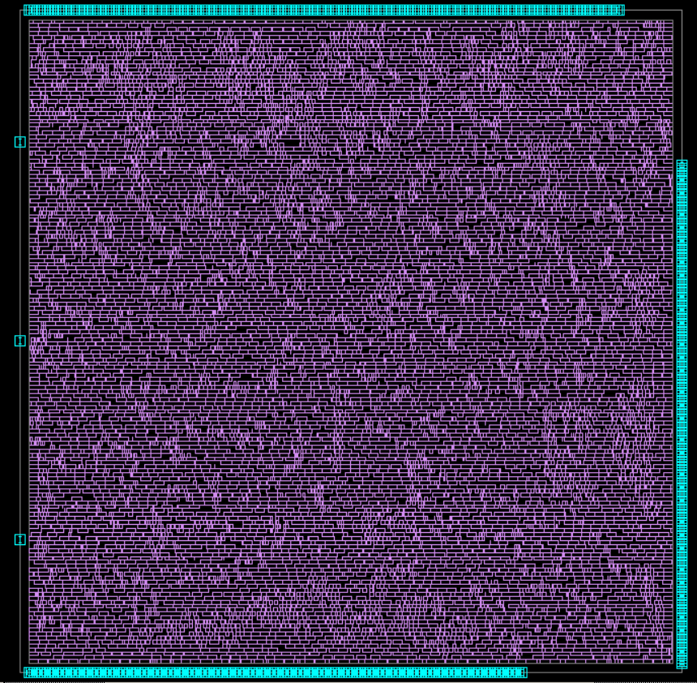</td>
</tr>
<tr>
<td><b>Floorplan</b> — core boundary와 IO/pin 영역 사이에 margin 2를 뒀습니다. 핀을 access·route할 공간이 필요하기 때문입니다.</td>
<td><b>Placement</b> — 초기 배치 후 end cap 삽입, 지정 간격(distance 15)마다 tap cell 삽입.</td>
</tr>
</table>

**핀 배치는 혼자 정할 수 없습니다.** 이 블록에 연결되는 쪽과 논의해서 side를 정하고, `genTDF_pin_fft32.m`로 TDF 파일을 자동 생성했습니다. **외주 업체와 소통할 때 실제로 협의해야 하는 지점**이 여기라는 것을 확인했습니다.

`core utilization`은 core를 얼마나 빽빽하게 채울지 정합니다. 높을수록 면적은 줄지만 PnR이 어려워집니다.

### 4.2 Power plan

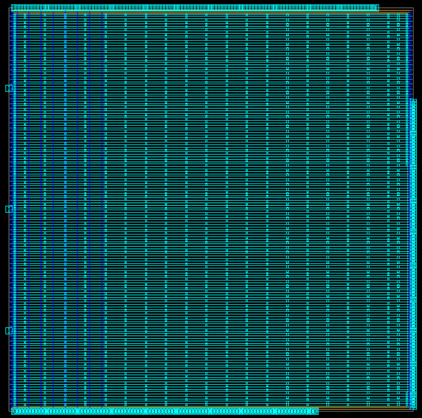

Power ring을 만들고 그 위에 power strap을 깔았습니다.

처음에는 `create_power_straps`를 경계 기준 offset으로 줬더니 **floating net이 있다는 오류**가 났습니다. `-within` 옵션으로 영역을 명시해 해결했습니다.

### 4.3 Congestion 확인

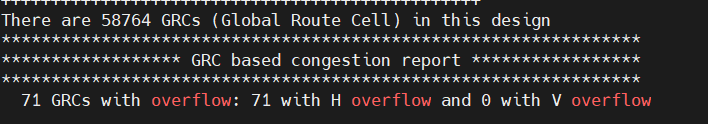

GRC(Global Route Cell) 기반 congestion report를 봅니다. overflow가 난 GRC는 그 영역의 routing demand가 capacity를 넘었다는 뜻입니다. **58,764개 GRC 중 71개에서 horizontal overflow**가 나왔습니다.

### 4.4 Route

<table>
<tr>
<td width="55%">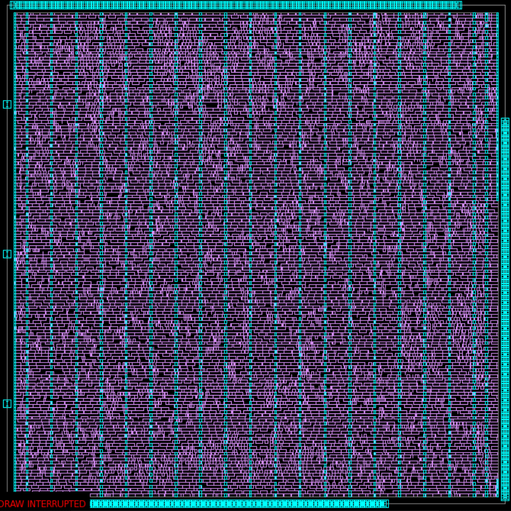</td>
<td width="45%">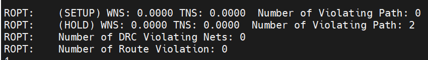</td>
</tr>
<tr>
<td>route와 route_opt를 거쳐 antenna violation과 DRC를 수정했습니다.</td>
<td>setup·hold 모두 <b>WNS 0.0000 / TNS 0.0000</b>, violating path 0. DRC violating net도 0.</td>
</tr>
</table>

### 4.5 Chip finish

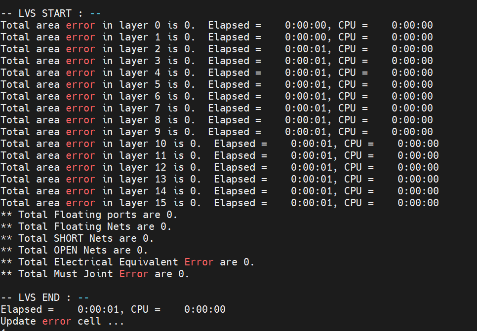

ICC 내장 LVS에서 **error 0**으로 통과했습니다. 여기서 나오는 `.sim.v`를 post-simulation에 씁니다. GDS는 physical cell 포함 여부에 따라 depth를 나눠 저장했습니다.

---

## 5. RC Extraction과 Post-STA

`chip_finish` 이후 StarRC로 기생 성분을 추출해 SPEF를 만들고, `chip_finish.sdc`와 함께 PrimeTime에 넣어 slack을 다시 봅니다.

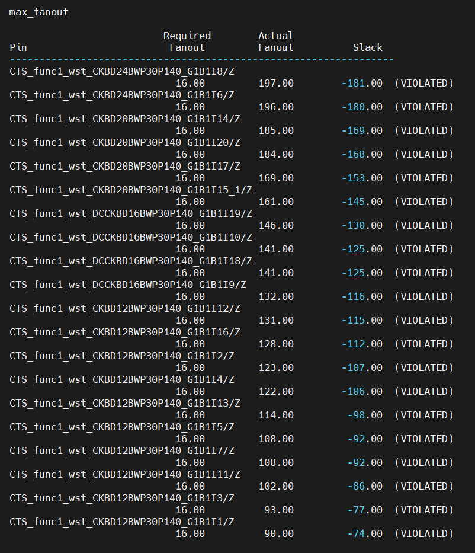

**ICC에서는 보이지 않던 위반들이 여기서 드러납니다.** 실제 배선의 RC가 반영되기 때문입니다. hold violation 5개와 max_fanout 위반이 나왔습니다.

### PT-ECO

PrimeTime의 `fix_eco_timing`으로 수정안을 뽑아 `eco_changes.tcl`로 쓰고, ICC에서 `pt_eco.tcl`로 반영한 뒤 다시 StarRC → PrimeTime을 돌리는 것을 반복했습니다.

- best corner에서 hold를, worst corner에서 setup을 확인 — **한쪽을 고치면 다른 쪽이 깨질 수 있으므로 양쪽을 번갈아 봐야 합니다.**
- 마지막 hold violation 1개는 자동 수정이 되지 않아, 해당 경로의 setup margin이 충분한지 확인한 뒤 **버퍼를 수동으로 1개 삽입**하고 `eco_changes.tcl`에 직접 반영했습니다.
- ECO가 반영되지 않는 오류가 나는 경우도 있었는데, 면적이 부족해 셀을 넣을 자리가 없는 것이 원인일 수 있습니다.

---

## 6. Sign-off와 Layout merge

ICC 내장 LVS는 sanity check이므로, **Calibre로 sign-off LVS/DRC**를 따로 돌렸습니다. `write_data.lvs.v`의 top module에 VDD/VSS가 선언되지 않은 경우가 있어 port와 input에 추가한 뒤 merge했습니다.

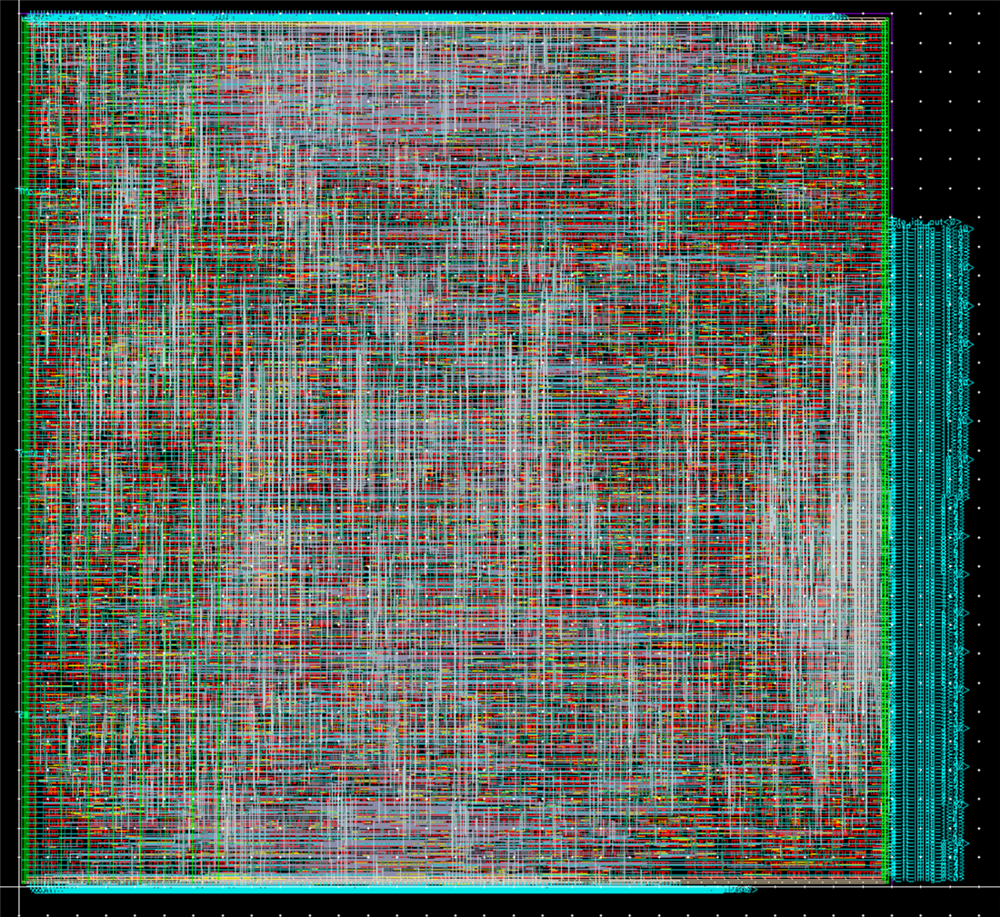

Virtuoso로 GDS를 stream import하고, power ring에 VDD/VSS 라벨을 붙였습니다. Verilog `lvs.v`를 불러올 때는 **TSMC 28 nm standard cell 라이브러리를 reference library에 반드시 넣어야** 합니다.

---

## 7. Post-simulation

`chip_finish`가 만든 `.sim.v`와 표준 셀 모델을 물려 ModelSim에서 게이트 레벨 시뮬레이션을 돌렸습니다. ECO 전후로 각각 수행했습니다.

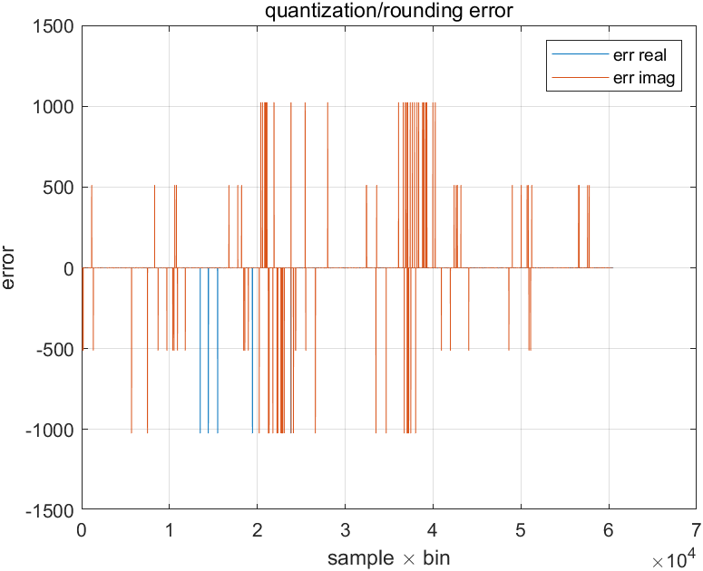

FFT 출력의 양자화·반올림 오차를 실수부·허수부로 나눠 확인했습니다. RTL 시뮬레이션 결과와 대조해 게이트 레벨에서도 같은 값이 나오는지 봤습니다.

> DC 합성은 2 GHz로 진행했는데, post-sim에서 1 GHz 조건 확인이 남아 있습니다.

---

## 8. MATLAB 기반 흐름 자동화

위 과정은 단계마다 스크립트를 고치고 서버에 올리고 결과를 받아오는 반복 작업입니다. 이를 **MATLAB 하나로 오케스트레이션**하도록 만들었습니다. (`main_fft32_DC_ICC_flow.m`)

| 단계 | 자동화 내용 |
|---|---|
| 1. genHDL & SIM | MATLAB에서 VHDL 자동 생성 → 서버 업로드 → ModelSim 시뮬레이션 |
| 2. DC Synthesis | target frequency를 인자로 받아 SYN 스크립트 생성·업로드 → 합성 → 리포트 다운로드 |
| 3. Formality | 합성 netlist EQ check |
| 4. PnR | DC 합성 결과로 die w/h와 area를 정하고 TDF·PnR 스크립트 생성·업로드 |
| 5. STA | StarRC·PrimeTime 실행, best/worst 결과 다운로드 후 MATLAB에서 분석. 위반 시 PT-ECO iteration |
| 6. Post-sim | ECO 전후 게이트 레벨 시뮬레이션 |

RTL 생성부터 back-end까지 한 흐름으로 묶어, **파라미터를 바꿔 가며 면적·타이밍을 비교**할 수 있게 했습니다.

---

## 정리

이 실습으로 얻은 것은 **어느 단계에서 무엇이 결정되고, 무엇이 그 다음 단계로 넘어가는지**에 대한 감각입니다.

- DC에서는 보이지 않던 hold가 Pre-STA에서, Pre-STA에서 보이지 않던 위반이 StarRC 이후 Post-STA에서 나타납니다. **위반이 언제 드러나는지 알아야 어느 단계로 되돌아갈지 판단할 수 있습니다.**
- 핀 배치와 core utilization은 혼자 정하는 값이 아니라 **연결되는 쪽·외주 업체와 협의해야 하는 값**입니다.
- best/worst corner를 번갈아 봐야 하고, 자동 ECO가 실패하면 수동 개입이 필요합니다.

---

[← 석사 연구](../README.md)
