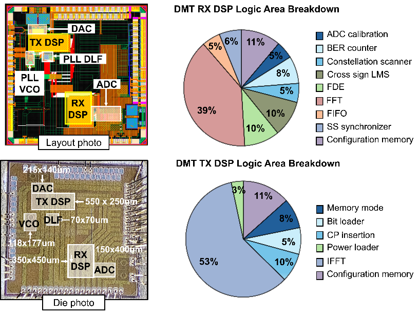

# Gayoung Kang — Circuit and System Design

고속 유선 통신 DSP의 알고리즘 설계부터 RTL 구현, FPGA 실시간 검증, 실칩 측정까지. 그리고 아날로그 회로 설계와 full-custom layout.

> 비공개 검토본. 공동 연구 결과와 개인 기여를 구분해 표기하며, 일부 측정 조건은 확인 중입니다.

 

## 📂 [석사 과정](masters/README.md) — DGIST CASSP Lab

| 프로젝트 | 분야 | 대표 결과 |
|---|---|---|
| [KETI DMT Transceiver](masters/keti/README.md) | 14 nm FinFET · 설계 → tape-out → 실측 | loopback **51 Gb/s** · 551 mW |
| [On-chip Adaptive Bit/Power Loading](masters/adaptive-bpl/README.md) | 졸업연구 · 시뮬레이터 → RTL → FPGA | FXP BER **2.16 × 10⁻⁵** |
| [광대역 칩간 인터페이스](masters/samsung-nrf/README.md) | 삼성미래기술 · NRF · TSMC 28 nm | 디코더 ON/OFF **BER 300배** |
| [RFSoC 하드웨어 검증](masters/rfsoc/README.md) | ZCU111 · 단계별 검증 방법론 | 최대 **128-QAM** 성상 확인 |
| [Mixed-Signal 회로 설계](masters/mixed-signal/README.md) | 수업 프로젝트 · 28 nm | LC VCO FoM **186.68 dBc/Hz** |

<table>
<tr>
<td width="50%"></td>
<td width="50%"></td>
</tr>
<tr>
<td>14 nm FinFET DMT TRX — chip layout과 die</td>
<td>On-chip Adaptive BPL — 다이 내부에서 닫히는 피드백 루프</td>
</tr>
</table>

 

---

## 📂 [학부 과정](undergraduate/README.md) — 홍익대학교 전자전기공학부

| 프로젝트 | 분야 | 대표 결과 |
|---|---|---|
| [Regulated-Supply 8-Phase Ring VCO](undergraduate/ring-vco/README.md) | 아날로그 · CMOS 90 nm | supply ripple **100 mV → 6.27 mV** |
| [2D FSM 기반 Stochastic Computing](undergraduate/stochastic-computing/README.md) | 디지털 · 학부연구생 | FoM **1.37× 개선** · IEEE TENCON |
| [LEGv8 ARM CPU EX단 최적화](undergraduate/legv8-cpu/README.md) | 디지털 · 45 nm | EX stage **6.71 → 4.88 ns** |
| [1-bit Full Adder Layout](undergraduate/full-adder-layout/README.md) | Layout · CMOS 90 nm | 6.8 × 4 µm² |
| [2-Stage Cascode Amplifier](undergraduate/amplifier-design/README.md) | 아날로그 · 이산소자 | 목표 gain 51 → 실측 **51.0** |
| [DGIST 연구 인턴](undergraduate/dgist-internship/README.md) | PCB · full-custom | Ring OSC **PEX 9.35 → 4.75 GHz** |

<table>
<tr>
<td width="50%"></td>
<td width="50%"></td>
</tr>
<tr>
<td>Regulated-Supply 8-Phase Ring VCO — CMOS 90 nm</td>
<td>Ring Oscillator full-custom layout — TSMC 28 nm</td>
</tr>
</table>

 

---

## 📄 [논문 · 발표](publications/README.md)

| 제목 | 발표 | 상태 |
|---|---|---|
| *Approximation of Cross Correlation for Energy-Efficient Synchronization of DMT Wireline Transceivers* | 2025 IEEE ICCE-Asia | 발표 완료 |
| *A 51 Gb/s DAC/ADC-Based DMT Wireline Transceiver Datapath in 14 nm FinFET* | IEEE ISSCC 2027 투고 | 심사 중 |
| *Practical 2D FSM for Stochastic Computing with Improved Hardware Efficiency and Accuracy* | IEEE TENCON | 게재 · 포스터 발표 |
| *Mitigating Data Hazards in LEGv8 ARM Processor Using GASU* | 2024 반도체공학회 하계학술대회 | 발표 완료 |

 

---

## 사용 도구 · 언어

| 분류 | 도구 | 사용한 프로젝트 |
|---|---|---|
| **언어** | VHDL | KETI DMT TRX, On-chip BPL, 3L4W 인터페이스 |
| | Verilog HDL | 2D FSM Stochastic Computing, LEGv8 ARM CPU |
| | MATLAB | 전 과제 — 고정소수점 시뮬레이터, HDL 자동 생성, SPI 제어, 결과 분석 |
| **RTL 검증** | ModelSim | KETI, On-chip BPL, 3L4W — FXP 모델과 bit-exact 대조 |
| | Xilinx Vivado | RFSoC 구현·ILA 캡처, LEGv8 CPU RTL 시뮬레이션 |
| **논리 합성** | Synopsys Design Compiler | KETI TRX, 2D FSM, LEGv8 CPU (Nangate 45 nm) |
| **커스텀 회로** | Cadence Virtuoso | LC VCO · BGR · CP-PLL (28 nm), Ring VCO (90 nm), Ring OSC (TSMC 28 nm) |
| | Spectre ADE | transient · AC · S-parameter · PSS · pnoise · parametric sweep |
| | HSPICE | Ring VCO |
| | OrCAD PSpice | 2-stage cascode amplifier |
| **Layout · 검증** | Cadence Virtuoso Layout | TSMC 28 nm Ring Oscillator |
| | Siemens Calibre | DRC · LVS · PEX (TSMC 28 nm) |
| | Microwind | CMOS 90 nm full adder — λ 기반 layout |
| **PCB** | Altium Designer | RF up/down converter 보드 (schematic · layout · DFM/DRC) |
| **FPGA 플랫폼** | RFSoC ZCU111 / ZCU208 | DMT TRX 실시간 검증, 2보드 칩간 통신 |
| **측정 장비** | Keysight M8196A AWG | 14 nm DMT TRX 실칩 측정 |
| | VSG25A | 2보드 외부 클럭 동기화 |

 

## 다루는 범위

| | |
|---|---|
| **알고리즘 · 모델링** | 고정소수점 시뮬레이터, bit/power loading, 상관 잡음 상쇄 |
| **RTL 설계** | MATLAB→HDL 자동 생성, bit-exact 검증, 논리 합성 |
| **FPGA 검증** | 실시간 constellation·BER 측정, SPI 제어, 2보드 클럭 동기화 |
| **실칩 측정** | 14 nm FinFET TRX, PCB 설계, 고속 측정 장비 |
| **아날로그 회로** | Ring VCO, LC VCO, BGR, CP-PLL, 증폭기 |
| **Layout** | CMOS 90 nm · TSMC 28 nm full-custom, DRC/LVS, PEX |
