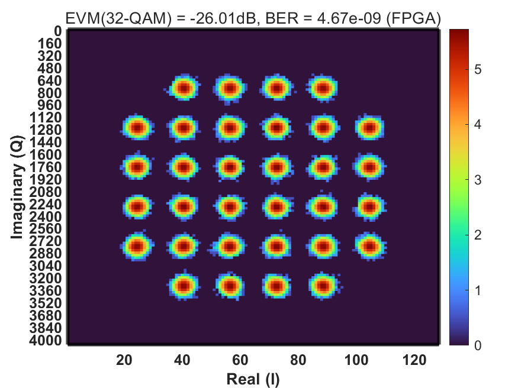

# Gayoung Kang — Circuit and System Design

고속 유선 통신 DSP의 알고리즘 설계부터 RTL 구현, FPGA 실시간 검증, 실칩 측정까지의 기록입니다.

> 비공개 검토본. 공동 연구 결과와 개인 기여를 구분해 표기하며, 일부 측정 조건은 확인 중입니다.

| 프로젝트 | 한 줄 요약 | 대표 수치 |
|---|---|---|
| [KETI DMT Transceiver](#keti-dmt-transceiver) | 14 nm FinFET DMT 송수신기 설계·실측 | loopback **51 Gb/s** · 551 mW |
| [On-chip Adaptive Bit/Power Loading](#on-chip-adaptive-bitpower-loading) | 로딩 연산을 호스트에서 칩 안으로 이전 | FXP BER **2.16 × 10⁻⁵** |
| [광대역 칩간 인터페이스](#다중-칩-연산-시스템용-광대역-칩간-인터페이스) | 3-lane 4-wire 다중 레인 인터페이스 (TSMC 28 nm) | 디코더 ON/OFF **BER 300배** |
| [RFSoC 하드웨어 검증](#rfsoc-하드웨어-검증) | 단계별 FPGA 실시간 검증 방법론 | 최대 **128-QAM** 성상 확인 |
| [학부 프로젝트](#학부-프로젝트) | Ring VCO · Stochastic Computing · CPU EX단 | supply ripple **16배 억제** |

 

---

## KETI DMT Transceiver

**14 nm FinFET · DMT 송수신기 · 설계 → tape-out → 실측**

DAC/ADC 기반 DMT 송수신기입니다. 부채널별 SNR에 따라 비트와 전력을 나눠 싣고 FDE로 등화해, 주파수 선택적 채널에 대응합니다.

| 조건 | 샘플레이트 | Data rate | BER |
|---|---|---|---|
| Loopback | 20 GS/s | 51 Gb/s | 5.2 × 10⁻³ |
| Notch channel | 16 GS/s | 27 Gb/s | 3.9 × 10⁻³ |

IP 구조, chip layout, PCB 도면, 측정 환경과 결과를 정리했습니다.

**→ [KETI 프로젝트 보기](masters/keti/README.md)**

 

---

## On-chip Adaptive Bit/Power Loading

**석사 졸업연구 · 고정소수점 시뮬레이터 → RTL → RFSoC 실시간 검증**

호스트 PC가 하던 bit/power loading을 칩 안으로 옮겼습니다. RX가 파일럿으로 부채널 오차를 측정하고, 같은 다이의 엔진이 나눗셈·로그·LUT 없이 정수 연산만으로 비트와 전력을 결정해 TX CONFMEM에 직접 씁니다. SPI 왕복과 PC 연산이 링크업 경로에서 빠집니다.

| 단계 | 결과 |
|---|---|
| FXP 골든 | BER 2.16 × 10⁻⁵ (목표 1e-4 만족) |
| RTL | ModelSim bit-exact 대조, 폐루프 b_n 일치 확인 |
| RFSoC 실측 | on-chip 엔진 Σb_n = 150 vs 호스트 off-chip 155 |

**→ [설계와 검증 보기](masters/adaptive-bpl/README.md)**

 

---

## 다중 칩 연산 시스템용 광대역 칩간 인터페이스

**삼성전자 미래기술육성사업 (SRFC-IT2301-01) · 한국연구재단 석사과정생연구장려금**

차동 신호는 wire 2개로 lane 1개를 보내 핀 효율이 절반입니다. 3개 lane을 4개 wire로 보내는 구조에 DMT 변조를 결합해, 핀을 늘리지 않고 대역폭을 올리면서 레인 간 상관 잡음을 상쇄합니다. **TSMC 28 nm tape-out 예정**입니다.

- WHT · NP1 두 스킴의 3L4W 디코더 설계 — 곱셈기 없이 shift + add와 ÷4로 복원
- RX DSP 설계 및 디코더 bypass 모드 추가 — 상관 잡음 제거 효과를 직접 비교
- ZCU208 실측: 디코더 OFF **BER 1.61 × 10⁻¹** → WHT **5.34 × 10⁻⁴**, 약 300배 개선

**→ [과제 내용 보기](masters/samsung-nrf/README.md)**

 

---

## RFSoC 하드웨어 검증

**ZCU111 · 단계별 검증 방법론**

Single tone → Multi tone → SNR 및 로딩 → 동기화 → FFT/FDE → constellation scanner와 BER 순서로, 어느 단계에서 문제가 생기는지 좁혀 가며 확인합니다.

측정 환경 구성, 단계별 관측 결과, 16/32/64/128-QAM 성상 측정을 정리했습니다.

**→ [RFSoC 검증 보기](engineering/rfsoc/README.md)**

 

---

## 학부 프로젝트

**홍익대학교 전자전기공학부 · 아날로그 회로 설계와 디지털 연산기 설계**

| 프로젝트 | 분야 | 대표 결과 |
|---|---|---|
| Regulated-Supply 8-Phase Ring VCO | 아날로그 · CMOS 90 nm | supply ripple **100 mV → 6.27 mV** |
| 2D FSM 기반 Stochastic Computing | 디지털 · 학부연구생 | FoM **1.37× 개선**, MSE 0.37 × 10⁻³ |
| 근사 곱셈기 기반 CPU EX단 최적화 | 디지털 · 45 nm | EX stage **6.71 → 4.88 ns** |

**→ [학부 프로젝트 보기](undergraduate/README.md)**

 

---

## 준비 중

| 구분 | 항목 |
|---|---|
| 석사 | Mixed-signal 수업 프로젝트, Full-custom 설계 경험 |
| 기타 | 논문 및 발표 자료 정리 |

자료 검토를 마친 페이지부터 순차적으로 추가합니다.
