# RFSoC 단계별 하드웨어 검증

Single tone으로 변환기와 신호 경로를 확인한 뒤, Multi tone·SNR 측정으로 채널을 파악하고, 동기화·FFT/FDE 내부 관측을 거쳐 constellation scanner와 BER로 수신 품질을 확인합니다.

## 검증 경로

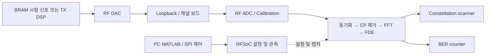

RFSoC 보드·장비의 실물 연결 사진은 아직 확인 중입니다. 아래 그림은 여러 검증 기록에서 선택했으며 RX-only, TRX와 On-chip BPL 사례를 구분합니다.

## 1 Single tone과 ADC calibration

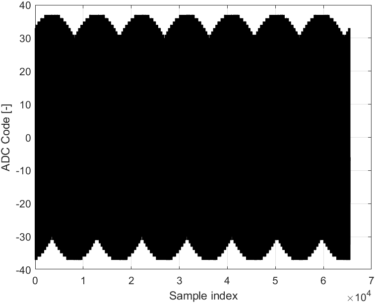

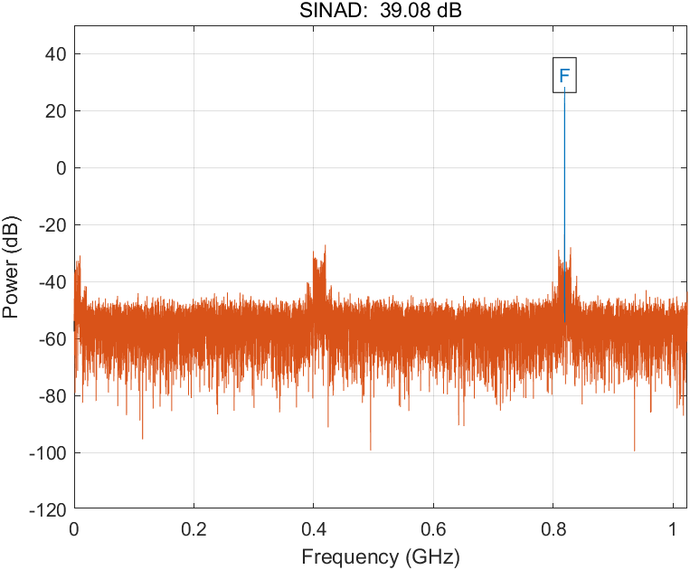

시간 파형과 스펙트럼으로 DAC→채널→ADC 경로를 점검합니다. 위 두 그림은 KETI 64way TRX RFSoC 발표자료 3페이지입니다.

Loopback과 channel board 조건 비교

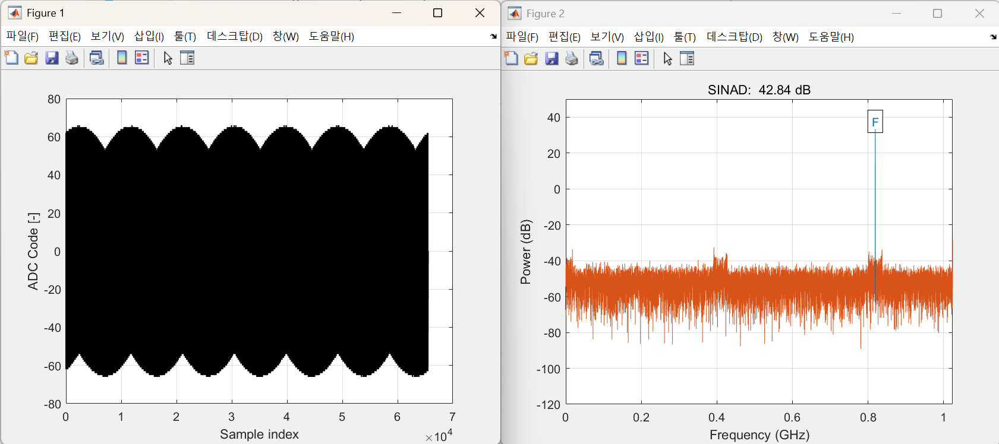

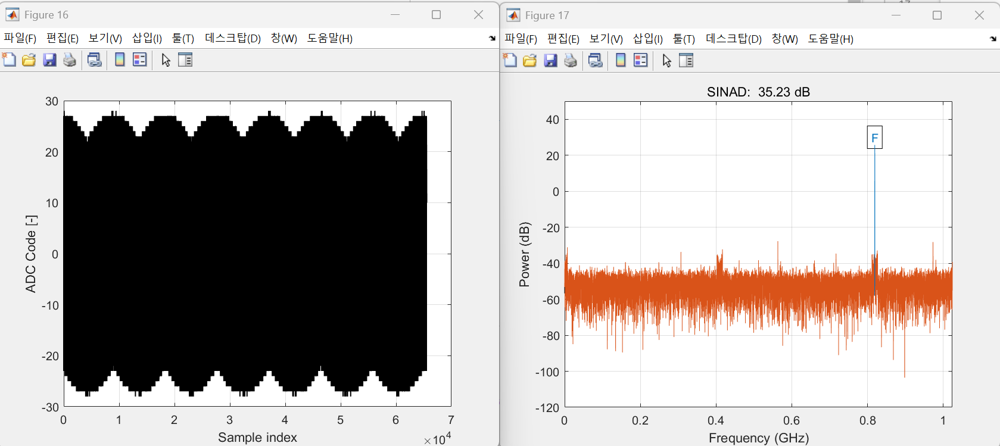

64way RX SPI 발표자료 17·19페이지. 각각 DAC 16-bit 설정의 loopback과 channel board 조건으로 기록되어 있습니다.

## 2 Multi tone과 채널 응답

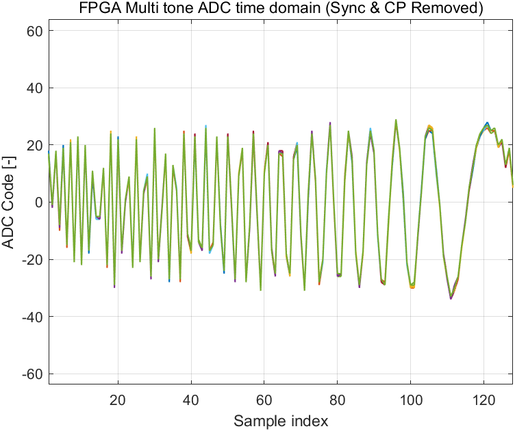

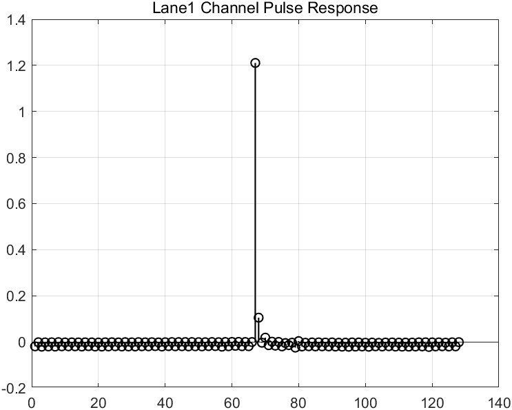

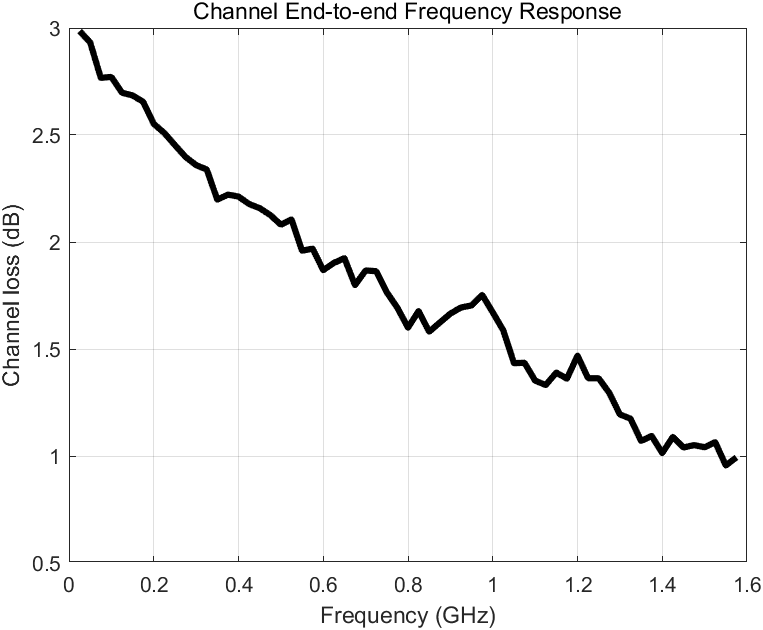

다중 톤 수신 파형, pulse response와 주파수별 감쇠를 확인합니다. 원본: KETI 발표자료 4페이지.

## 3 SNR profile과 Bit/Power loading

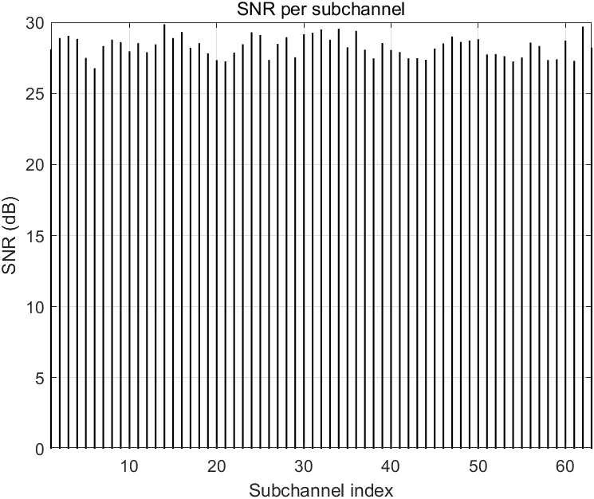

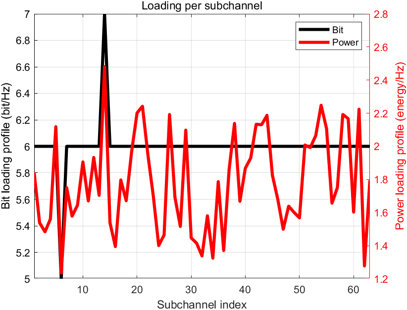

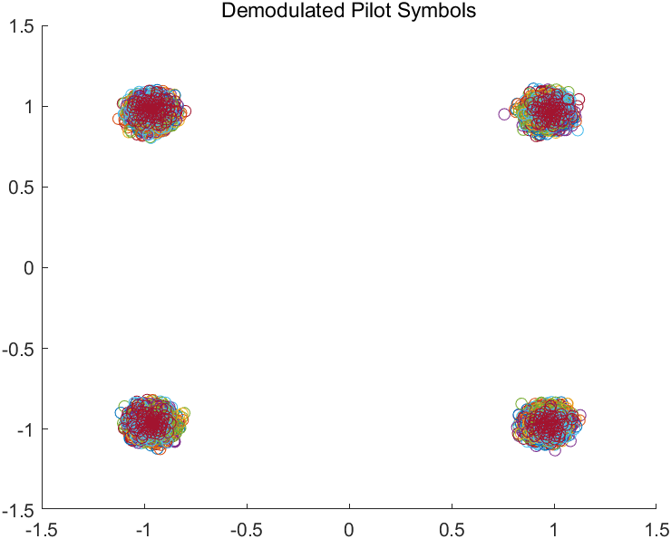

파일럿으로 부채널별 신호 품질을 추정하고 비트·전력을 할당합니다. 파일럿 성상과 로딩 결과를 함께 보며 설정 근거를 확인합니다. 원본: KETI 발표자료 5페이지.

## 4 동기화와 내부 데이터패스 관측

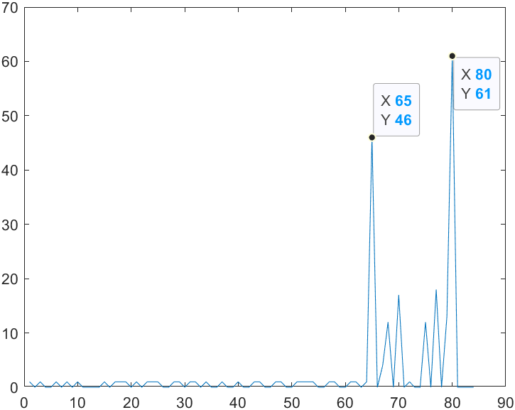

동기화 peak를 확인해 심볼 시작 위치를 찾습니다. 원본: KETI 발표자료 16페이지.

| FFT 이후 MATLAB | FFT 이후 RFSoC |
|---|---|
| 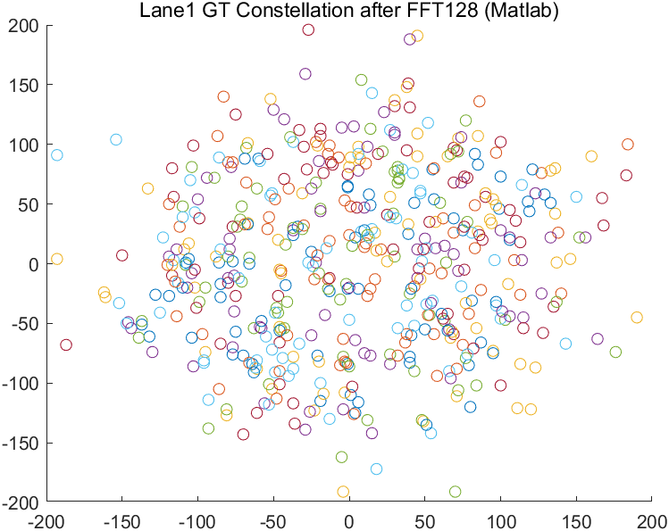 | 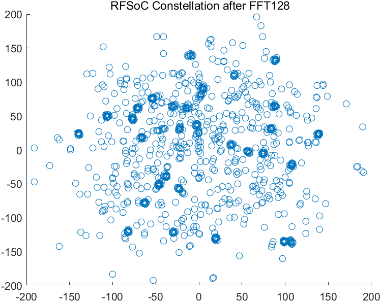 |

| FDE 이후 MATLAB | FDE 이후 RFSoC |
|---|---|
| 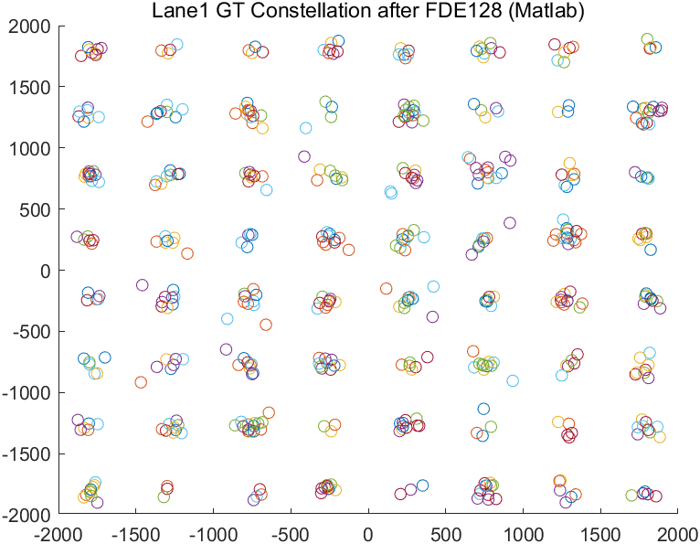 | 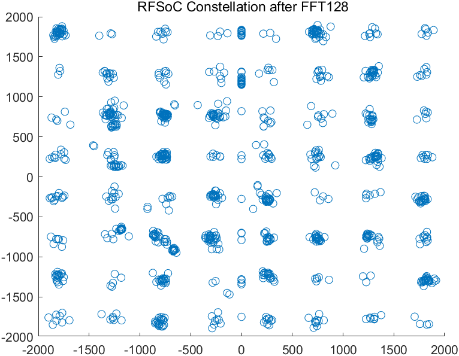 |

FFT·FDE 내부 관측점에서 기준 모델과 하드웨어 출력을 비교합니다. 위 그림은 KETI 발표자료 20·21페이지의 디버깅 기록으로, 그림만으로 bit-exact 일치를 주장하지 않습니다. FDE 이전과 이후의 성상 변화를 함께 보여줍니다.

## 5 낮은 BER의 constellation scanner 결과

성상점이 명확히 분리되고 원본 BER 표기를 확인할 수 있는 32-QAM과 64-QAM 결과를 선정했습니다. 두 그림은 서로 다른 검증 기록이므로 QAM 차수만 변경한 동일 조건 비교를 의미하지 않습니다.

### 32-QAM

32개 성상점이 뚜렷하게 분리됩니다. 원본 scanner 표기는 **EVM −26.01 dB, BER 4.67 × 10⁻⁹**입니다. 출처는 On-chip BPL RFSoC FPGAFigure의 `FPGA FDE out Constellation Diagram Res 8 Channel 32-QAM mv avg 256.png`입니다.

### 64-QAM

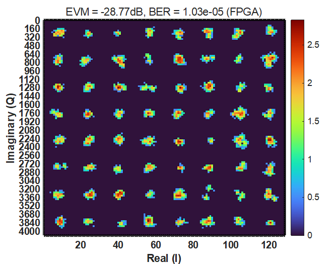

8×8 성상점이 분리된 64-QAM 결과입니다. 원본 scanner 표기는 **EVM −28.77 dB, BER 1.03 × 10⁻⁵**입니다. 출처는 KETI 64way TRX RFSoC 발표자료 24페이지입니다.

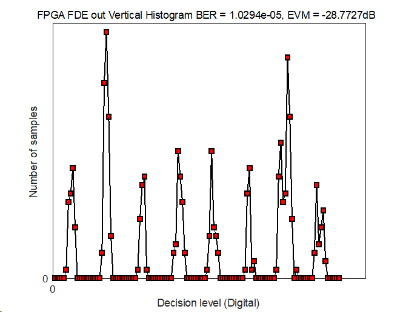

같은 페이지의 scanner histogram으로 판정 구간의 분포를 함께 확인합니다.

### 대응 BER counter 기록

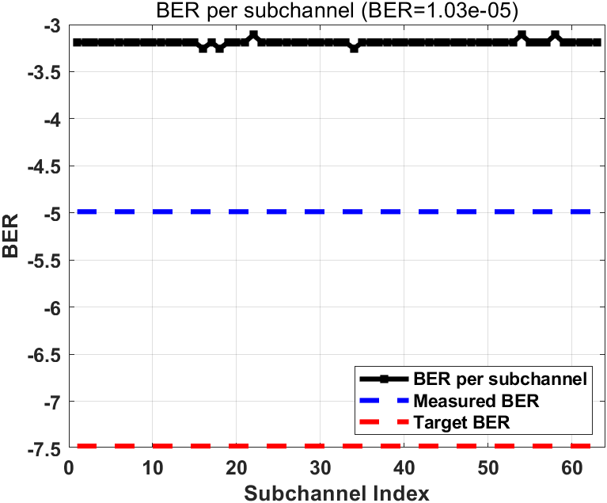

KETI 발표자료 23페이지의 BER counter 기록을 24페이지 scanner 결과와 함께 제시합니다. Scanner에 표시된 BER는 counter의 직접 오류 집계값과 같은 측정 방식으로 간주하지 않습니다. 정확한 산출 방식·측정 창·로딩 조건은 원본 스크립트와 기록 대조 후 확정합니다.

## 출처

- RFSoC_64way_RX_SPI_강가영_발표자료.pptx: calibration 비교 17·19페이지
- KETI_64way_TRX_RFSoC_강가영_발표자료.pptx: 3–5, 16, 20–24페이지
- RFSoC_TRX_BIDI_강가영_발표자료.pptx: 검증 절차 참고. 시뮬레이션 constellation은 대표 실측 결과에서 제외했습니다.
- On-chip BPL FPGAFigure: 위 32-QAM scanner 원본

각 그림의 출처는 본문에 파일명과 슬라이드 번호로 표시했습니다.

[KETI 프로젝트](../../masters/keti/README.md) · [메인](../../README.md)

