# KETI DMT Transceiver

14nm FinFET DAC/ADC 기반 DMT 송수신기. 채널별 SNR에 따른 비트·전력 할당과 FDE를 통해 주파수 선택적 채널에 대응합니다.

> 아래 성능은 공동 연구의 시스템 결과입니다. 개인 담당 블록과 기여 문장은 별도 확인 후 확정합니다.
>
> 이 페이지의 figure와 수치는 **IEEE ASSCC 2026 투고 원고**에서 가져왔습니다. 해당 원고는 **채택되지 않았고 현재 다른 학회에 재투고한 상태**입니다. 자세한 내용은 [논문 · 발표 페이지](../../publications/README.md)를 참고하세요.

## 설계 IP 구조

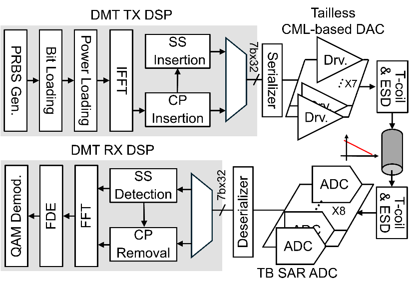

TX는 비트·전력 로딩, IFFT, CP 및 동기화 시퀀스 삽입을 수행하고, RX는 동기화, CP 제거, FFT, FDE와 QAM 복조를 수행합니다.

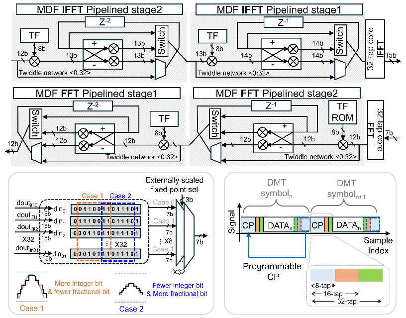

128-tap FFT/IFFT 구조, 고정소수점 스케일링 및 가변 CP를 설명하는 원고 figure입니다.

## Layout과 die photo

원고 Fig. 7. TX/RX DSP와 데이터 변환기 위치 및 DSP 면적 구성을 함께 제시합니다.

## PCB layout

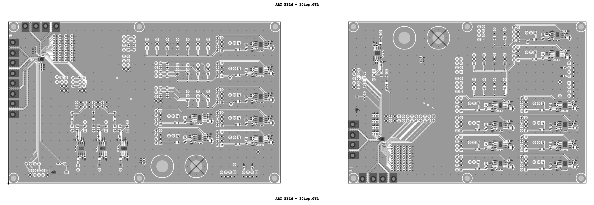

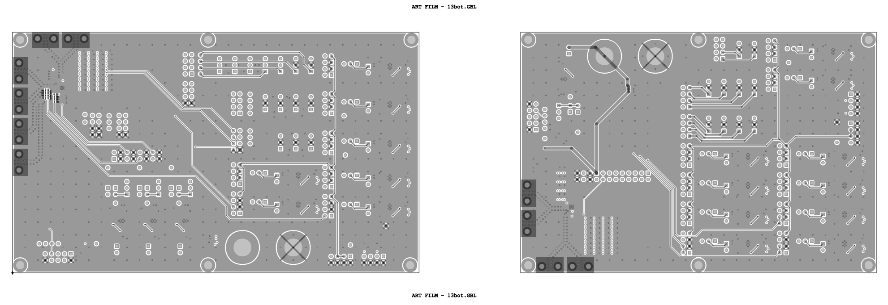

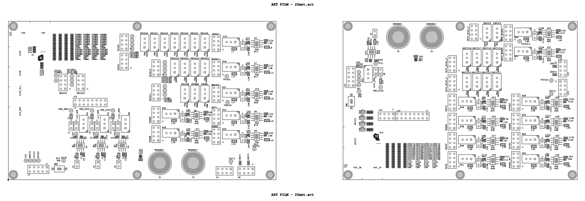

DMT_TRX8.pdf의 top copper, bottom copper, 상면 부품 표기 도면입니다. PDF의 아래쪽 여백을 제외해 렌더링했습니다. 함께 제공된 DMT_TRX8.brd와 DMT_TX_RX.DSN은 PCB 원본 설계 자료로 보관하며, 본 페이지에서는 도면을 통해 보드 구성을 보여줍니다. PCB 설계 담당 범위는 별도 확인이 필요합니다.

## 모델링과 RTL 검증

1차년도 보고서 16–18·23페이지는 고정소수점 모델링, power-loader 정밀도 검토 및 TX/RX RTL 검증을 설명합니다. 초기 설계의 시뮬레이션 결과와 이후 원고의 실칩 측정을 구분해 개발 과정으로 연결합니다.

보고서에 제시된 128 Gb/s는 과제 목표이며 본 포트폴리오의 실측 달성값으로 사용하지 않습니다.

## 실측 환경

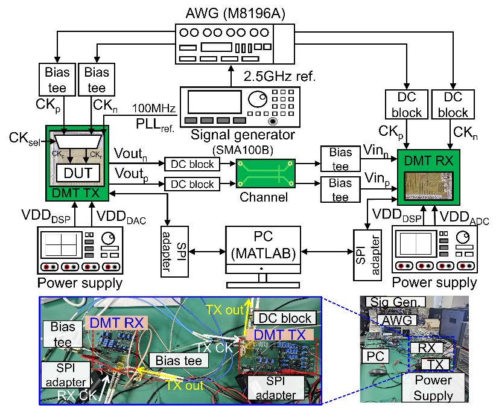

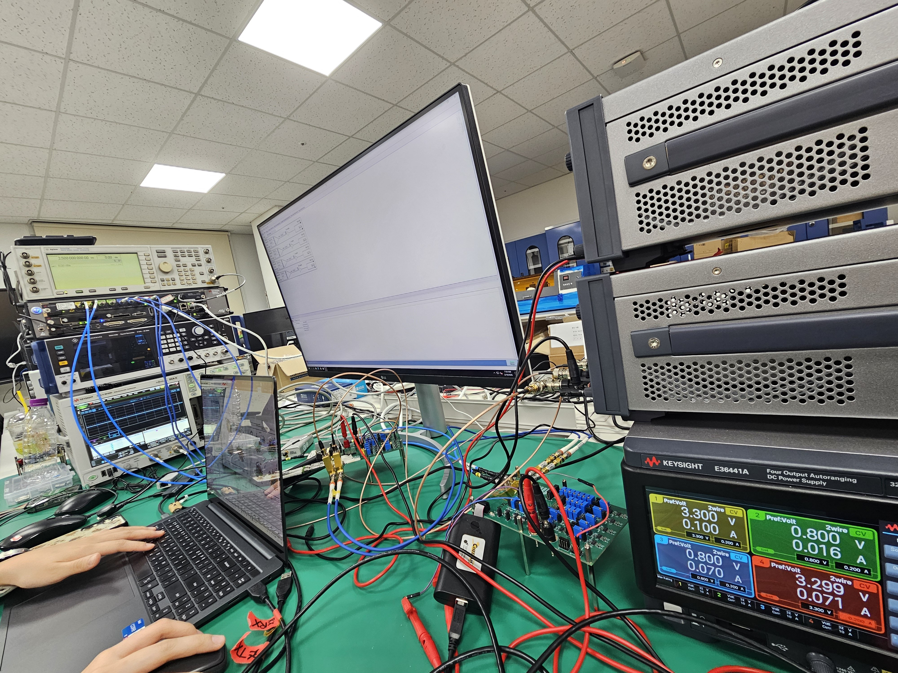

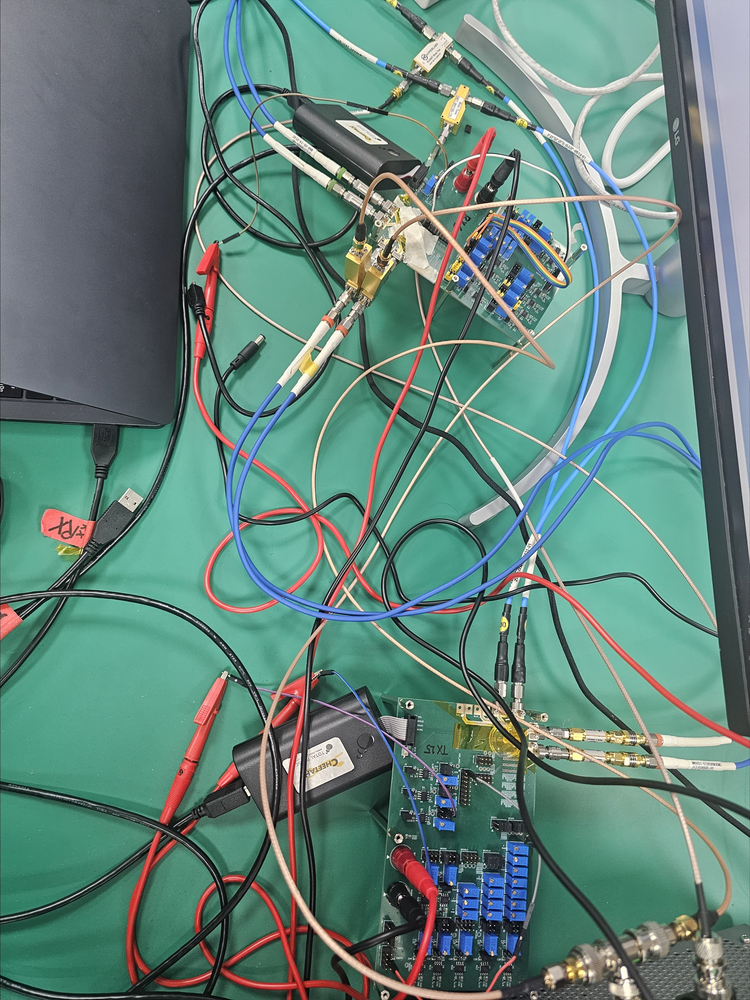

측정 발표자료 2페이지에서 추출한 실험실 전경과 보드 사진입니다. 원고 결과와의 세부 배선·측정 시점 일치 여부는 검토 중입니다.

## 실측 결과

| 조건 | Sampling rate | Data rate | Aggregate BER |
|---|---:|---:|---:|
| Loopback | 20 GS/s | 51 Gb/s | 5.2 × 10⁻³ |
| Notch channel | 16 GS/s | 27 Gb/s | 3.9 × 10⁻³ |

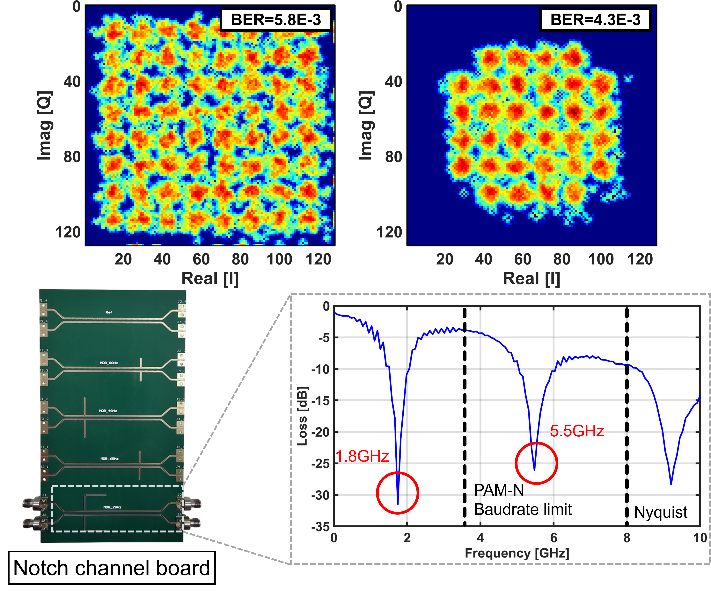

Loopback의 constellation과 notch 보드·채널 응답입니다. 1.8 GHz와 5.5 GHz에 notch가 나타납니다.

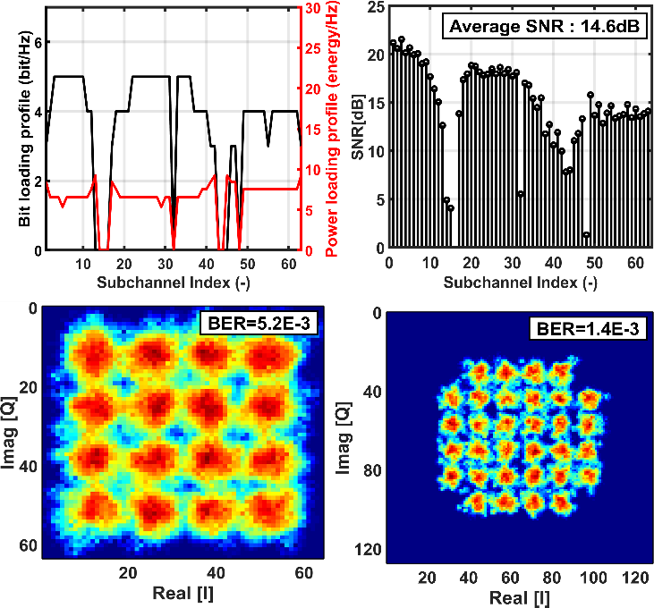

Notch 채널의 SNR, 로딩 분포와 constellation을 함께 제시합니다. 원문은 일부 constellation BER을 EVM으로 추정했다고 기술하므로 aggregate BER과 구분합니다.

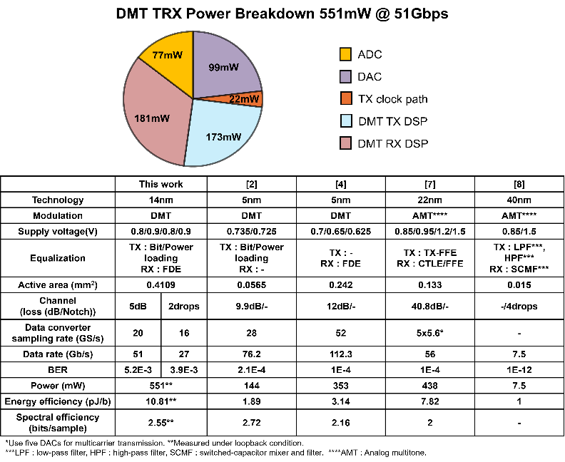

최종 원고는 loopback 기준 551 mW, 10.8 pJ/b를 보고합니다.

## 근거

ASSCC2026_DMT_TRX_FINAL_reordered.docx, Fig. 1–7 및 본문. 실측 사진: 2509_DMT_TRX_Measurement_V1.pptx, slide 2.

[RFSoC 단계별 검증](../rfsoc/README.md) · [← 석사 연구](../README.md)

