# Mixed-Signal 회로 설계

**IC689 Mixed-Signal Circuit Design · 28 nm**

BGR(기준전압 생성기), LC VCO, Charge-Pump PLL을 각각 설계하고 시뮬레이션했습니다.

**사용 도구** — Cadence Virtuoso · Spectre ADE (transient · AC · S-parameter · PSS · pnoise · parametric sweep) · MATLAB (CP-PLL 거동 모델)

| 블록 | 주요 결과 |
|---|---|
| [Bandgap Reference](#1-bandgap-reference-generator) | VREF **1.25 V**, 저항비 L = 8.35로 TC 최적화 |
| [NMOS Cross-Coupled LC VCO](#2-nmos-cross-coupled-lc-vco--10-ghz) | 9.94 GHz, PN **−108.07 dBc/Hz**, FoM **186.68** |
| [Charge-Pump PLL 거동 모델](#3-charge-pump-pll-거동-모델) | R₁·I_CP 스윕으로 damping·대역폭 분석 |

---

## 1. Bandgap Reference Generator

온도에 무관한 기준전압을 만들려면 **온도에 비례하는 항(PTAT)과 반비례하는 항(CTAT)을 더해 상쇄**시켜야 합니다.

<table>
<tr>
<td width="50%">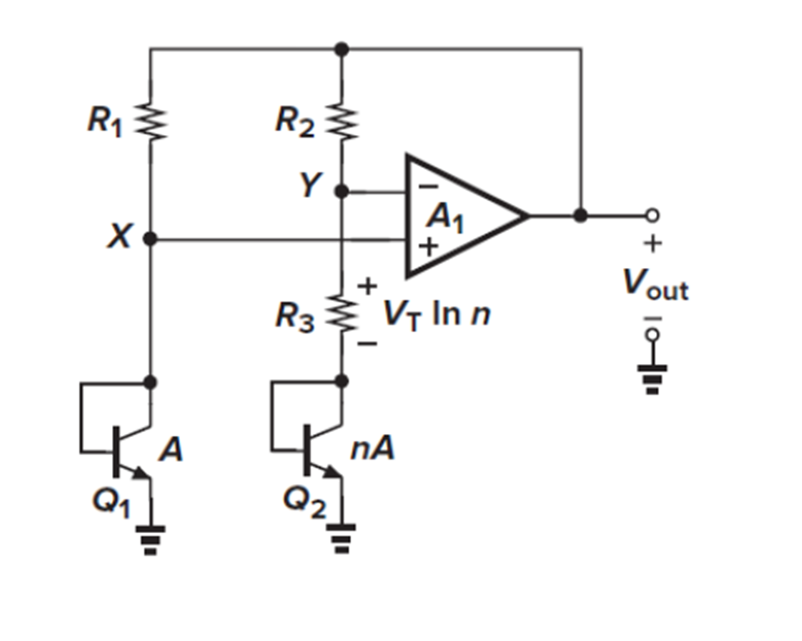</td>
<td width="50%">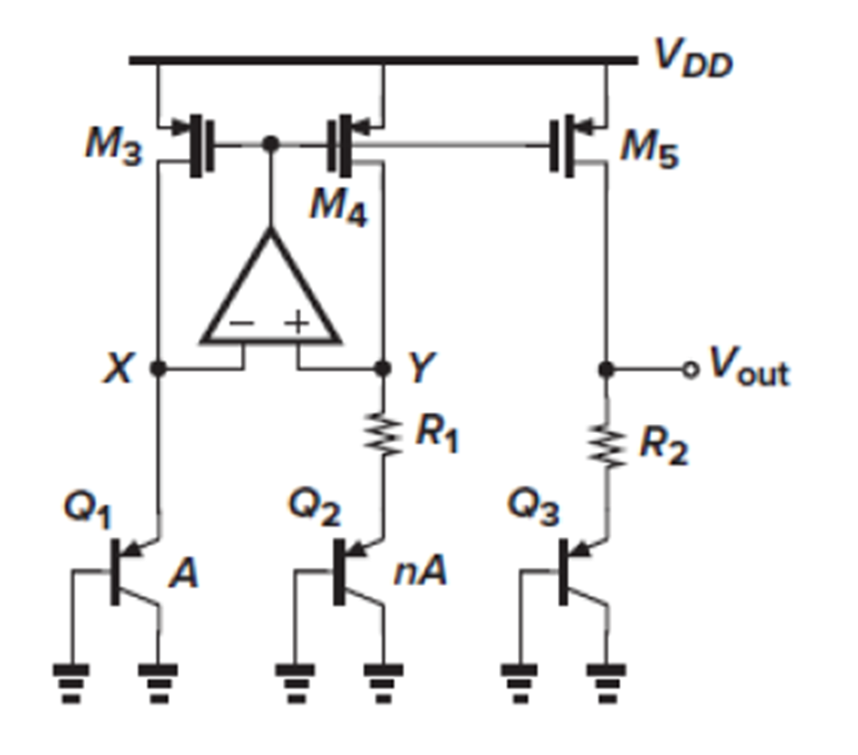</td>
</tr>
<tr>
<td>동작 원리 — Q₁ : Q₂ 면적비를 1 : n으로 두면 두 BJT의 V_BE 차이가 V_T·ln n 이 됩니다.</td>
<td>설계한 회로 — 전류 미러(M₃~M₅), OP Amp, BJT 3개(Q₁, Q₂, Q₃)와 저항 R₁·R₂.</td>
</tr>
</table>

```
VREF = V_BE3 + (R2 / R1) · V_T · ln(n)
        └ CTAT ┘   └────── PTAT ──────┘
```

### 동작점 확인

OP Amp가 X, Y 노드를 같은 전위로 묶어야(virtual ground) R₁ 양단에 정확히 `V_T·ln n`이 걸립니다.

| 항목 | 값 |
|---|---|
| V_X / V_Y | 788.9 mV / 788.8 mV |
| 두 노드 전압차 | **83 µV** |
| I_X / I_Y | 11.767 µA |
| 두 가지 전류차 | **5.24 pA** |

전압차 83 µV, 전류차 5.24 pA로 virtual ground가 성립합니다. 두 BJT branch의 전류가 거의 같으므로 OP Amp가 의도대로 동작하고 있습니다.

### 온도계수 최적화

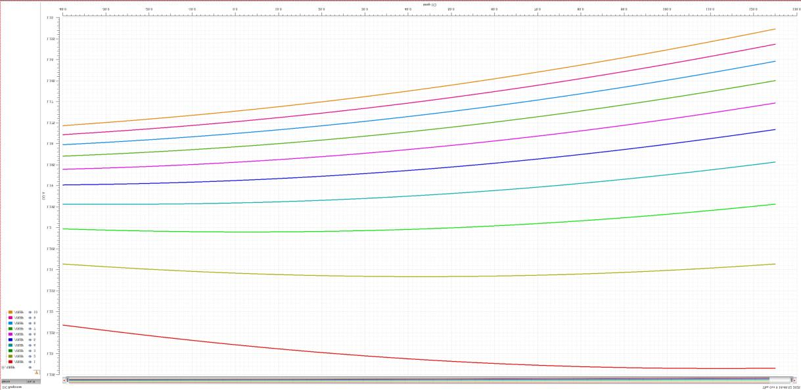

TC가 0이 되려면 PTAT 기울기(저항비 `L = R₂/R₁`)와 CTAT 기울기(Q₃)가 정확히 상쇄되어야 합니다. `n = 8`, `R₁ = 4.7 kΩ`로 두고 **L을 스윕**했습니다.

| 파라미터 | 값 |
|---|---|
| BJT 면적비 n | 8 |
| R₁ | 4.7 kΩ |
| **최적 저항비 L = R₂/R₁** | **8.35** |
| VREF | **1.25 V** |

**저항의 절대값이 아니라 비율이 TC를 결정**합니다. 따라서 R₁과 R₂를 같은 재질·같은 단위소자(m = 1)로 구성해 공정 변동에서 비율이 함께 움직이도록 했습니다. 이렇게 하면 절대값이 틀어져도 TC는 유지됩니다.

---

## 2. NMOS Cross-Coupled LC VCO — 10 GHz

학부에서 설계한 [Ring VCO](../../undergraduate/ring-vco/README.md)와 달리, LC tank를 쓰면 위상잡음이 크게 좋아지는 대신 주파수 가변 범위가 좁아집니다. 10 GHz를 목표로 설계했습니다.

### 2.1 인덕터 — Q-factor 검증

<table>
<tr>
<td width="32%">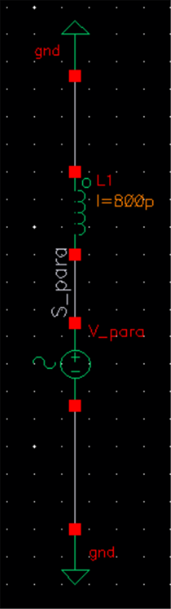</td>
<td width="68%">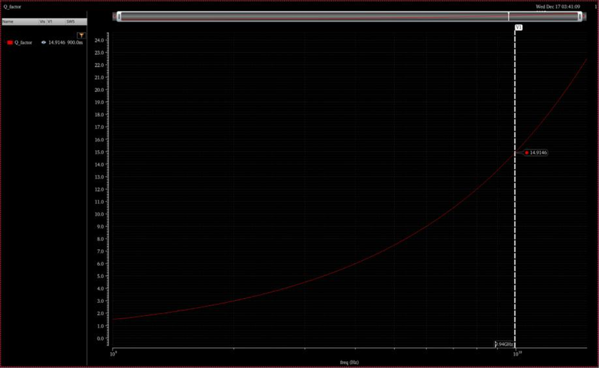</td>
</tr>
<tr>
<td>L = 800 pH</td>
<td>S-parameter 시뮬레이션 후 <code>Q = Im(Z₁₁) / Re(Z₁₁)</code>로 계산. 10 GHz에서 <b>Q ≈ 15</b>.</td>
</tr>
</table>

**이 인덕터가 적절한 이유를 세 가지로 확인했습니다.**

| 관점 | 근거 |
|---|---|
| L-C 균형 | `ω₀ = 1/√(LC)`에서 L = 800 pH이면 C_total = 316 fF. cap bank와 varactor를 넣어 ±10 % tuning range를 확보하기에 적절한 크기입니다. |
| 위상잡음 | Leeson 식에서 `PN ∝ 1/Q²`. 28 nm 공정에서 얻을 수 있는 범위 안에서 Q = 15는 목표 위상잡음을 만족합니다. |
| 전력 | Q가 낮으면 발진 유지에 필요한 g_m이 커져 전류가 늘어납니다. Q = 15에서 I_bias 15 mA 제약을 지킬 수 있습니다. |

### 2.2 시뮬레이션 결과

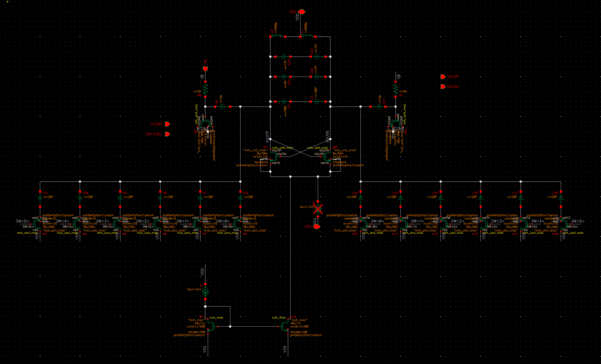

<table>
<tr>
<td width="50%">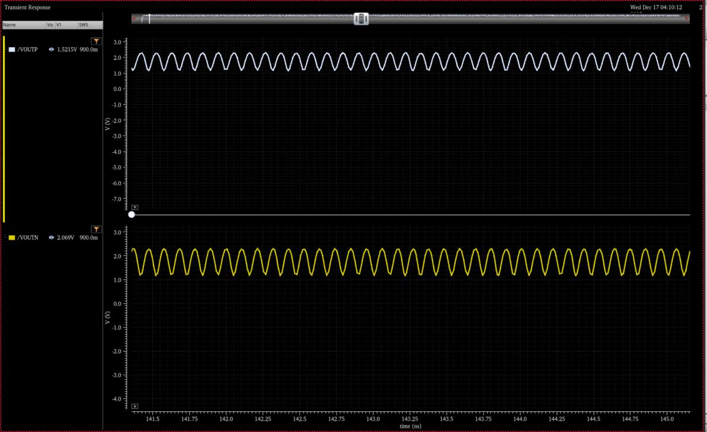</td>
<td width="50%">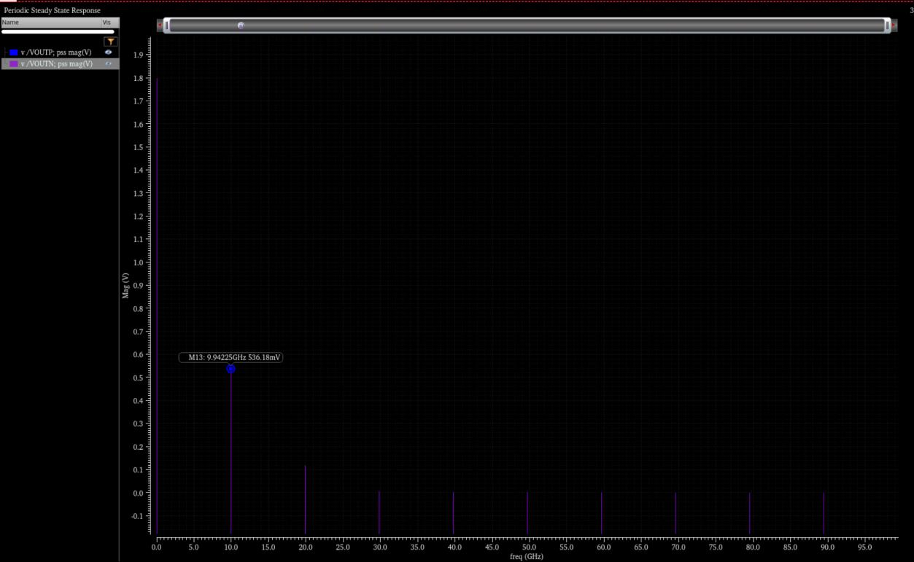</td>
</tr>
<tr>
<td><b>Transient</b> — 잡음으로 기동해 약 5 ns 안에 정상상태에 듭니다.</td>
<td><b>PSS</b> — 기본파가 <b>9.94225 GHz</b>. 목표 10 GHz에 근접하며 LC tank가 의도대로 공진합니다.</td>
</tr>
</table>

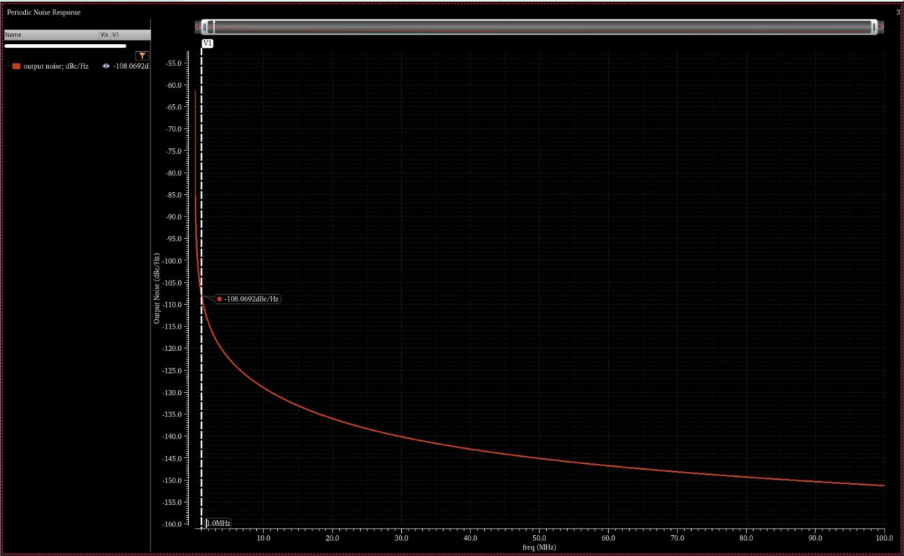

**1 MHz offset에서 위상잡음 −108.07 dBc/Hz** 입니다.

### 2.3 Tuning range와 K_VCO

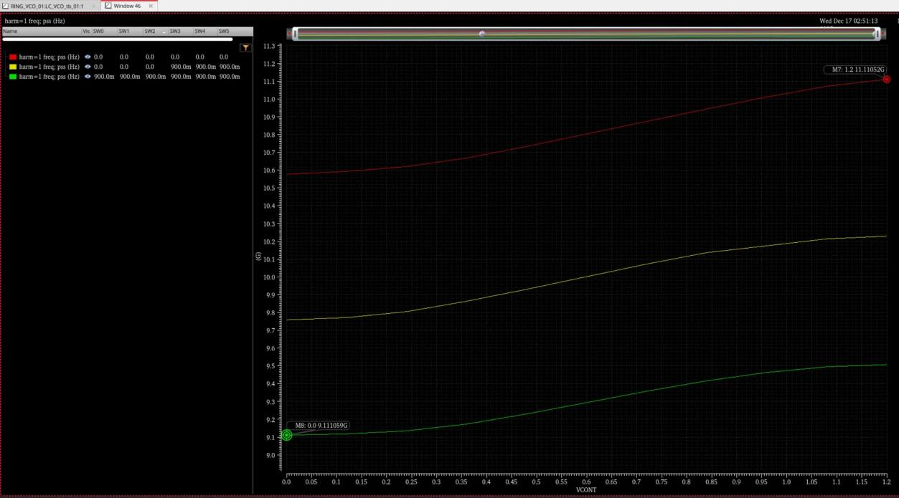

Coarse tuning(switch bank SW0~SW5)과 fine tuning(V_CONT 0 ~ 1.2 V)을 parametric sweep으로 겹쳐 그렸습니다. SW max / mid / min 세 경우가 서로 겹쳐 **끊김 없는 연속 가변**이 확인됩니다.

| 항목 | 값 |
|---|---|
| f_max | 11.111 GHz |
| f_min | 9.111 GHz |
| Δf | **2.0 GHz** |
| 가변 범위 | **±10.05 %** (목표 ±10 % 만족) |

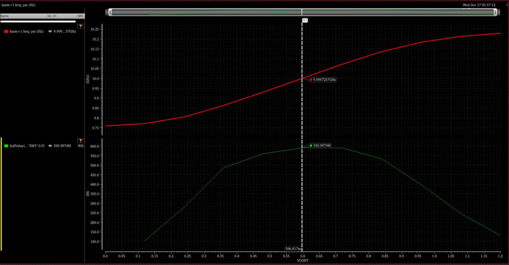

V_CONT에 따른 K_VCO입니다. 중심 주파수 10 GHz 부근에서 **K_VCO ≈ 591 MHz/V** 입니다. PLL에 넣을 때 K_VCO는 loop 안정성에 직접 영향을 주므로, 동작점에서의 값을 확인해 두는 것이 중요합니다.

### 2.4 FoM

```
FoM = −L(Δf) + 20·log(f₀ / Δf) − 10·log(P_DC / 1 mW)
    = 108.07 + 20·log(9942 / 1) − 10·log(1.362)
    = 186.68 dBc/Hz
```

| 항목 | 값 |
|---|---|
| 위상잡음 L(Δf) | −108.07 dBc/Hz @ 1 MHz |
| 발진 주파수 f₀ | 9.942 GHz |
| 소비 전력 P_DC | 1.362 mW |
| **FoM** | **186.68 dBc/Hz** |

---

## 3. Charge-Pump PLL 거동 모델

PFD & Charge Pump → 2차 passive loop filter → VCO → Divider로 구성된 CP-PLL의 거동 모델을 만들어, **루프 파라미터가 응답에 어떻게 작용하는지** 확인했습니다.

| 파라미터 | 기호 | 값 |
|---|---|---|
| VCO gain | K_VCO | 500 MHz/V |
| Charge pump 전류 | I_CP | 100 µA |
| 분주비 | N | 100 |
| 기준 주파수 | f_ref | 50 MHz |
| Loop filter cap | C₁ | 40 pF |
| Ripple 억제 cap | C₂ | 1 pF |
| Damping 저항 | R₁ | 가변 |

목표 출력은 `N × f_ref = 5 GHz` 입니다.

### 3.1 R₁ — damping factor

<table>
<tr>
<td width="50%">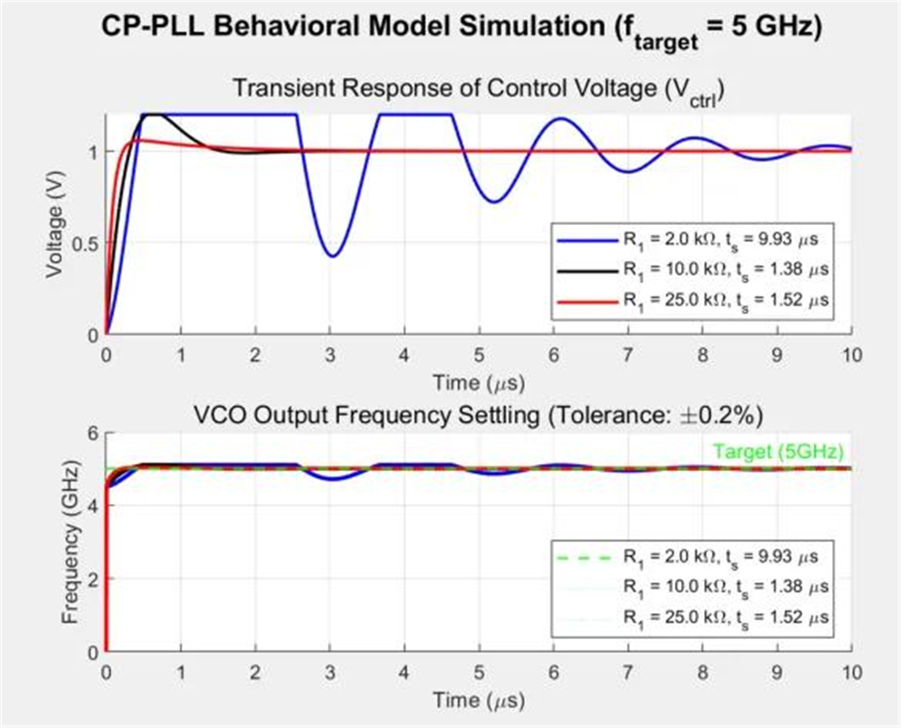</td>
<td width="50%">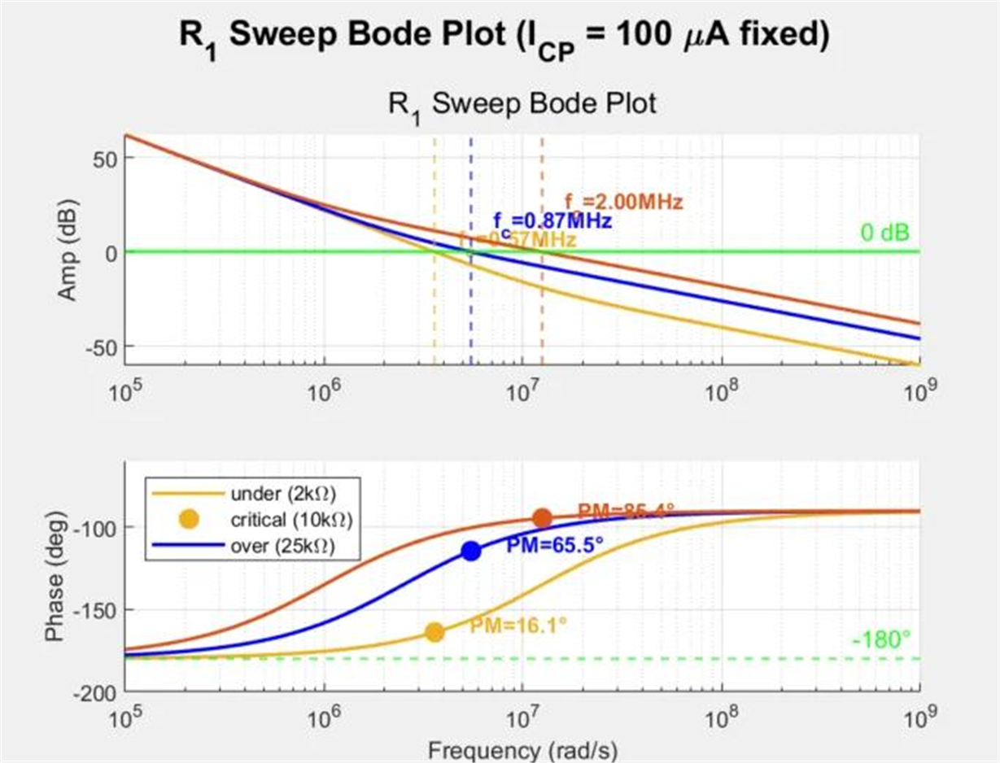</td>
</tr>
<tr>
<td>V_ctrl 과도응답과 VCO 출력 주파수 정착</td>
<td>R₁ 스윕 Bode plot — 위상여유 비교</td>
</tr>
</table>

| R₁ | Damping | V_ctrl 거동 | 정착 시간 (±0.2 %) | 안정성 |
|---|---|---|---:|---|
| 2 kΩ | Under-damped (ζ < 1) | 링잉 큼 | 9.93 µs | Poor |
| **10 kΩ** | **Critically damped (ζ ≈ 1)** | **오버슈트 거의 없음** | **1.38 µs** | **Good** |
| 25 kΩ | Over-damped (ζ > 1) | 링잉 없이 느리게 접근 | 1.52 µs | Stable |

**R₁이 작으면 위상여유가 부족해 링잉이 길어지고, 크면 링잉은 없지만 오히려 느려집니다.** 10 kΩ에서 가장 빠르게 정착합니다.

### 3.2 I_CP — 루프 대역폭

<table>
<tr>
<td width="50%">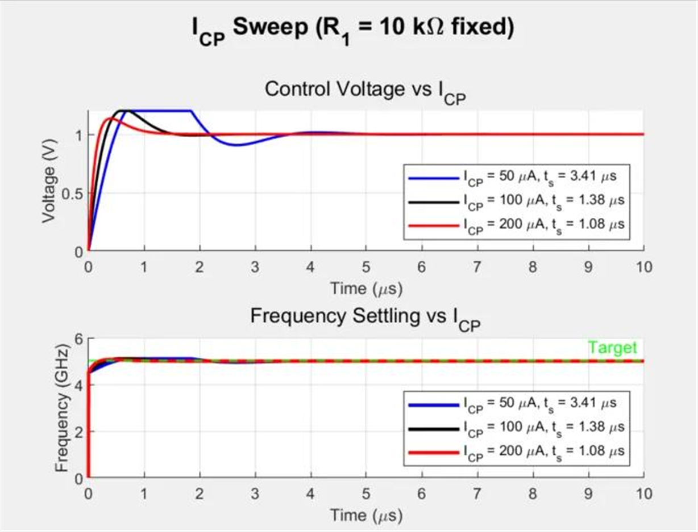</td>
<td width="50%">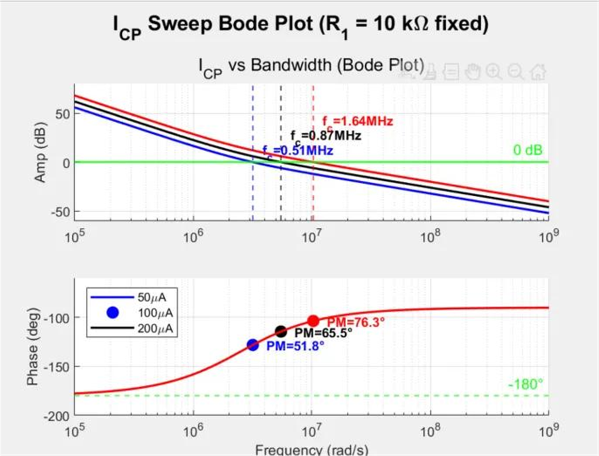</td>
</tr>
<tr>
<td>I_CP에 따른 V_ctrl과 주파수 정착</td>
<td>I_CP 스윕 Bode plot</td>
</tr>
</table>

| I_CP | 루프 특성 | 정착 시간 |
|---|---|---:|
| 50 µA | 좁은 대역폭, 낮은 루프 이득 | 3.41 µs |
| 100 µA | 기준 | 1.38 µs |
| 200 µA | 넓은 대역폭, 높은 루프 이득 | **1.08 µs** |

I_CP를 키우면 루프 이득이 올라가 대역폭이 넓어지고 정착이 빨라집니다. 다만 대역폭이 넓어질수록 기준 주파수 성분이 덜 걸러져 spur가 커지므로, 실제 설계에서는 정착 속도와 spur 사이에서 절충이 필요합니다.

---

[← 석사 연구](../README.md)
