# 다중 칩 연산 시스템용 광대역 칩간 인터페이스

| | |
|---|---|
| 과제명 | 다중 칩 연산 시스템을 위한 광대역 칩간 인터페이스 설계 기술 개발<br>*Wide-bandwidth Chip-to-Chip Interface Design Technology for Multi-Chip Computing Systems* |
| 지원 | 삼성전자 미래기술육성사업 (SRFC-IT2301-01) · 한국연구재단 석사과정생연구장려금 |
| 본인 역할 | **RX DSP 및 3L4W 디코더 설계**, 다중 레인 인코더 설계, DMT DSP RTL 설계, RFSoC 실시간 검증 환경 구축 |

차동 신호 방식은 wire 2개로 lane 1개를 전송하므로 핀 효율이 절반입니다. 이 과제는 **N개 lane을 (N+1)개 wire로** 전송하는 구조에 DMT 변조를 결합해, 핀을 늘리지 않고 대역폭을 올리면서 레인 간 상관 잡음을 상쇄하는 것을 목표로 합니다. 최종 목표는 7-lane 8-wire이고, 현재 3-lane 4-wire까지 RTL과 하드웨어 검증을 마쳤습니다.

---

## 1. 목표 구조 — 7-lane 8-wire

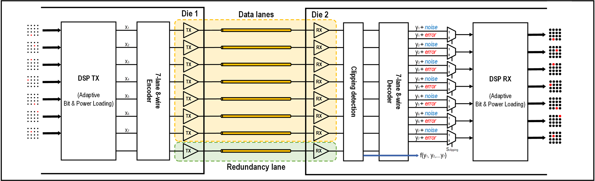

Die 1의 DSP TX가 적응형 bit/power loading으로 7개 lane을 만들고, 인코더가 이를 8개 wire로 확산합니다. 8번째는 redundancy lane입니다. Die 2에서는 clipping detection이 각 wire의 포화 여부를 판단해, 정상 구간에서는 디코더 출력을, 포화 구간에서는 raw 수신값을 선택하도록 MUX를 제어합니다. 클리핑이 디코딩 오류로 번지는 것을 막는 구조입니다.

---

## 2. 3-lane 4-wire 인코더 · 디코더

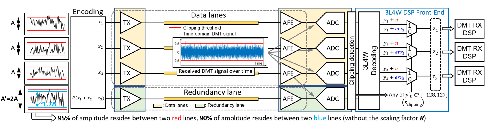

N = 3 구성입니다. 데이터 레인 3개에 redundancy lane 1개를 더해 wire 4개로 보내고, 수신단이 디지털 영역에서 되돌리면서 **wire에 공통으로 실린 상관 잡음을 함께 제거**합니다.

### 두 가지 스킴 — WHT와 NP1

`TX.enc_scheme_sel`로 고릅니다. 0 = WHT, 1 = NP1.

**인코딩 (3 lane → 4 wire)**

| wire | WHT (E = H₄(2:4,:)ᵀ) | NP1 (R = 0.6) |
|---|---|---|
| w1 | L1 + L2 + L3 | L1 |
| w2 | −L1 + L2 − L3 | L2 |
| w3 | L1 − L2 − L3 | L3 |
| w4 | −L1 − L2 + L3 | clip(round(0.6 · (L1+L2+L3))) |

WHT는 Hadamard의 zero-sum 3개 행으로 확산하고, NP1은 데이터 3레인을 그대로 보내면서 4번째에 R-가중 합을 실어 리던던시를 만듭니다.

**디코딩 (4 wire → 3 lane)**

| | WHT (¼ · H₄(2:4,:) · y) | NP1 (R = 0.6) |
|---|---|---|
| lane0 | (y1 − y2 + y3 − y4) / 4 | (y1 − 3y2 − 3y3 + 5y4) / 4 |
| lane1 | (y1 + y2 − y3 − y4) / 4 | (−3y1 + y2 − 3y3 + 5y4) / 4 |
| lane2 | (y1 − y2 − y3 + y4) / 4 | (−3y1 − 3y2 + y3 + 5y4) / 4 |

**강점이 갈립니다.** WHT는 계수 합이 0이라 공통 잡음이 자동으로 소거되지만 클리핑 대응 장치가 없습니다. NP1은 redundancy wire로 복호하되 그 wire가 먼저 포화되므로, 포화 샘플은 raw lane으로 우회시켜 클리핑에 견딥니다.

**R = 0.6을 고른 이유** — 5·R = 3이 되어 두 스킴 모두 **정수 계수 ÷4**로 정확히 복원됩니다. 곱셈기도, 역행렬 연산도 필요 없습니다.

### RTL 구현

두 스킴은 계수만 다른 같은 형태입니다.

```
lane = ( c1·y1 + c2·y2 + c3·y3 + c4·y4 ) / 4

WHT : c ∈ {+1, −1}      → 덧셈 / 뺄셈만
NP1 : c ∈ {1, 3, 5}     → ×3 = (x<<1)+x , ×5 = (x<<2)+x
끝단 ÷4 = >>2
```

가중합 → ÷4 회로는 공유하고 **계수셋만 MUX로 선택**합니다. 일반 곱셈기를 쓰지 않습니다.

**반올림을 한쪽으로 통일했습니다.** Σ를 4로 나누면 소수부가 남으므로 `(Σ + 2) >> 2`로 round-half-up 처리합니다. "+2"는 반 LSB를 더해 최근접 반올림 효과를 내는 것이고, WHT·NP1 두 경로에 같은 식을 씁니다. MATLAB `round()`는 round-half-away-from-zero라 음수 0.5-tie에서만 1 LSB가 갈리는데, sub-LSB 차이라 BER과 동기에는 영향이 없습니다.

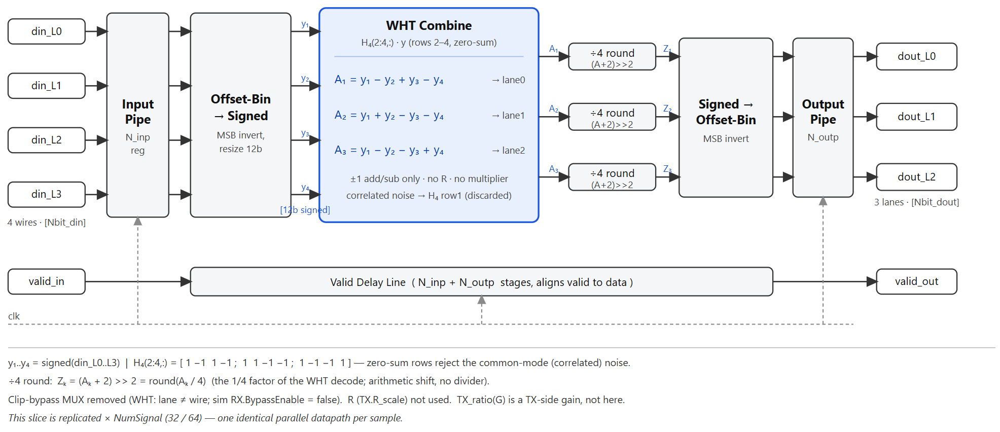

RX front-end DSP입니다. ADC가 주는 offset binary를 MSB invert로 signed 12b로 바꾸고, WHT combine에서 ±1 가감산만으로 A₁~A₃를 만든 뒤 `(A+2)>>2`로 라운딩합니다. 다시 offset binary로 되돌려 RX DSP에 넘깁니다. valid 신호는 지연선으로 데이터와 정렬합니다. 이 슬라이스가 NumSignal(32 또는 64)만큼 병렬로 복제됩니다.

### 디코더 bypass 모드를 만든 이유

기존 RX RTL에는 WHT와 NP1 모드만 있고 디코더를 우회하는 경로가 없었습니다. 디코더가 상관 잡음을 실제로 얼마나 제거하는지 정량화하려면 **디코더를 끈 상태와 직접 비교**해야 하므로, RX DSP에 OFF 모드를 추가했습니다. 이후 검증은 OFF / NP1 / WHT 세 모드를 같은 조건에서 돌리는 방식으로 진행했습니다.

### RTL 모드별 검증

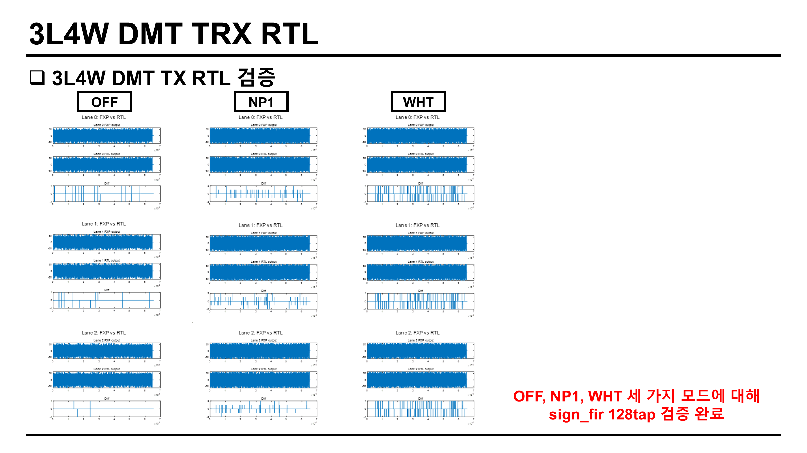

TX 쪽입니다. 레인마다 FXP 모델 출력과 RTL 출력을 위아래로 놓고 그 아래에 차분(Diff)을 그렸습니다. 세 모드 모두 차분이 ±1 LSB 수준의 산발적인 값에 머뭅니다. sign_fir 128 tap 구성까지 포함해 검증을 마쳤습니다.

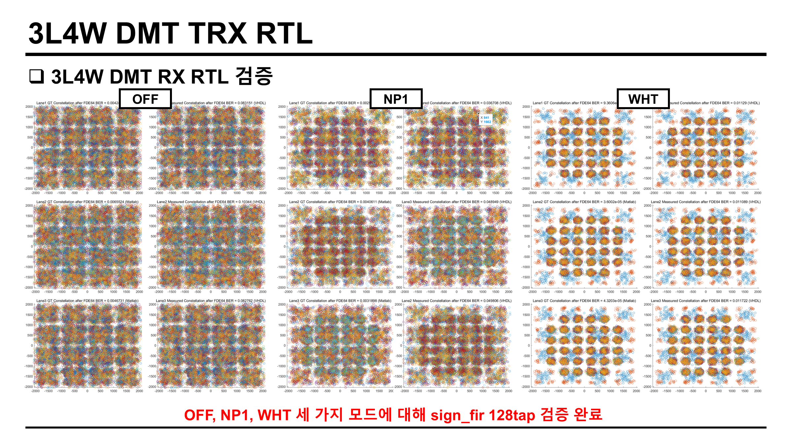

RX 쪽입니다. 각 모드에서 왼쪽이 MATLAB 기준(GT), 오른쪽이 RTL(VHDL) 결과이고, 그림 제목에 FDE 이후 BER이 적혀 있습니다. OFF는 성상이 뭉개져 BER이 8.3 × 10⁻²까지 올라가고, NP1에서 형태가 돌아오며, WHT에서 가장 선명해집니다.

### 상관 잡음 제거 확인 — ZCU208 실측

loopback 채널에 상관 잡음을 임의로 주입하고 세 모드로 돌렸습니다. 송신 신호원은 BRAM에 저장한 파형을 재생하는 경로와 TX DSP가 직접 만드는 경로 두 가지로 각각 측정했습니다.

같은 레인(Lane 0)·같은 부채널을 TX DSP 경로에서 비교하면 차이가 그대로 보입니다.

<table>
<tr>
<td width="33%">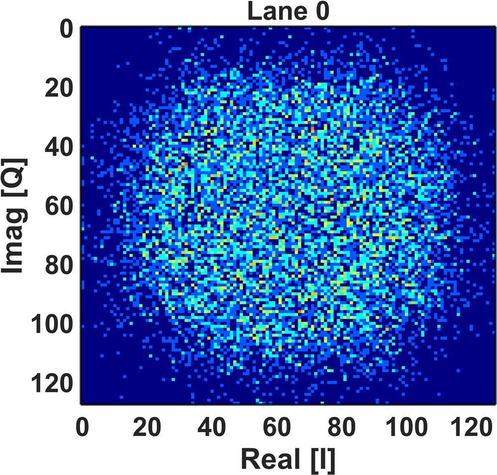</td>
<td width="33%">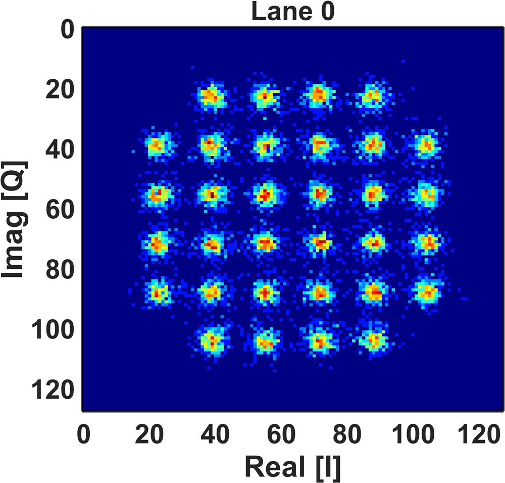</td>
<td width="33%">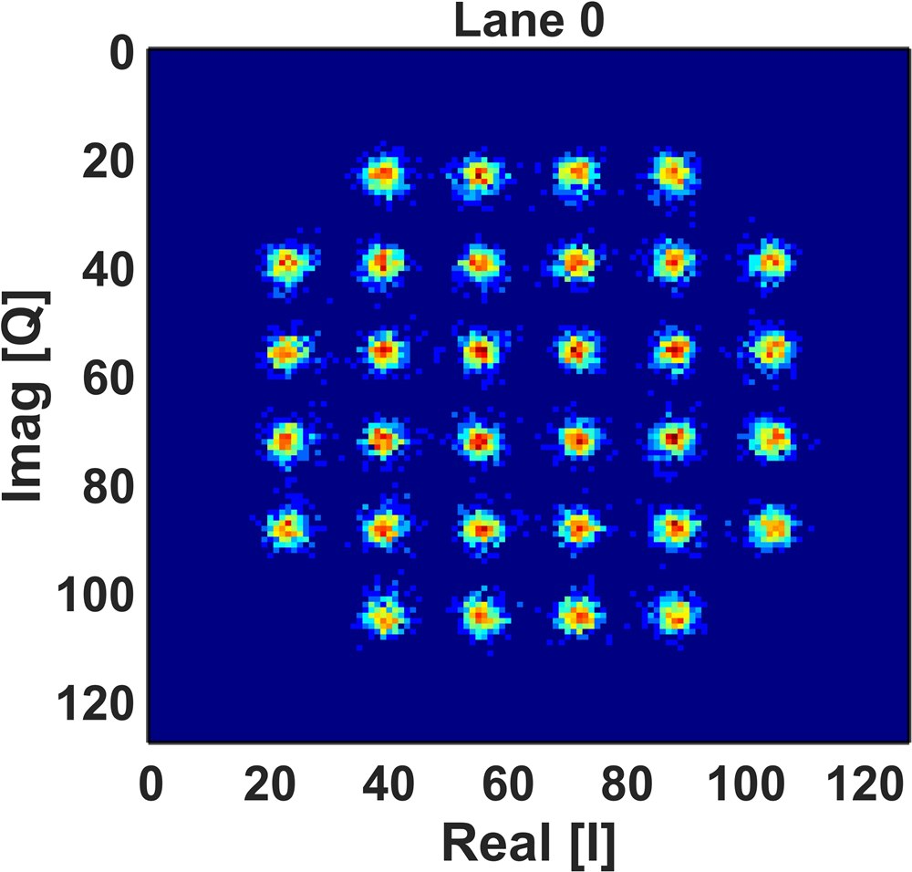</td>
</tr>
<tr>
<td><b>OFF</b> — 디코더 bypass. 성상이 형성되지 않습니다.</td>
<td><b>NP1</b> — 성상이 복원됩니다.</td>
<td><b>WHT</b> — 가장 뚜렷합니다.</td>
</tr>
</table>

| 모드 | avg BER (BRAM 소스) | avg BER (TX DSP 소스) |
|---|---|---|
| OFF (디코더 bypass) | 1.61 × 10⁻¹ | 1.61 × 10⁻¹ |
| NP1 | 4.37 × 10⁻³ | 3.86 × 10⁻³ |
| **WHT** | **5.34 × 10⁻⁴** | **5.68 × 10⁻⁴** |

디코더를 끄면 BER 0.161로 통신이 성립하지 않고, WHT 복호를 켜면 5.34 × 10⁻⁴까지 내려갑니다. **약 300배 차이**입니다. 상관 잡음이 zero-sum 계수합으로 소거된다는 것을 하드웨어에서 확인한 결과입니다.

모드별 전체 측정 결과입니다. 각 그림은 왼쪽이 BRAM 소스, 오른쪽이 TX DSP 소스이고, 레인마다 부채널별 BER 곡선과 성상 3종을 함께 보여줍니다.

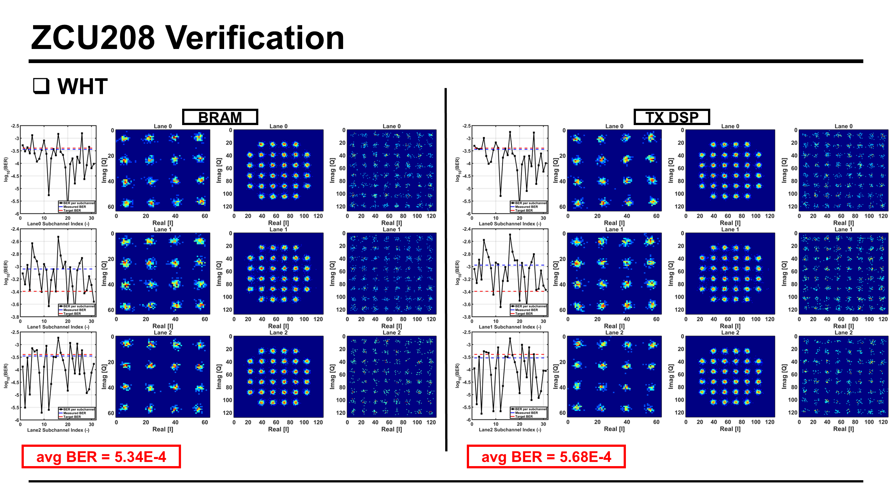

**WHT** — 세 레인 모두 성상이 분리되고, 부채널별 BER이 목표선 부근에 모입니다.

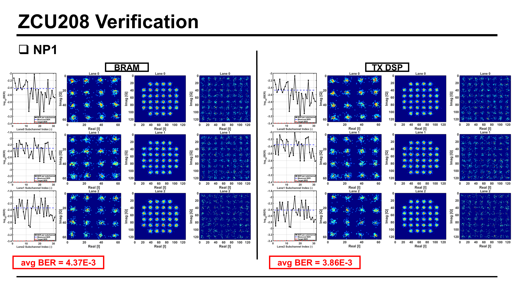

**NP1** — 성상은 복원되지만 BER 곡선이 목표선 위에 있습니다. 대신 클리핑 구간에서 raw lane으로 우회할 수 있다는 점이 WHT에 없는 장점입니다.

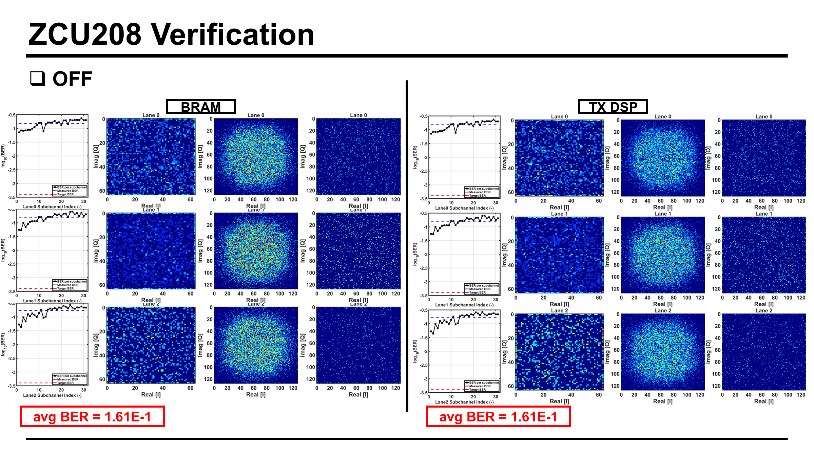

**OFF** — 디코더를 우회하면 성상이 전혀 형성되지 않고 부채널별 BER이 10⁻¹ 수준에 붙습니다. 상관 잡음이 그대로 남는다는 뜻입니다.

---

## 3. 단일 레인 DMT DSP RTL

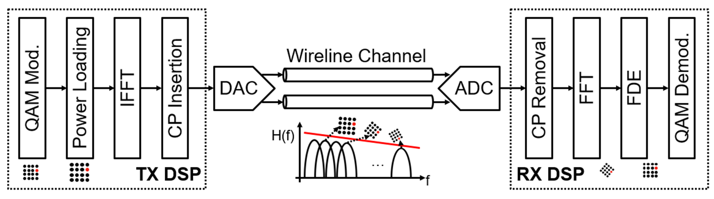

TX는 QAM 변조 → power loading → IFFT → CP 삽입, RX는 CP 제거 → FFT → FDE → QAM 복조입니다. 채널 응답 H(f)에 따라 부반송파마다 다른 QAM 차수를 싣습니다.

**면적 최적화** — 단일 레인은 32-way 128-tap IFFT/FFT이며, Multi-Path Delay Feedback(MDF) 구조를 써서 fully-parallel 대비 면적을 크게 줄였습니다.

**연산 정밀도 최적화** — MATLAB 시뮬레이션 결과를 근거로 IFFT/FFT와 비트/파워 로딩 계수의 연산 해상도(resolution bit)를 결정해 하드웨어 자원 사용량을 최소화했습니다.

MATLAB에서 VHDL을 자동 생성하는 프레임워크를 만들어 per-tap 파이프라인을 파라미터화(Ktap = 32 인스턴스)하고 timing closure를 맞췄습니다.

---

## 4. RFSoC 실시간 검증 환경

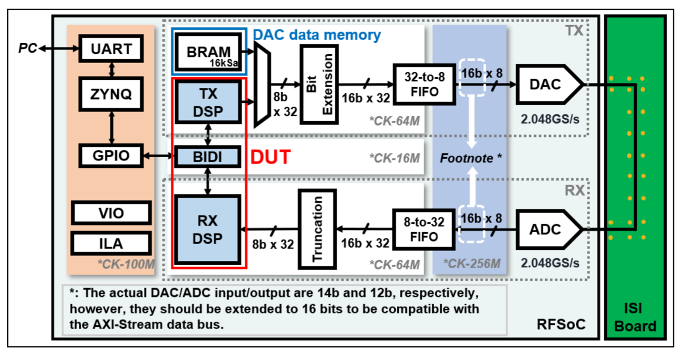

검증 대상(DUT)은 TX DSP · BIDI · RX DSP입니다. PC가 UART로 ZYNQ PS와 통신하고, GPIO로 BIDI를 제어합니다. TX 입력은 BRAM(16 kSa)의 시험 파형과 TX DSP 출력 중에서 고릅니다. 클럭 도메인은 제어 100 MHz, DSP 64 MHz, BIDI 16 MHz, 변환기 인터페이스 256 MHz로 나눴고, 32-to-8 / 8-to-32 FIFO로 폭을 맞췄습니다. DAC/ADC 실제 입출력은 14b·12b이지만 AXI-Stream 버스에 맞추려고 16b로 확장합니다.

3L4W 구성에서는 wire마다 BRAM과 MUX를 하나씩 두어 4개 계통으로 늘리고, TX DSP 3개(3 lane + 1 redundancy)와 RX DSP 3개 사이에 3L4W front-end DSP를 끼웁니다. DAC/ADC는 각각 4채널 3.2 GS/s, 8 sample/clk이며 fabric은 400 MHz, DSP는 50 MHz로 돕니다.

**4 wire를 differential로 쓴 이유** — DMT 신호는 Fs = 3.2 GS/s에서 0~1.6 GHz를 씁니다. 평가 보드의 single-ended 포트는 LF balun 2쌍(0.01~1.3 GHz)과 HF balun 2쌍(1.6~3.1 GHz)으로 나뉘어 4개 wire의 대역폭이 서로 달라집니다. 대역을 맞추려고 differential 포트를 썼습니다.

### 2보드 구성

보드 1대 안에서 loopback으로 도는 검증은 칩간 통신이 아닙니다. 실제 조건에 맞추려고 ZCU111 **2대**를 각각 TX와 RX로 놓고 연동했습니다.

<table>
<tr>
<td width="50%">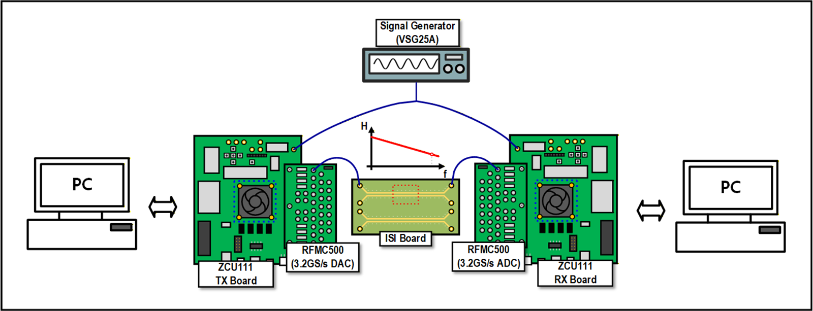</td>
<td width="50%">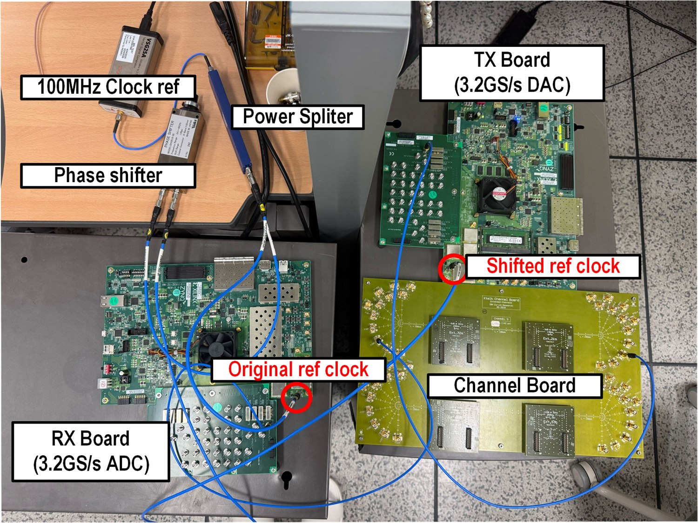</td>
</tr>
<tr>
<td>PC ↔ ZCU111 TX + RFMC500(3.2 GS/s DAC) → ISI Board → RFMC500(3.2 GS/s ADC) + ZCU111 RX ↔ PC.</td>
<td>실제 구성. 100 MHz 기준 클럭을 power splitter로 나누고 한쪽에 phase shifter를 넣어 두 보드의 ref clock을 맞춥니다.</td>
</tr>
</table>

보드마다 내부 클럭을 쓰면 두 보드 사이에 클럭 스큐가 생깁니다. 외부 클럭 소스(VSG25A) 하나를 공유하도록 바꾸고, phase shifter로 보드 간 위상차를 보정해 동기화를 맞췄습니다.

---

## 5. 실시간 검증 결과

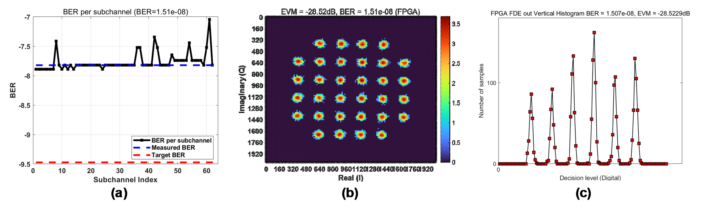

ZCU111 2보드에서 단일 레인 DMT TX/RX DSP를 loopback 채널로 실시간 구동한 결과입니다.

| 항목 | 값 |
|---|---|
| BER | **1.51 × 10⁻⁸** |
| EVM (32-QAM) | −28.52 dB |

(a) 부채널별 BER이 측정 BER 선 부근에서 고르게 분포합니다. (b) 32-QAM 성상의 32개 점이 분리되어 나타납니다. (c) FDE 출력 수직 히스토그램의 결정 레벨이 모두 분리됩니다.

DSP datapath 로직이 하드웨어에서 안정적으로 동작함을 확인했습니다.

---

## 6. 본인 수행 범위

수행한 항목입니다.

- **3L4W 디코더 설계** — WHT · NP1 두 스킴, 계수 MUX 기반 공유 데이터패스, `(Σ+2)>>2` 라운딩 통일
- **RX DSP 설계** — 3L4W front-end DSP, ADC calibration, sign synchronizer, CP 제거 FIFO, FFT/FDE lane, constellation scanner
- 디코더 효과를 정량화하기 위한 **RX DSP bypass(OFF) 모드 추가** 및 3모드 비교 검증 체계 구성
- 3L4W 인코더 설계 및 DMT TX 데이터패스 통합
- N-lane N-wire 구조 MATLAB 모델링, 상관 잡음 상쇄 알고리즘과 전송 효율 정량 검증
- 비트/파워 로딩을 포함한 단일 레인 DMT DSP RTL 설계 — 32-way 128-tap, MDF 구조
- MATLAB → VHDL 자동 생성 프레임워크 구축, fixed-point 모델과 bit-exact 대조
- ZCU111 2보드 외부 클럭 동기화 실시간 검증 환경 구축 및 단일 레인 IP 하드웨어 검증

**같은 보고서에 실린 다음 성과는 과제 참여자의 다른 IP이며 본인 수행분이 아닙니다.**

- 7-bit binary-weighted DAC + 4:1 serializer, TSMC 28 nm tape-out
- GROSC 기반 Time-based ADC(VTC + TDC), Time-Interleaving 구조, TSMC 28 nm tape-out

---

## 7. 다음 단계

| 항목 | 내용 |
|---|---|
| 멀티 레인 확장 | 3L4W에서 7L8W로 인코더·디코더 확장, 레인 간 간섭 상쇄 로직 RTL 구현 |
| 2보드 실시간 검증 | ISI 보드를 적용해 다양한 채널 조건에서 부채널별 로딩 동작과 인접 레인 간섭 상쇄를 목표 BER 기준으로 분석 |
| 논리 합성 분석 | Synopsys Design Compiler로 면적·전력·타이밍 분석, critical path 확인, netlist에 SDF를 적용한 타이밍 시뮬레이션 |

---

## 관련 페이지

- [On-chip Adaptive Bit/Power Loading](../adaptive-bpl/README.md) — 이 과제의 bit/power loading을 칩 내부 폐루프로 옮긴 졸업연구
- [RFSoC 하드웨어 검증](../../engineering/rfsoc/README.md)

## 자료 출처

7L8W 구조도와 단일 레인 datapath, RFSoC 검증 블록도, 2보드 셋업, 측정 결과는 본인이 작성한 **2026년도 석사과정생연구장려금 1차년도 연차보고서**의 그림 1~6입니다. 3L4W front-end 블록도와 인코딩·디코딩 수식은 본인 발표자료 `NP1_강가영_발표자료.pptx`에서 가져왔습니다. OFF/NP1/WHT 모드별 RTL·ZCU208 검증 결과는 본인이 설계한 RX DSP와 디코더를 대상으로 수행한 것이며, 그림은 연구실 검증 기록에서 인용했습니다. 상세 기록은 [`figure-sources.json`](figure-sources.json)에 있습니다.
