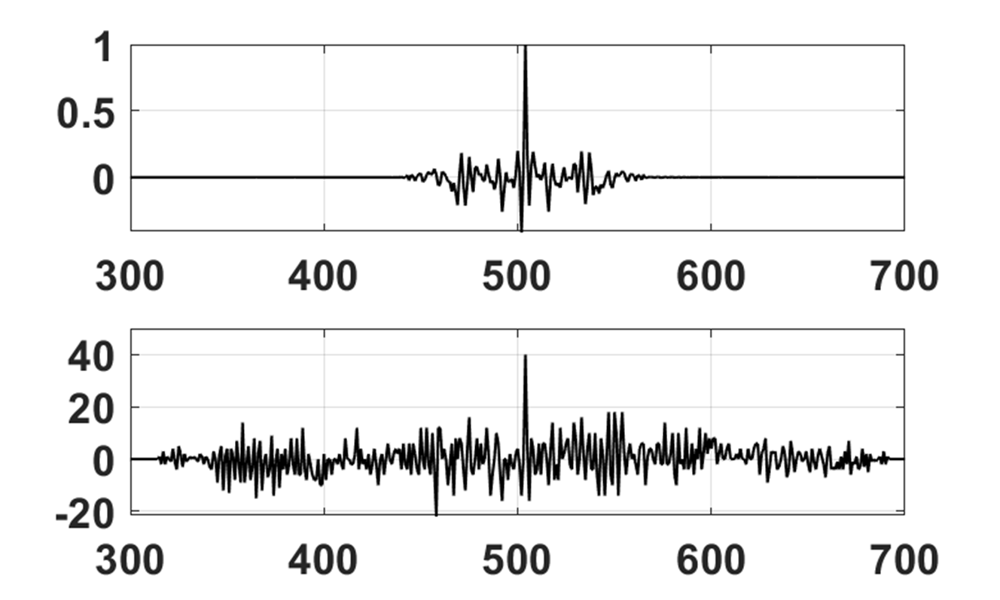
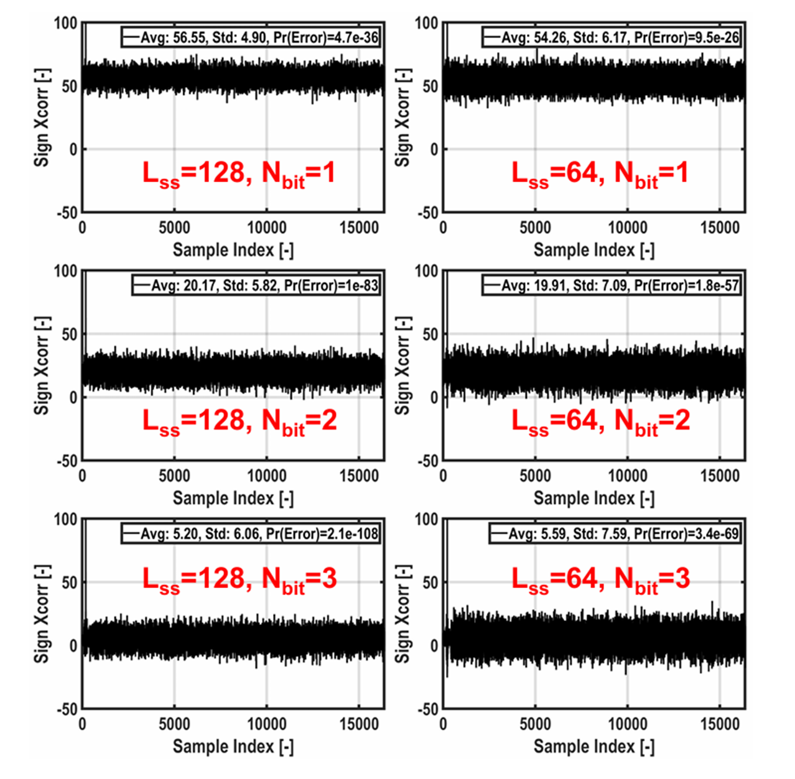
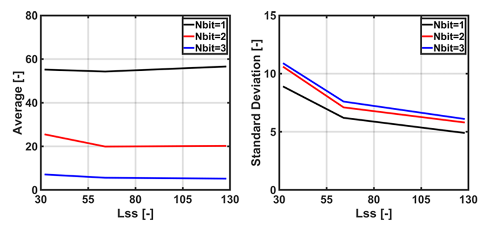
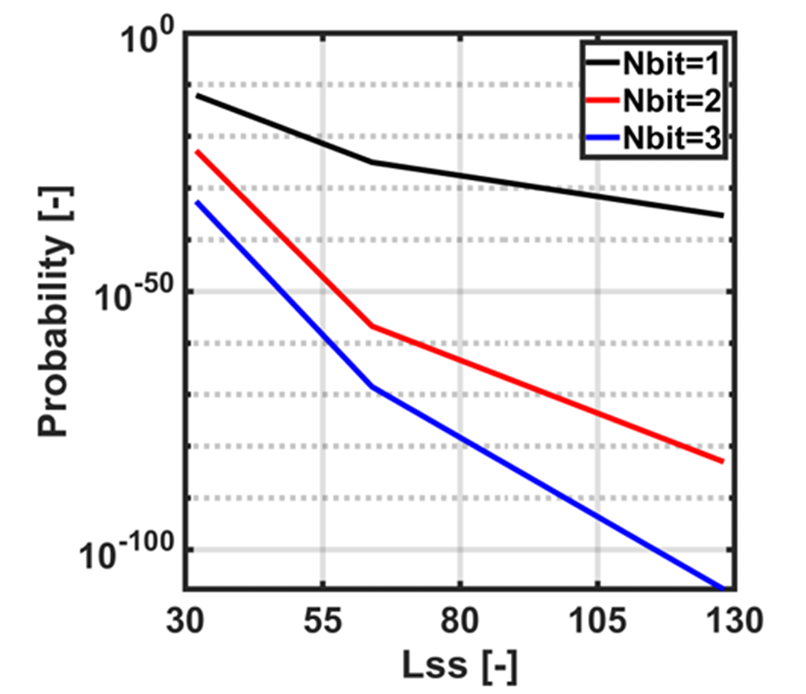

# 논문 · 발표

| # | 제목 | 발표 | 저자 위치 | 상태 | 원본 |
|---|---|---|---|---|---|
| 1 | *Approximation of Cross Correlation for Energy-Efficient Synchronization of Discrete Multitone Wireline Transceivers* | 2025 IEEE ICCE-Asia | 7인 중 5저자 | 발표 완료 | IEEE Xplore |
| 2 | *A 51 Gb/s DAC/ADC-Based Discrete Multitone Wireline Transceiver Datapath in 14 nm FinFET* | **IEEE ISSCC 2027 투고** | 15인 중 6저자 | 심사 중 | 비공개 |
| 3 | *Practical 2D FSM for Stochastic Computing with Improved Hardware Efficiency and Accuracy* | IEEE TENCON | 3인 중 2저자 | 게재 · 포스터 발표 | IEEE Xplore |
| 4 | *Mitigating Data Hazards in LEGv8 ARM Processor Using Geometric Approximation Speed Unit* | 2024 반도체공학회 하계학술대회 | 2인 중 2저자 | 발표 완료 (포스터) | [📄](../BS/LEGv8-CPU/paper/2024_반도체공학회_하계학술대회_포스터.pdf) |

> 2번 원고는 심사 중이므로 채택된 성과로 기재하지 않습니다.

---

## 1. DMT 동기화를 위한 Cross-Correlation 근사 — ICCE-Asia 2025

**Jaewon Lee¹'², Pier-Andrea Francese¹, Korkut Kaan Tokgoz³, Seoyoung Jang¹'⁴, Gayoung Kang⁴, Yoonji Choi⁴, Gain Kim¹'⁴**
¹IBM Research Europe · ²ETH Zürich · ³Sabanci University · ⁴DGIST

> 발표자료 원본은 IEEE 저작권 대상이라 이 저장소에 포함하지 않았습니다. 정식 논문은 IEEE Xplore에서 확인할 수 있습니다.

### 문제

PAM은 심볼이 연속으로 흐르므로 전이(transition)에서 타이밍을 바로 복원할 수 있습니다. 반면 **DMT는 블록 단위 프레임**으로 보내기 때문에, 수신단이 CP 위치를 먼저 찾아야 FFT 창을 맞출 수 있습니다.

이를 위해 알고 있는 동기화 시퀀스(SS)를 프레임에 끼워 넣고 **cross-correlation**으로 위치를 찾는데, 이 연산이 비쌉니다.



수신 신호와 SS의 상관을 취하면 정렬 지점에서 뚜렷한 peak가 나옵니다. 이 peak를 문턱과 비교해 동기 여부를 판정합니다.

### 제안 — Sign-Sign Cross-Correlation

기존 방식은 8-bit × 8-bit 곱셈기를 `L_ss`개 돌리고 16-bit 결과를 누적해 23-bit 비교기로 판정합니다. 정확하지만 면적과 전력을 많이 씁니다.

```
기존   :  Σ  ss[i] × y[i+n]                    8b×8b 곱셈기 × L_ss
제안   :  Σ  sign(ss[i]) × sign(y[i+n])        XNOR 게이트 × L_ss
```

**부호 1비트만 쓰면 곱셈이 XNOR 하나로 바뀝니다.** 누적기 폭도 23-bit에서 8-bit로 줄어듭니다.

동기화 시퀀스로는 **Zadoff-Chu 수열의 실수부를 8-bit로 양자화**해 썼습니다. 주파수 영역에서 크기가 평탄해 검출이 안정적이기 때문입니다.

### 성능 지표

검출 실패 확률은 상관 출력의 peak(p), 평균(m), 표준편차(σ)로 근사합니다.

```
Pr[error] ≈ erfc( (p − m) / σ )
```



`L_ss`(시퀀스 길이)와 `N_bit`(양자화 비트)를 바꿔가며 Sign Xcorr 출력을 관측한 결과입니다. 조건마다 평균·표준편차·오류확률이 함께 표기되어 있습니다.



`L_ss`가 길어질수록 표준편차가 줄어 peak가 배경에서 더 뚜렷하게 분리됩니다.

### 결과 — 무엇을 늘리는 것이 유리한가



`L_ss`를 늘려도, `N_bit`를 늘려도 오류확률은 내려갑니다. 그렇다면 **같은 성능을 더 싸게 얻는 쪽은 어디인가**가 설계 문제가 됩니다.

하드웨어 비용을 `FoM ≈ N_bit² × L_ss`로 두고, 목표 오류확률 1 × 10⁻³⁰을 만족하는 두 설계점을 비교했습니다.

| | L_ss | N_bit | FoM |
|---|---:|---:|---:|
| **Case A** | 128 | 1 | **~128** |
| Case B | 32 | 3 | ~288 |

**시퀀스를 길게 가져가는 쪽이 양자화 비트를 늘리는 쪽보다 2배 이상 비용 효율적**입니다. 곱셈기 폭은 비트 수의 제곱으로 커지는 반면, 시퀀스 길이는 선형으로만 늘기 때문입니다.

### 시뮬레이션 조건

| 항목 | 값 |
|---|---|
| 채널 | 30 GHz Nyquist에서 삽입손실 16 dB |
| 데이터 변환기 | 8-bit, ENOB 6.0 |
| 잡음 | 변환기 잡음에 40 dB SNR 가우시안 잡음 추가 |
| 동기화 시퀀스 | Zadoff-Chu 실수부, 8-bit 양자화 |

---

## 2. 14 nm FinFET DMT 송수신기 데이터패스 — ISSCC 2027 투고 원고

**Seoyoung Jang¹, Dongjun Lee², Taeho Shin³, Yujin Choi¹, Yoonji Choi¹, Gayoung Kang¹, Jaewon Lee⁴, Sungho Lee², Hyunseuk Ahn², Kwang-Ho Lee², Haram Ju², Fatemeh Akbar⁵, Kiarash Gharibdoust⁶, Jaeduk Han³, Gain Kim¹**
¹DGIST · ²KETI · ³한양대 · ⁴ETH Zürich · ⁵Sharif University of Technology · ⁶EM Microelectronics

> 심사 중인 원고이므로 본문 PDF는 이 저장소에 포함하지 않았습니다.

### 기여

DAC/ADC 기반 wireline TRX는 디지털 등화·변조를 재구성할 수 있어 불균일한 채널에 유리합니다. DMT는 대역을 직교 부채널로 나눠 채널 조건에 따라 부채널별 비트·전력을 배분하므로, **주파수 선택적 감쇠나 notch가 있는 채널**에 특히 잘 맞습니다.

기존 연구는 DMT **TX만** 또는 **RX만** 구현했거나, notch 채널 대응이 제한적인 아날로그 중심 multicarrier 구조였습니다. 이 원고는 **TX와 RX DSP를 모두 통합해 부채널 적응 동작이 가능한 DMT TRX 데이터패스**를 14 nm FinFET에서 처음으로 보입니다.

### 구조

| 항목 | 내용 |
|---|---|
| IFFT / FFT | 128-tap. **32-tap 코어를 재사용**하는 pipelined MDF 구조로 면적 효율 확보 |
| 고정소수점 스케일링 | 15-bit IFFT 출력을 정수·분수부로 나누고 **3-bit 제어로 7-bit 창을 선택**. 창을 옮겨 진폭 스케일을 유연하게 조정 |
| Cyclic Prefix | **8 / 16 / 32 tap 가변**. 채널 조건별로 CP 오버헤드 최적화 |
| TX 출력 | 7-bit 32-way 병렬 → 7-bit tailless CML DAC → ESD 보호가 있는 T-coil |
| RX 입력 | 8-way time-based SAR ADC → **sign-sign synchronizer** → CP 제거 → FFT → FDE → QAM 복조 |

RX의 sign-sign synchronizer는 [위 ICCE-Asia 연구](#1-dmt-동기화를-위한-cross-correlation-근사--icce-asia-2025)에서 다룬 근사 상관 기법을 적용한 블록입니다.

### 측정

외부 클럭은 Keysight M8196A AWG로 공급하고, TX 클럭은 on-chip PLL과 외부 입력 중 선택합니다. RX 입력은 AC 결합에 common mode 250 mV. TX/RX DSP는 0.9 V, DAC/ADC는 0.8 V로 동작합니다. SPI 설정은 MATLAB으로 시퀀싱했습니다.

| 조건 | 샘플레이트 | Data rate | Aggregate BER | 평균 SNR |
|---|---|---|---|---|
| Loopback | 20 GS/s | **51 Gb/s** | 5.2 × 10⁻³ | 18.2 dB (5.5 bits/Hz) |
| Notch 채널 | 16 GS/s | **27 Gb/s** | 3.9 × 10⁻³ | 14.6 dB |

Notch 채널은 1.8 GHz와 5.5 GHz에 깊은 감쇠가 있는 multi-drop 보드를 씁니다. **SNR이 10 dB 아래인 부채널에는 비트를 배정하지 않습니다.**

전체 전력은 551 mW, 에너지 효율은 **10.8 pJ/b** 입니다.

### 면적

| 블록 | 면적 |
|---|---|
| TX DSP | 550 × 250 µm² |
| RX DSP | 350 × 450 µm² |
| DAC | 215 × 140 µm² |
| ADC | 400 × 150 µm² |
| PLL VCO | 118 × 177 µm² |
| Digital loop filter | 70 × 70 µm² |

RX·TX DSP 모두 FFT / IFFT 코어가 면적의 대부분을 차지합니다.

설계·검증·측정 내용은 [KETI DMT Transceiver 페이지](../MS/KETI/README.md)에 정리되어 있습니다.

---

## 3. 학부 논문

학부 과정에서 참여한 논문 2편은 각 프로젝트 페이지에 내용이 정리되어 있습니다.

| 논문 | 프로젝트 페이지 |
|---|---|
| *Practical 2D FSM for Stochastic Computing…* (IEEE TENCON) | [2D FSM 기반 Stochastic Computing](../BS/Stochastic-Computing/README.md) |
| *Mitigating Data Hazards in LEGv8 ARM Processor…* (2024 반도체공학회) | [LEGv8 ARM CPU EX단 최적화](../BS/LEGv8-CPU/README.md) |

---

[← 메인으로](../README.md)
