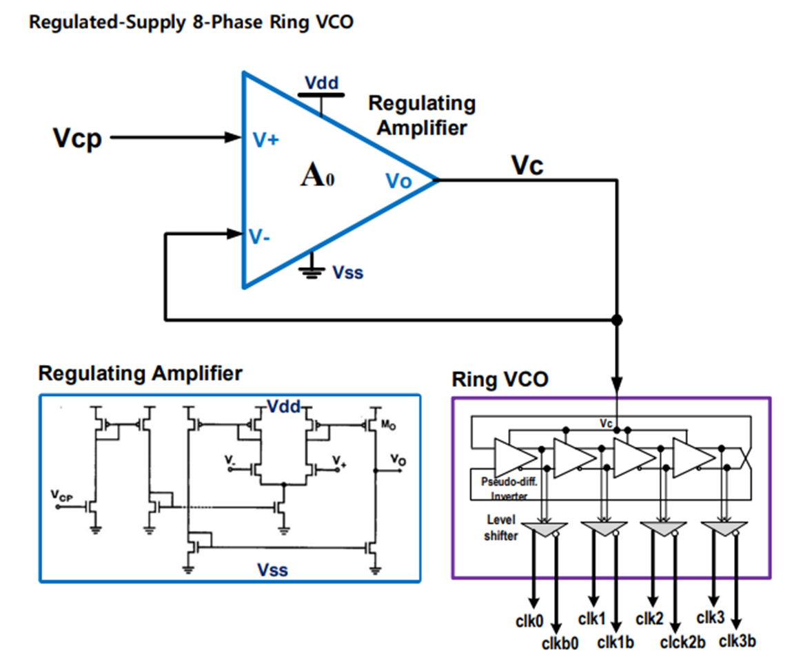
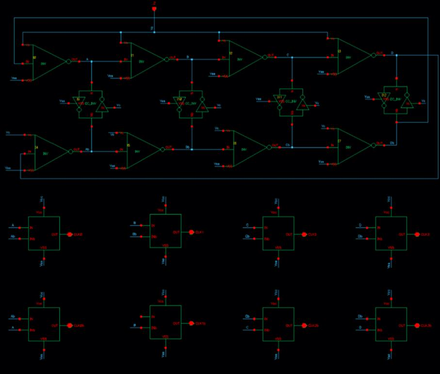
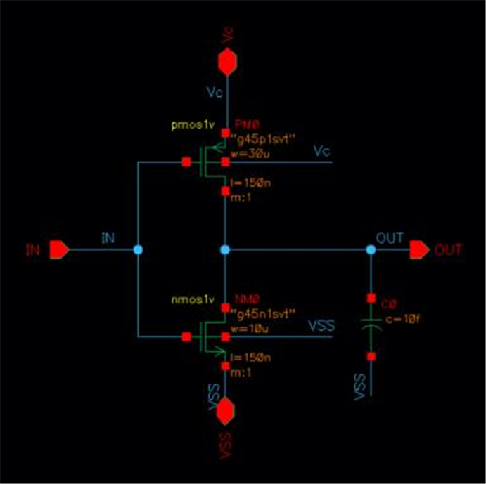
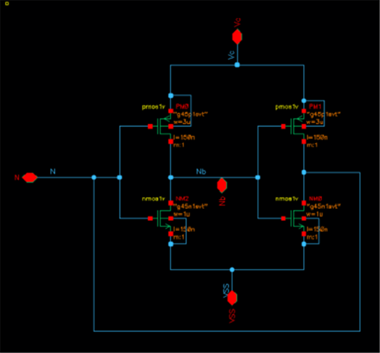
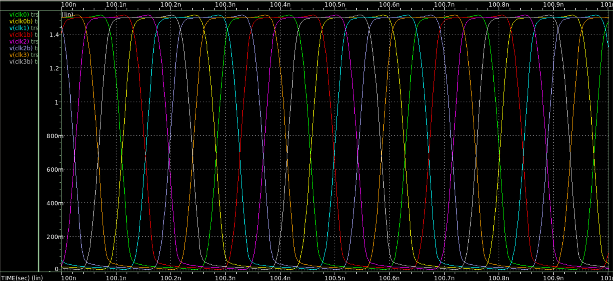
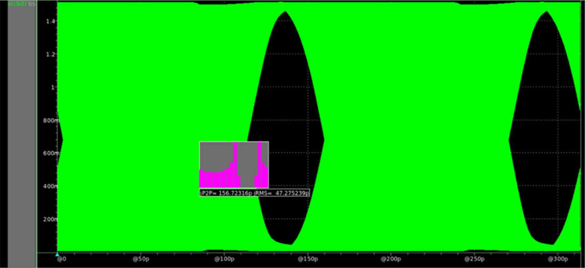
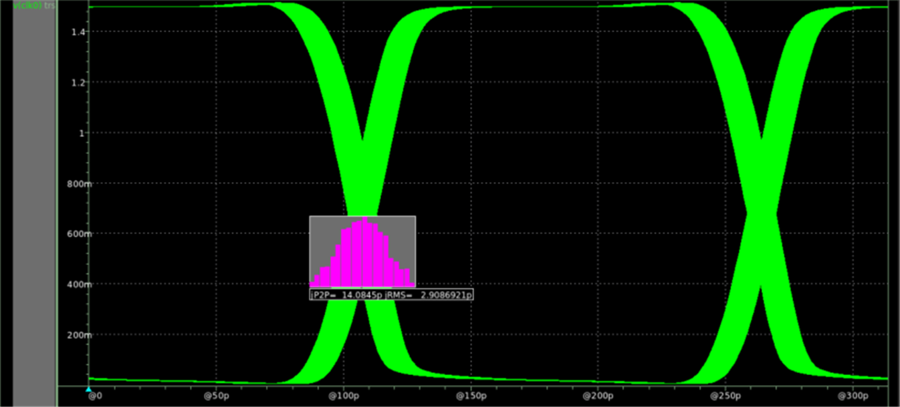
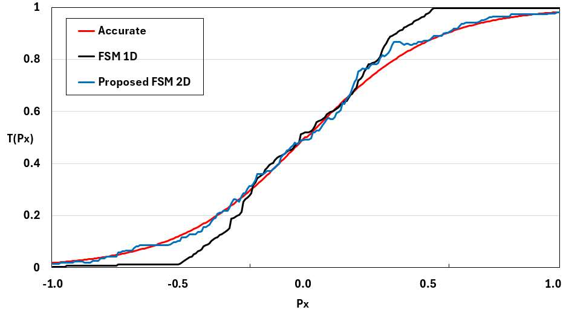
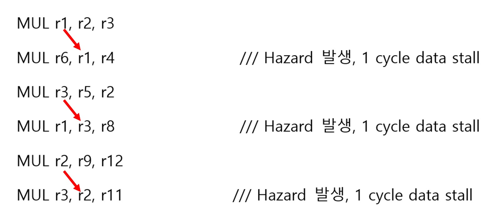
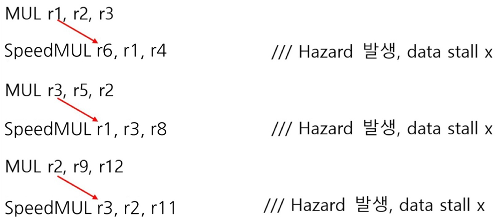

# 학부 프로젝트

홍익대학교 전자전기공학부. 아날로그 회로 설계와 디지털 연산기 설계를 각각 다뤘습니다.

| 프로젝트 | 분야 | 대표 결과 |
|---|---|---|
| [Regulated-Supply 8-Phase Ring VCO](#1-regulated-supply-8-phase-ring-vco--cmos-90-nm) | 아날로그 · CMOS 90 nm | supply ripple **100 mV → 6.27 mV** |
| [2D FSM 기반 Stochastic Computing](#2-2d-fsm-기반-stochastic-computing) | 디지털 · 학부연구생 | FoM **1.37× 개선**, MSE 0.37 × 10⁻³ |
| [근사 곱셈기 기반 CPU EX단 최적화](#3-근사-곱셈기-기반-legv8-arm-cpu-ex단-최적화) | 디지털 · 45 nm | EX stage **6.71 → 4.88 ns** |

---

## 1. Regulated-Supply 8-Phase Ring VCO — CMOS 90 nm

PLL의 VCO 블록과 그 앞단 레귤레이터를 설계했습니다. Ring VCO는 출력이 다음 인버터의 입력으로 되돌아가는 구조라 supply noise가 매 단마다 누적되어 jitter로 쌓입니다. **공급 전압의 흔들림을 앞단에서 잡아 VCO에 깨끗한 전원을 주는 것**이 과제의 핵심입니다.

Regulating Amplifier가 `Vcp`를 받아 `Vc`를 만들고, 이 `Vc`가 Ring VCO의 공급으로 들어갑니다. Ring VCO 출력은 level shifter를 거쳐 `clk0 ~ clk3b` 8상 클럭으로 나옵니다.

### 1.1 Ring VCO

4단 차동 구조로 8상을 만듭니다. 각 단은 main inverter와 cross-coupled inverter로 구성됩니다.

<table>
<tr>
<td width="50%"></td>
<td width="50%"></td>
</tr>
<tr>
<td><b>Main inverter</b> — 신호를 전달하는 경로. 크기를 키우면 RC 지연이 줄어 발진 주파수가 올라갑니다.</td>
<td><b>Cross-coupled inverter</b> — 위상 잡음을 줄이고 주파수 안정성을 잡는 역할. 크기를 키우면 주파수는 오히려 내려갑니다.</td>
</tr>
</table>

두 인버터가 서로 겨루는(fighting) 구조라 상대 크기를 정하는 것이 설계의 핵심이었습니다.

| | Main Inverter | | C-C Inverter | | Level Shifter | |
|---|---|---|---|---|---|---|
| | NMOS | PMOS | NMOS | PMOS | NMOS | PMOS |
| L | 150 n | 150 n | 150 n | 150 n | 100 n | 100 n |
| W | 10 u | 30 u | 1 u | 3 u | 200 n | 600 n |

**크기 비율을 이렇게 잡은 이유**

- **PMOS : NMOS = 3 : 1** — NMOS의 전자 이동도가 PMOS 정공 이동도보다 2~3배 높습니다. 상승·하강 시간을 맞춰 **duty cycle을 50 %에 붙이려면** PMOS를 그만큼 키워야 합니다.
- **Main : C-C = 10 : 1** — main inverter는 주파수를 결정하므로 크게, c-c inverter는 위상 잡음만 담당하므로 작게 두어 **전력 소모를 줄였습니다.**

`clk0 ~ clk3b` 8상이 각각 45° 간격으로, 0 V ~ 1.5 V full swing으로 나옵니다.

**제어전압에 따른 발진 주파수**

| Vcp | CLK frequency | Duty cycle |
|---|---|---|
| 75 mV | 2.219 GHz | 48.73 % |
| 0.9 V | 2.895 GHz | 49.39 % |
| 1.1 V | 3.594 GHz | 49.42 % |
| 1.3 V | 4.015 GHz | 49.50 % |

목표였던 2 GHz 이상을 전 구간에서 만족하고, 제어전압에 대해 주파수가 단조·선형으로 증가합니다. duty cycle은 전 구간 50 %에 근접합니다.

### 1.2 Regulating Amplifier

2-stage current mirror 구조입니다. Stage 1이 mirror pole, Stage 2가 dominant pole을 담당합니다.

`Vc = Vcp`가 되어야 하므로 feedback factor `k = 1`로 두었고, 이때 폐루프 이득이 `A₀/(1+A₀)`이므로 **개루프 이득 A₀를 키울수록 유리**합니다. 동시에 고주파까지 동작해야 하므로 넓은 대역폭도 필요한데, 이 둘은 trade-off입니다. 전류를 더 흘리는 쪽으로 풀었습니다 — main current source의 L을 줄이고 W를 키웠습니다.

| 항목 | 값 |
|---|---|
| DC gain | 20.13 dB |
| −3 dB 대역폭 | 156.87 MHz |
| Unity-gain 주파수 | 3.51 GHz |
| Phase margin | 26.6° (180° − 153.45°) |

위상이 −180°에 닿기 전에 이득이 0 dB를 지나므로 폐루프가 안정합니다.

### 1.3 Supply noise 억제 결과

`Vcp = 1.0 V`에서 공급 전압에 **진폭 3종(±1 / ±10 / ±50 mV) × 주파수 3종(1 / 10 / 100 MHz)** 의 잡음을 넣고, CLK0의 jitter를 eye diagram으로 측정했습니다.

| Vdd 잡음 | 잡음 주파수 | Vdd ripple | **Vc ripple** | CLK0 jitter |
|---|---|---:|---:|---:|
| ±1 mV | 1 MHz | 2 mV | 3.857 mV | 3.784 ps |
| ±10 mV | 1 MHz | 20 mV | 4.265 mV | 19.519 ps |
| ±50 mV | 1 MHz | 100 mV | 6.197 mV | **47.275 ps** |
| ±1 mV | 10 MHz | 2 mV | 3.848 mV | 1.482 ps |
| ±10 mV | 10 MHz | 20 mV | 4.256 mV | 4.157 ps |
| ±50 mV | 10 MHz | 100 mV | 6.171 mV | 19.835 ps |
| ±1 mV | 100 MHz | 2 mV | 3.845 mV | 1.439 ps |
| ±10 mV | 100 MHz | 20 mV | 4.278 mV | 1.561 ps |
| ±50 mV | 100 MHz | 100 mV | 6.268 mV | **2.909 ps** |

**공급 리플 100 mV가 Vc에서 6.27 mV로 줄어듭니다.** 레귤레이터가 약 16배 억제한 결과입니다.

같은 ±50 mV 잡음이라도 잡음 주파수에 따라 jitter가 크게 갈립니다.

<table>
<tr>
<td width="50%"></td>
<td width="50%"></td>
</tr>
<tr>
<td><b>±50 mV · 1 MHz</b> — jitter 47.275 ps. eye가 크게 닫힙니다.</td>
<td><b>±50 mV · 100 MHz</b> — jitter 2.909 ps. eye가 열려 있습니다.</td>
</tr>
</table>

Vc ripple은 두 조건이 6.197 mV와 6.268 mV로 거의 같은데 jitter는 16배 차이납니다. 잡음 주기가 길수록 VCO가 같은 방향의 위상 오차를 더 오래 누적하기 때문입니다. **Vc ripple만으로는 jitter를 예측할 수 없고 잡음의 주파수까지 함께 봐야 한다**는 점을 확인했습니다.

---

## 2. 2D FSM 기반 Stochastic Computing

**학부연구생 과제** · 논문 *Practical 2D FSM for Stochastic Computing with Improved Hardware Efficiency and Accuracy* (Jiho Kim, **Gayoung Kang**, Youngmin Kim — Hongik University) 제2저자

Stochastic Computing은 값을 비트스트림에서 '1'이 나올 확률로 표현해, 곱셈을 AND 게이트 하나로 처리할 수 있는 연산 방식입니다. 하드웨어는 극단적으로 단순해지지만 정확도가 떨어져 실제로 쓰기 어렵다는 문제가 있습니다. 기존 1차원 FSM은 상태 수에 따라 구현 가능한 함수와 입력 범위가 묶여 있어, sigmoid(x)를 직접 구현하지 못하고 sigmoid(8x) 같은 형태로 범위를 접어야 했습니다.

제안 구조는 입력 X와 별도의 확률 입력 K를 각각 SNG로 변환해 **두 독립 변수로 상태를 전이**시킵니다. 4×4 = 16개 상태가 MUX의 선택 신호가 되고, 상태마다 대응하는 가중치 비트스트림 `W₀ ~ W₁₅`를 골라 출력합니다. 두 입력이 독립이므로 비트스트림 간 상관이 줄고, 가중치를 상태별로 따로 줄 수 있어 구현 가능한 함수의 자유도가 올라갑니다.

X와 K의 조합 4가지에 따라 가로·세로로 상태가 전이합니다. M = N = 4로 균형을 맞춘 것이 정확도에 유리했습니다.

sigmoid(4x) 구현 결과입니다. 1차원 FSM(검정)은 입력이 −0.5 이하에서 0, 0.5 이상에서 1로 붙어 곡선을 따라가지 못합니다. 제안한 2D FSM(파랑)은 실제 곡선(빨강)에 근접합니다.

**Verilog HDL로 구현하고 Synopsys Design Compiler로 전력·면적을 측정했습니다.**

| 구성 | Power (mW) | Area (µm²) | Error (MSE) | FoM (P×A×E) |
|---|---:|---:|---:|---:|
| 2×4 (8-state) | 5.28 | 64,001 | 1.47 × 10⁻³ | 498.04 |
| **4×4 (16-state, 제안)** | 9.02 | 108,818 | **0.37 × 10⁻³** | **362.69** |
| 8×4 (32-state) | 16.63 | 198,834 | 0.54 × 10⁻³ | 1,773.50 |

FoM은 전력 × 면적 × 오차로, 낮을수록 좋습니다. 4×4 구성이 2×4 대비 **1.37배**, 8×4 대비 **4.89배** 우수합니다. 상태를 무작정 늘리면 면적과 전력만 커지고 오차는 오히려 나빠진다는 점이 8×4 결과에서 드러납니다. 4×4에서 전체 값의 96.5 %가 오차 0.05 이내에 들어옵니다.

---

## 3. 근사 곱셈기 기반 LEGv8 ARM CPU EX단 최적화

**2024 반도체공학회 하계학술대회 포스터** · *Mitigating Data Hazards in LEGv8 ARM Processor Using Geometric Approximation Speed Unit* (Eunsu Kim, **Gayoung Kang** — Hongik University) 제2저자

5단 파이프라인(IF/ID/EX/MEM/WB) LEGv8 ARM 프로세서에서 곱셈은 EX 단계를 2 cycle 잡아먹습니다. 뒤따르는 명령이 그 결과를 쓰면 data hazard가 생겨 stall이 발생합니다.

`MUL` 다음 명령이 결과 레지스터를 참조할 때마다 1 cycle stall이 걸립니다.

**접근** — 정확도가 덜 중요한 연산에는 근사 곱셈기를 써서 EX 단계를 1 cycle에 끝내자는 것입니다.

<table>
<tr>
<td width="50%"></td>
<td width="50%"></td>
</tr>
<tr>
<td>(a) 일반 full adder (b) carry-out selectable (c) carry-in configurable</td>
<td>SARA — 캐리를 예측해 sub-adder를 병렬로 돌리는 구조</td>
</tr>
</table>

16×16 Dadda_SARA 곱셈기 4개와 32-bit SARA 가산기를 조합해 32×32 **GASU(Geometric Approximation Speed Unit)** 를 구성했습니다.

**곱셈기 비교** — Synopsys Design Compiler, 45 nm Nangate OpenCell Library

| 구조 | Power | Delay | Area | PSNR |
|---|---:|---:|---:|---:|
| Wallace_RCA | 3.3 mW | 1.72 ns | 4,193 µm² | Inf |
| Dadda_CLA | 3.2 mW | 1.61 ns | 3,981 µm² | Inf |
| Wallace_SARA | 3.7 mW | 1.33 ns | 4,650 µm² | 24 dB |
| **GASU (제안)** | 3.9 mW | 1.46 ns | 4,919 µm² | **53 dB** |

Wallace_SARA가 가장 빠르지만 PSNR 24 dB로 오차가 큽니다. GASU는 지연을 1.46 ns로 낮추면서 **PSNR 53 dB**를 확보해, 속도와 정확도 사이에서 쓸 만한 지점을 잡았습니다.

일반 `MUL`은 EX1·EX2 두 단계를 쓰고, GASU를 쓰는 `SpeedMUL`은 SUB MUL 한 단계로 끝납니다.

`SpeedMUL`로 바꾸면 같은 의존 관계에서도 stall이 사라집니다.

| 항목 | 값 |
|---|---|
| EX stage delay (Wallace_RCA) | 6.71 ns |
| **EX stage delay (GASU)** | **4.88 ns** |
| 최종 동작 주파수 | 200 MHz (5 ns) |

EX 단계가 critical path였으므로, 이 단계를 4.88 ns로 줄여 전체 클럭을 200 MHz로 맞췄습니다.

---

## 4. 그 외 교과 프로젝트

| 과목 | 내용 |
|---|---|
| 집적회로설계 | CAD 실습 — 회로 설계와 layout, 검증 |
| 전자회로실험 및 설계 | MOSFET 바이어스와 증폭기 설계, 실측 |
| IT 시스템 종합설계 | 팀 프로젝트 |

## 연구 인턴

| 기간 | 기관 |
|---|---|
| 2024 하계 | DGIST 하계 인턴 (수료) |
| 2025 동계 | DGIST 동계 인턴 (수료) |

이후 석사 성과를 인턴 기간의 성과로 소급하지 않습니다.

---

## 관련 페이지

- [석사 연구 — On-chip Adaptive BPL](../masters/adaptive-bpl/README.md)
- [메인으로](../README.md)

## 자료 출처

VCO 항목은 본인이 작성한 IC Design Term Project 보고서 2편(`Project Part1`, `Final Project`)에서, Stochastic Computing은 공저 논문 원고에서, CPU EX단은 2024 반도체공학회 하계학술대회 포스터에서 가져왔습니다. 상세 기록은 [`figure-sources.json`](figure-sources.json)에 있습니다.
