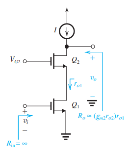
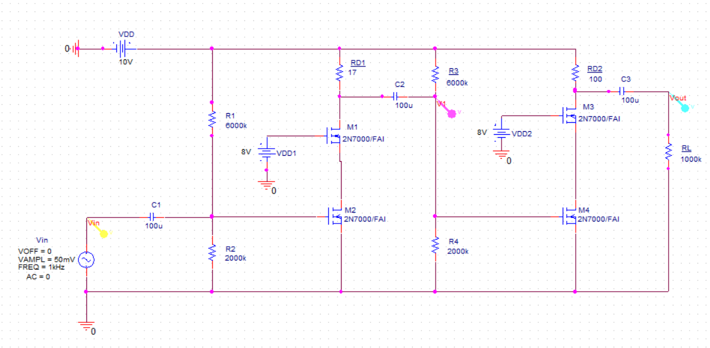
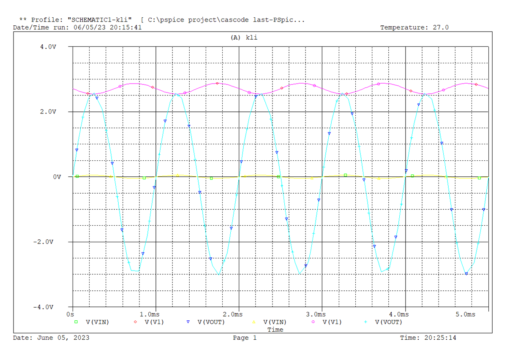
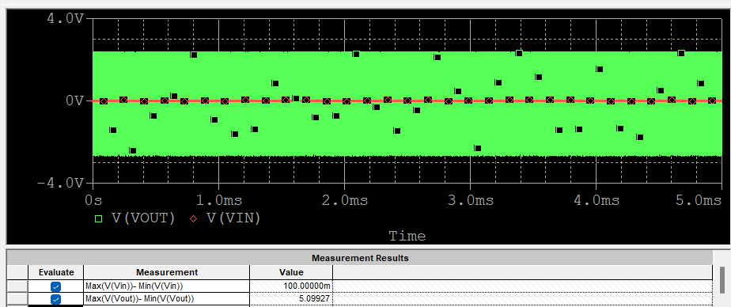

# 2-Stage Cascode Amplifier

**전자회로실험 및 설계 · 이산소자(2N7000) · 목표 gain 51**

주어진 스펙은 **gain 51** 하나였습니다. 2단으로 나누어 stage 1에서 −3, stage 2에서 −17을 얻어 (−3) × (−17) = 51을 맞추는 구성을 잡았습니다.

---

## 1. 왜 cascode인가

CS(common-source) 단을 두 개 쌓으면 2-stage 증폭기가 되지만, **headroom이 부족해 각 단의 gain을 충분히 올리기 어렵습니다.** 부하 저항 `R_D`를 키우면 gain은 오르지만 드레인 전압이 내려가 동작점이 깨집니다.

Cascode는 CS 증폭단 위에 CG(common-gate) 버퍼를 얹어 출력 저항을 키웁니다.

| | 출력 저항 | Gain |
|---|---|---|
| Common-source | `r_o1` | `−g_m1 · r_o1` |
| **Cascode** | `(g_m2 r_o2) r_o1` | `−(g_m1 r_o1)(g_m2 r_o2)` |

출력 저항이 `(g_m2 r_o2)` 배 커지므로, **부하 저항을 키우지 않고도** gain을 확보할 수 있습니다.

---

## 2. 설계

2N7000 MOSFET 기준으로 동작점을 잡았습니다. `V_TH = 2.1 × (−0.0016 × 27 + 1.04) ≈ 2.09 V`, `L = 1 u`, `W = 1 u`.

---

## 3. 결과

입력 `Vin`, 1단 출력 `V1`, 최종 출력 `Vout`을 함께 관측했습니다.

| 측정 | 값 |
|---|---|
| max(Vin) − min(Vin) | 100.0 mV |
| max(Vout) − min(Vout) | 5.098 V |
| **전체 gain** | **51.0** |

목표였던 gain 51을 만족했습니다. 중간 노드 측정에서 1단 gain이 약 3.2배로 나와, 의도한 −3 / −17 분배와 일치합니다.

---

[← 학부 과정](../README.md) · [자료 출처](figure-sources.json)
