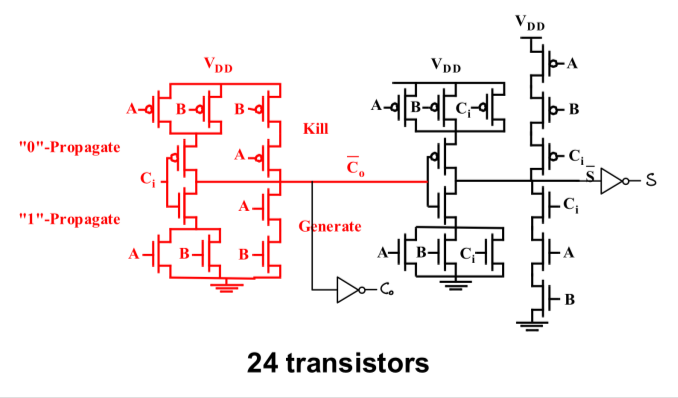
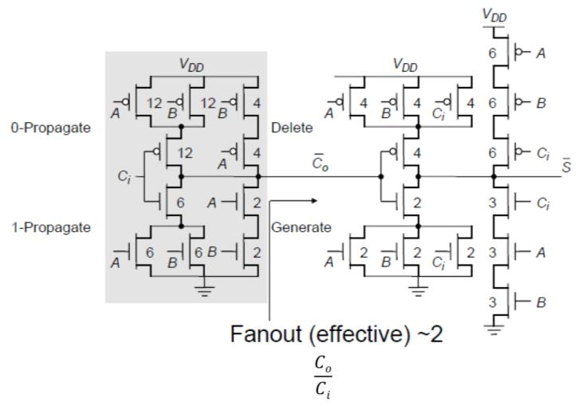

# 1-bit Full Adder — Schematic부터 Layout까지

**집적회로설계 (CAD) · CMOS 90 nm**

Mirror style full adder를 schematic부터 layout까지 직접 그리고, transient 시뮬레이션으로 worst-case delay가 어느 입력 조합에서 나오는지 확인했습니다.

---

## 1. 회로

트랜지스터 **24개**로 구성된 Mirror Adder입니다. A, B, Cin으로 먼저 `Cout`을 만들고, 그 `Cout`을 다시 써서 `S`를 만드는 구조입니다.

각 트랜지스터의 크기를 표기한 도면입니다. 유효 fanout을 약 2로 맞췄습니다.

---

## 2. Layout

면적은 **6.8 × 4 µm² (136 × 80 λ²)** 입니다.

---

## 3. Transient 시뮬레이션과 delay 분석

8가지 입력 조합을 모두 확인했습니다. A를 DC로 두고 B, Cin에 클럭을 주어 진리표 전 구간을 훑었습니다.

| A | B | Cin | S | Cout | Carry 상태 |
|---|---|---|---|---|---|
| 0 | 0 | 0 | 0 | 0 | Delete |
| 0 | 0 | 1 | 1 | 0 | Delete |
| 0 | 1 | 0 | 1 | 0 | Propagate |
| 0 | 1 | 1 | 0 | 1 | Propagate |
| 1 | 0 | 0 | 1 | 0 | Propagate |
| 1 | 0 | 1 | 0 | 1 | Propagate |
| 1 | 1 | 0 | 0 | 1 | Generate |
| 1 | 1 | 1 | 1 | 1 | Generate |

**worst-case delay는 Propagate 구간에서 나옵니다.**

Sum은 Cout을 받아 만들어지므로 Sum delay가 Cout delay에 얹힙니다. 그런데 Delete(A=B=0)와 Generate(A=B=1)에서는 Cout이 Cin과 무관하게 각각 0과 1로 정해집니다. Propagate(A≠B)에서만 `Co = AB + Ci(A+B)`가 `AB = 0`, `A+B = 1`이 되어 **`Co = Ci`**, 즉 Cin이 Cout까지 실제로 전파됩니다. 이 경로가 가장 깁니다.

---

## 4. 2-bit Ripple Carry Adder로 확장

<table>
<tr>
<td width="40%"></td>
<td width="60%"></td>
</tr>
<tr>
<td>Full adder 2개를 캐리로 연결한 2-bit RCA.</td>
<td>Full adder layout을 그대로 인스턴스화해 배치·배선했습니다.</td>
</tr>
</table>

---

[← 학부 과정](../README.md) · [자료 출처](figure-sources.json)
