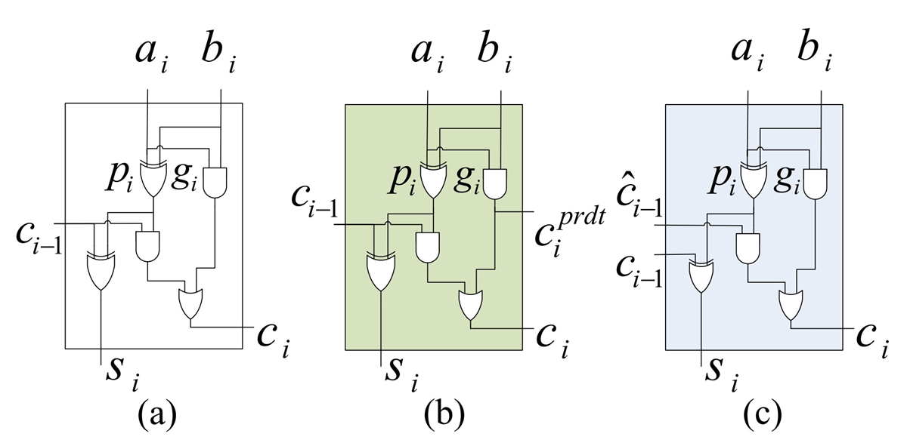
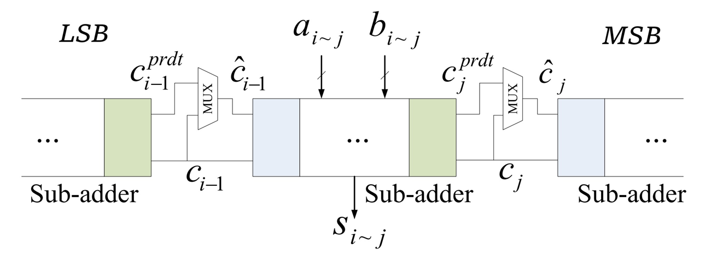
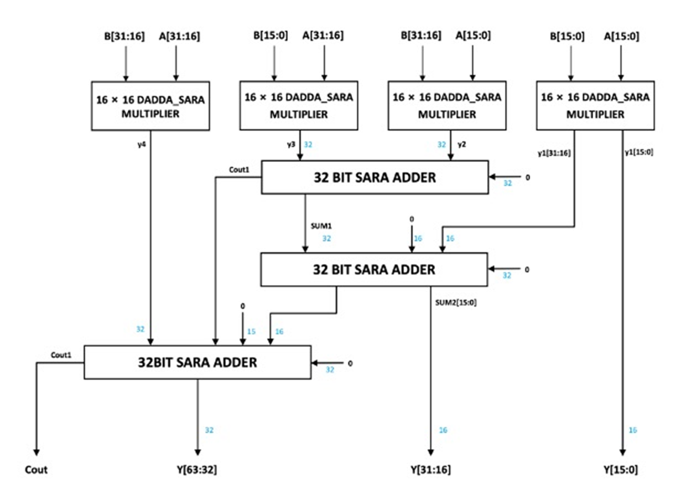

# LEGv8 ARM CPU EX단 최적화

**IT 시스템 종합설계 (6인 팀) → 2024 반도체공학회 하계학술대회 포스터 (제2저자)**

*Mitigating Data Hazards in LEGv8 ARM Processor Using Geometric Approximation Speed Unit*
Eunsu Kim, **Gayoung Kang** — Hongik University

---

## 1. 팀 프로젝트 — LEGv8 ARM 프로세서

5단 파이프라인(IF / ID / EX / MEM / WB) LEGv8 ARM 프로세서를 설계하고 명령어와 모듈을 확장했습니다.

- `MUL`, `LPMUL`, `UDIV` 명령어와 해당 모듈 추가
- `BR`, `BL` 분기 명령어 추가 — factorial 등 재귀·반복 동작 지원
- ID / EX 단계에 **exception handler** 모듈 추가
- 어셈블러로 어셈블리를 기계어로 변환
- Synopsys Design Compiler 합성으로 clock speed 최적화

여기서 **EX 단계가 critical path**로 드러났습니다. 곱셈이 EX를 2 cycle 잡아먹고, 뒤따르는 명령이 그 결과를 참조하면 data hazard로 stall이 걸립니다.

`MUL` 다음 명령이 결과 레지스터를 참조할 때마다 1 cycle stall이 발생합니다.

---

## 2. 접근 — 근사 곱셈기로 EX를 1 cycle에

정확도가 덜 중요한 연산에는 근사 곱셈기를 써서 EX 단계를 1 cycle에 끝내자는 것입니다.

<table>
<tr>
<td width="50%"></td>
<td width="50%"></td>
</tr>
<tr>
<td>(a) 일반 full adder (b) carry-out selectable (c) carry-in configurable</td>
<td>SARA — 캐리를 예측해 sub-adder를 병렬로 돌려 캐리 전파 지연을 끊는 구조</td>
</tr>
</table>

16×16 Dadda_SARA 곱셈기 4개와 32-bit SARA 가산기를 조합해 32×32 **GASU(Geometric Approximation Speed Unit)** 를 구성했습니다.

**곱셈기 비교** — Synopsys Design Compiler, 45 nm Nangate OpenCell Library

| 구조 | Power | Delay | Area | PSNR |
|---|---:|---:|---:|---:|
| Wallace_RCA | 3.3 mW | 1.72 ns | 4,193 µm² | Inf |
| Dadda_CLA | 3.2 mW | 1.61 ns | 3,981 µm² | Inf |
| Wallace_SARA | 3.7 mW | 1.33 ns | 4,650 µm² | 24 dB |
| **GASU (제안)** | 3.9 mW | 1.46 ns | 4,919 µm² | **53 dB** |

Wallace_SARA가 1.33 ns로 가장 빠르지만 PSNR 24 dB로 오차가 큽니다. GASU는 지연을 1.46 ns로 낮추면서 **PSNR 53 dB**를 확보해, 속도와 정확도 사이에서 쓸 만한 지점을 잡았습니다.

---

## 3. 결과

일반 `MUL`은 EX1·EX2 두 단계를 쓰고, GASU를 쓰는 `SpeedMUL`은 SUB MUL 한 단계로 끝납니다.

`SpeedMUL`로 바꾸면 같은 의존 관계에서도 stall이 사라집니다.

| 항목 | 값 |
|---|---|
| EX stage delay (Wallace_RCA) | 6.71 ns |
| **EX stage delay (GASU)** | **4.88 ns** |
| 최종 동작 주파수 | 200 MHz (5 ns) |

EX 단계가 critical path였으므로, 이 단계를 4.88 ns로 줄여 전체 클럭을 200 MHz로 맞췄습니다.

---

[← 학부 과정](../README.md) · [자료 출처](figure-sources.json)
