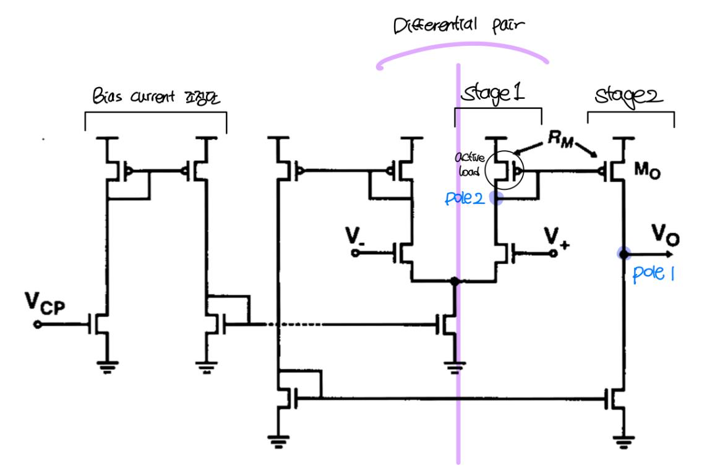
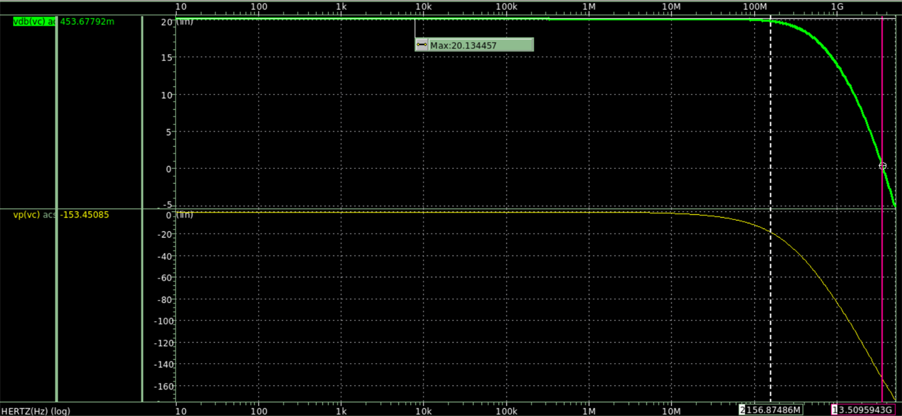

# Regulated-Supply 8-Phase Ring VCO

**CMOS 90 nm · IC Design Term Project**

PLL의 VCO 블록과 그 앞단 레귤레이터를 설계했습니다. Ring VCO는 출력이 다음 인버터의 입력으로 되돌아가는 구조라 supply noise가 매 단마다 누적되어 jitter로 쌓입니다. **공급 전압의 흔들림을 앞단에서 잡아 VCO에 깨끗한 전원을 주는 것**이 과제의 핵심입니다.

Regulating Amplifier가 `Vcp`를 받아 `Vc`를 만들고, 이 `Vc`가 Ring VCO의 공급으로 들어갑니다. Ring VCO 출력은 level shifter를 거쳐 `clk0 ~ clk3b` 8상 클럭으로 나옵니다.

---

## 1. Ring VCO

4단 차동 구조로 8상을 만듭니다. 각 단은 main inverter와 cross-coupled inverter로 구성됩니다.

<table>
<tr>
<td width="50%"></td>
<td width="50%"></td>
</tr>
<tr>
<td><b>Main inverter</b> — 신호를 전달하는 경로. 크기를 키우면 RC 지연이 줄어 발진 주파수가 올라갑니다.</td>
<td><b>Cross-coupled inverter</b> — 위상 잡음을 줄이고 주파수 안정성을 잡는 역할. 크기를 키우면 주파수는 오히려 내려갑니다.</td>
</tr>
</table>

두 인버터가 서로 겨루는(fighting) 구조라 상대 크기를 정하는 것이 설계의 핵심이었습니다.

| | Main Inverter | | C-C Inverter | | Level Shifter | |
|---|---|---|---|---|---|---|
| | NMOS | PMOS | NMOS | PMOS | NMOS | PMOS |
| L | 150 n | 150 n | 150 n | 150 n | 100 n | 100 n |
| W | 10 u | 30 u | 1 u | 3 u | 200 n | 600 n |

**크기 비율을 이렇게 잡은 이유**

- **PMOS : NMOS = 3 : 1** — NMOS의 전자 이동도가 PMOS 정공 이동도보다 2~3배 높습니다. 상승·하강 시간을 맞춰 **duty cycle을 50 %에 붙이려면** PMOS를 그만큼 키워야 합니다.
- **Main : C-C = 10 : 1** — main inverter는 주파수를 결정하므로 크게, c-c inverter는 위상 잡음만 담당하므로 작게 두어 **전력 소모를 줄였습니다.**

`clk0 ~ clk3b` 8상이 각각 45° 간격으로, 0 V ~ 1.5 V full swing으로 나옵니다.

### 제어전압 스윕

`Vcp`를 스윕하며 발진 주파수와 duty cycle을 측정했습니다. 아래는 스윕 구간에서 뽑은 대표점입니다.

| Vcp | CLK frequency | Duty cycle |
|---|---|---|
| 75 mV | 2.219 GHz | 48.73 % |
| 0.9 V | 2.895 GHz | 49.39 % |
| 1.1 V | 3.594 GHz | 49.42 % |
| 1.3 V | 4.015 GHz | 49.50 % |

목표였던 2 GHz 이상을 전 구간에서 만족하고, 제어전압에 대해 주파수가 단조·선형으로 증가합니다. duty cycle은 전 구간 50 %에 근접합니다.

---

## 2. Regulating Amplifier

2-stage current mirror 구조입니다. Stage 1이 mirror pole, Stage 2가 dominant pole을 담당합니다.

`Vc = Vcp`가 되어야 하므로 feedback factor `k = 1`로 두었고, 이때 폐루프 이득이 `A₀/(1+A₀)`이므로 **개루프 이득 A₀를 키울수록 유리**합니다. 동시에 고주파까지 동작해야 하므로 넓은 대역폭도 필요한데, 이 둘은 trade-off입니다. 전류를 더 흘리는 쪽으로 풀었습니다 — main current source의 L을 줄이고 W를 키웠습니다.

| 항목 | 값 |
|---|---|
| DC gain | 20.13 dB |
| −3 dB 대역폭 | 156.87 MHz |
| Unity-gain 주파수 | 3.51 GHz |
| Phase margin | 26.6° (180° − 153.45°) |

위상이 −180°에 닿기 전에 이득이 0 dB를 지나므로 폐루프가 안정합니다.

---

## 3. Supply noise 억제 결과

`Vcp = 1.0 V`에서 공급 전압에 **진폭 3종(±1 / ±10 / ±50 mV) × 주파수 3종(1 / 10 / 100 MHz)** 의 잡음을 넣고, CLK0의 jitter를 eye diagram으로 측정했습니다.

| Vdd 잡음 | 잡음 주파수 | Vdd ripple | **Vc ripple** | CLK0 jitter |
|---|---|---:|---:|---:|
| ±1 mV | 1 MHz | 2 mV | 3.857 mV | 3.784 ps |
| ±10 mV | 1 MHz | 20 mV | 4.265 mV | 19.519 ps |
| ±50 mV | 1 MHz | 100 mV | 6.197 mV | **47.275 ps** |
| ±1 mV | 10 MHz | 2 mV | 3.848 mV | 1.482 ps |
| ±10 mV | 10 MHz | 20 mV | 4.256 mV | 4.157 ps |
| ±50 mV | 10 MHz | 100 mV | 6.171 mV | 19.835 ps |
| ±1 mV | 100 MHz | 2 mV | 3.845 mV | 1.439 ps |
| ±10 mV | 100 MHz | 20 mV | 4.278 mV | 1.561 ps |
| ±50 mV | 100 MHz | 100 mV | 6.268 mV | **2.909 ps** |

**공급 리플 100 mV가 Vc에서 6.27 mV로 줄어듭니다.** 레귤레이터가 약 16배 억제한 결과입니다.

같은 ±50 mV 잡음이라도 잡음 주파수에 따라 jitter가 크게 갈립니다.

<table>
<tr>
<td width="50%"></td>
<td width="50%"></td>
</tr>
<tr>
<td><b>±50 mV · 1 MHz</b> — jitter 47.275 ps. eye가 크게 닫힙니다.</td>
<td><b>±50 mV · 100 MHz</b> — jitter 2.909 ps. eye가 열려 있습니다.</td>
</tr>
</table>

Vc ripple은 두 조건이 6.197 mV와 6.268 mV로 거의 같은데 jitter는 16배 차이납니다. 잡음 주기가 길수록 VCO가 같은 방향의 위상 오차를 더 오래 누적하기 때문입니다. **Vc ripple만으로는 jitter를 예측할 수 없고 잡음의 주파수까지 함께 봐야 한다**는 점을 확인했습니다.

---

[← 학부 과정](../README.md) · [자료 출처](figure-sources.json)
